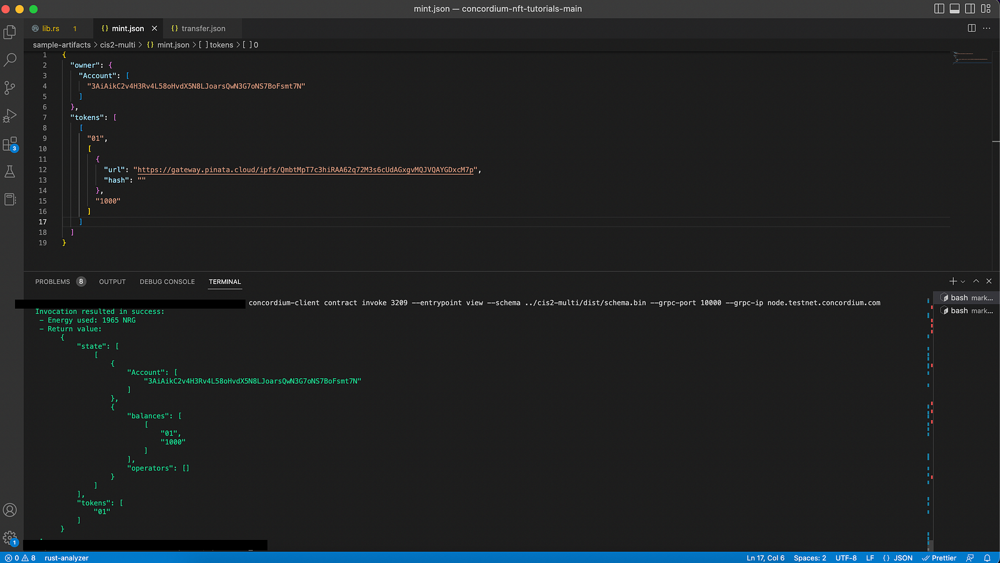
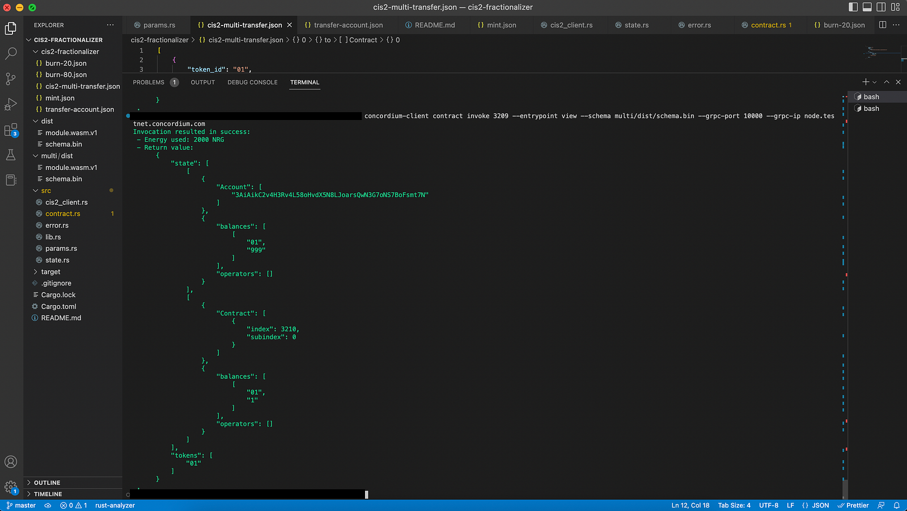
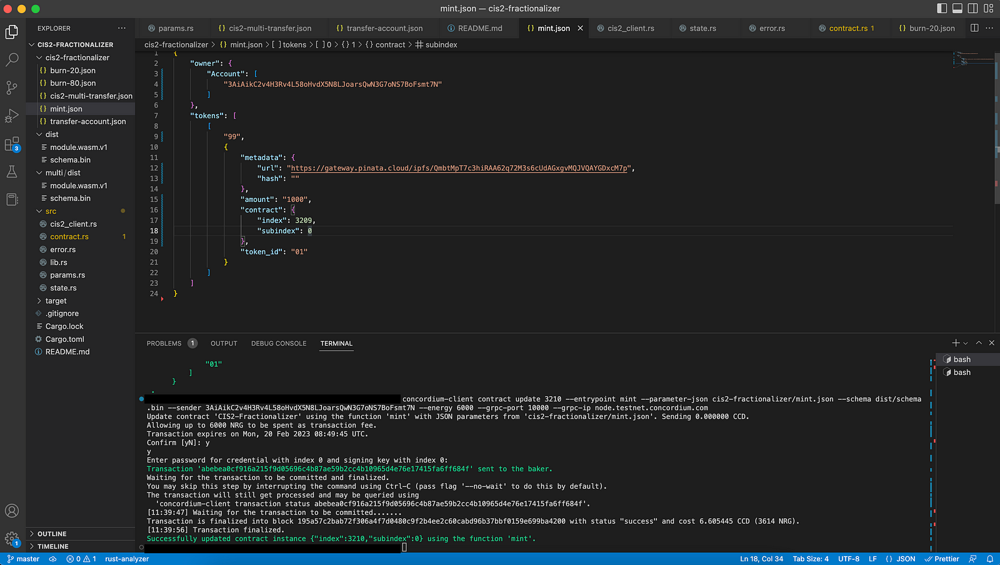
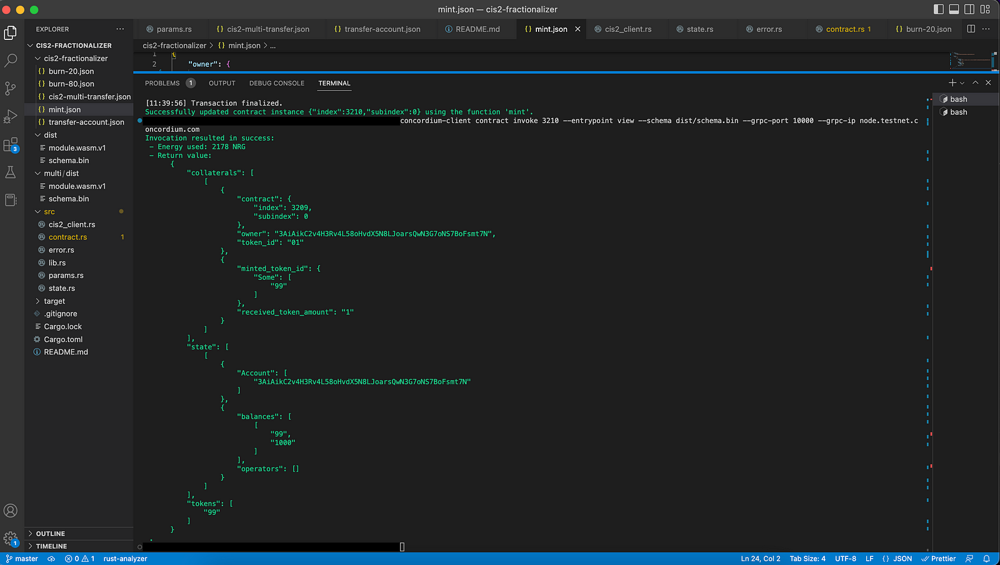

.. _mint-fractionalized-nft:

========================
Mint fractionalized NFTs
========================

You have deployed fractionalizer and are ready to mint some NFTs as a fraction of another one. To do that follow these steps:

* Mint a CIS-2 NFT
* Transfer NFT to the fractionalizer contract and lock it.
* Mint fractions
* Check state
* Transfer some
* Burn all of them
* Check the state

Mint a regular NFT (to be collateralized)
=========================================

Remember that your fractionalization logic starts with collateralizing the CIS-2 NFT. In order to mint a CIS-2 NFT you can follow the :ref:`Mint a Semi-fungible token tutorial<sft-index>`. As previously mentioned in this tutorial, you will use cis2-multi smart contract for minting our token and you can find the full code here. The screenshot below shows only the ``mint()`` function. You can find build/deploy processes in the tutorial.

Check the state by calling the ``view()`` function as shown below.

.. code-block:: console

    concordium-client contract invoke <YOUR-TOKEN-CONTRACT-INDEX>--entrypoint view --schema ../cis2-multi/dist/schema.bin --grpc-port 10000 --grpc-ip node.testnet.concordium.com

Transfer CIS-2 NFT
==================

You have successfully minted a CIS-2 NFT and now you can transfer it to the fractionalizer contract. In order to do that, you need to call the ``transfer()`` function from the token’s contract using its index and schema file. Create a JSON file to give the input parameters like the below and specify the fractionalizer contract index value.

.. code-block:: console

    [
    {
    "token_id": "<YOUR-TOKEN-ID>",
    "amount": "<TOKEN-AMOUNT-TO-LOCK>",
    "from": {
    "Account": [
        "<YOUR-ACCOUNT>"
    ]
    },
    "to": {
    "Contract": [
        {
        "index": <YOUR-FRACTIONALIZER-CONTRACT-INDEX>,
        "subindex": 0
        },
        "onReceivingCIS2"
    ]
    },
    "data": ""
    }
    ]

Don't get confused in this part. You need to use the **token’s schema** to change **its state**. You want to keep both schemas in the same project folder for the sake of order. That's why you created a section for the **cis2-multi** contract's schema file, so you can either copy the **schema** file from cis2-multi to your fractionalizer directory´, or you can call it from that file using the JSON above. This tutorial does it the first way, by creating a file and copying/pasting the schema from cis2-multi.

Run the command below to transfer the token to the fractionalizer.

.. code-block:: console

    concordium-client contract update <YOUR-TOKEN-CONTRACT-INSTANCE> --entrypoint transfer --parameter-json cis2-fractionalizer/cis2-multi-transfer.json --schema multi/dist/schema.bin --sender <YOUR-ADDRESS> --energy 6000 --grpc-port 10000 --grpc-ip node.testnet.concordium.com

Nice. Now check the token contract’s state.

Super cool! As you can see, the fractionalizer contract has one token and your account has the rest.

Now, check the fractionalizer’s state.

Even nicer! As you can see, you have locked the **“NFT 01” token** as ``received_token_amount`` with ``token_id:01`` from the **cis2-multi** contract.

Mint fractions
==============

You are ready to mint fractions of the token now. Create a JSON file like the one below. You need to mint new tokens based on the collateralized one, so specify the exact ``token_id`` and ``contract _index``. ``amount`` sets how many fractions are going to be minted.

.. code-block:: console

    {
    "owner": {
    "Account": ["<YOUR-ACCOUNT>"]
    },
    "tokens": [
    [
    "<YOUR-TOKEN-ID>",
    {
        "metadata": {
        "url": "<METADATA-URL>",
        "hash": "<HASH>"
        },
        "amount": "<FRACTION-AMOUNT>",
        "contract": { "index": <YOUR-TOKEN-CONTRACT-INDEX>, "subindex": 0 },
        "token_id": "<YOUR-TOKEN-ID-COLLATERAL>"
    }
    ]
    ]
    }

Then run the following command to mint the fractions.

.. code-block:: console

    concordium-client contract update <YOUR-CONTRACT-INSTANCE> --entrypoint mint --parameter-json ../sample-artifacts/cis2-fractionalizer/mint.json --schema ../cis2-fractionalizer/schema.bin --sender $ACCOUNT --energy 6000 --grpc-port 10000 --grpc-ip node.testnet.concordium.com

Now, check the fractionalizer’s state with the command below.

.. code-block:: console

    concordium-client contract invoke <YOUR-FRACTIONALIZER-CONTRACT-INDEX> --entrypoint view --schema dist/schema.bin  --grpc-port 10000 --grpc-ip node.testnet.concordium.com

Congrats! You have now locked an NFT and created 1000 fractions that represent the token. New fractions are CIS-2 tokens, and you can transfer them or sell them on a marketplace. Anything that can apply to a CIS-2 token is also available for these fractions.
