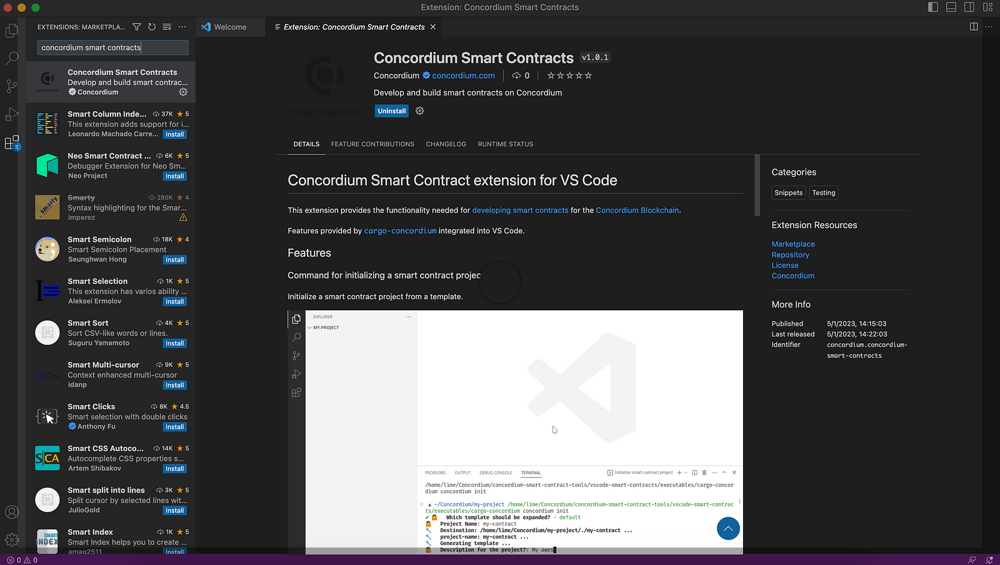
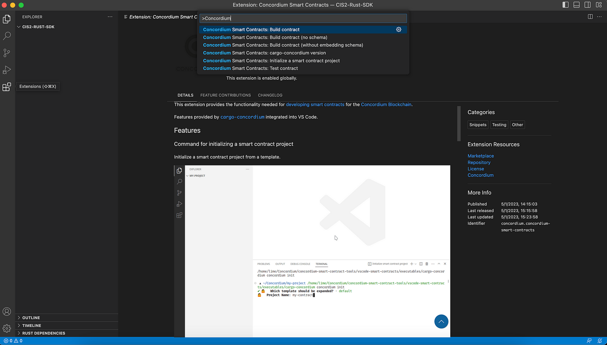
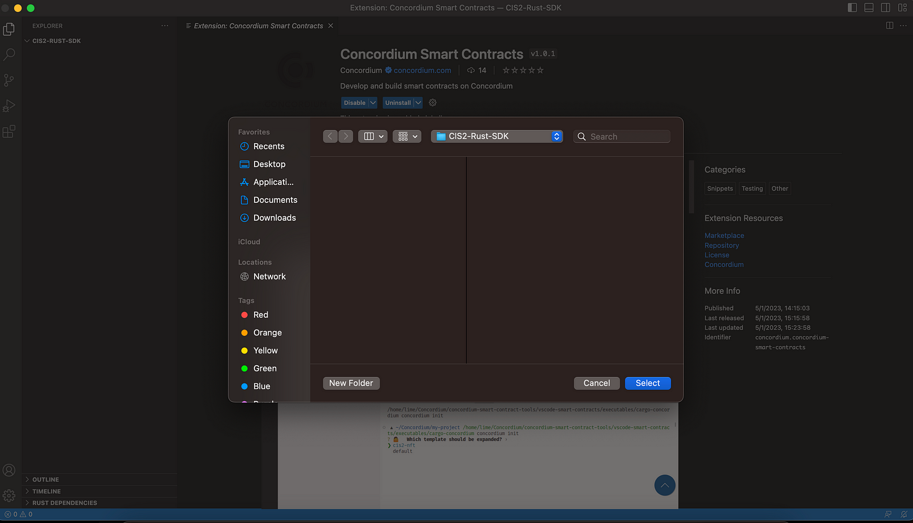
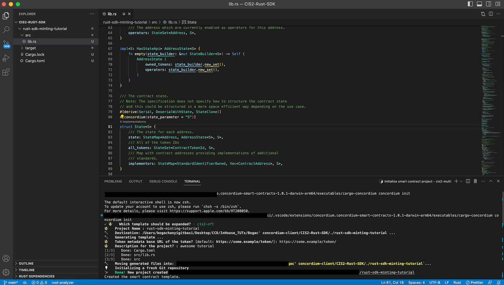
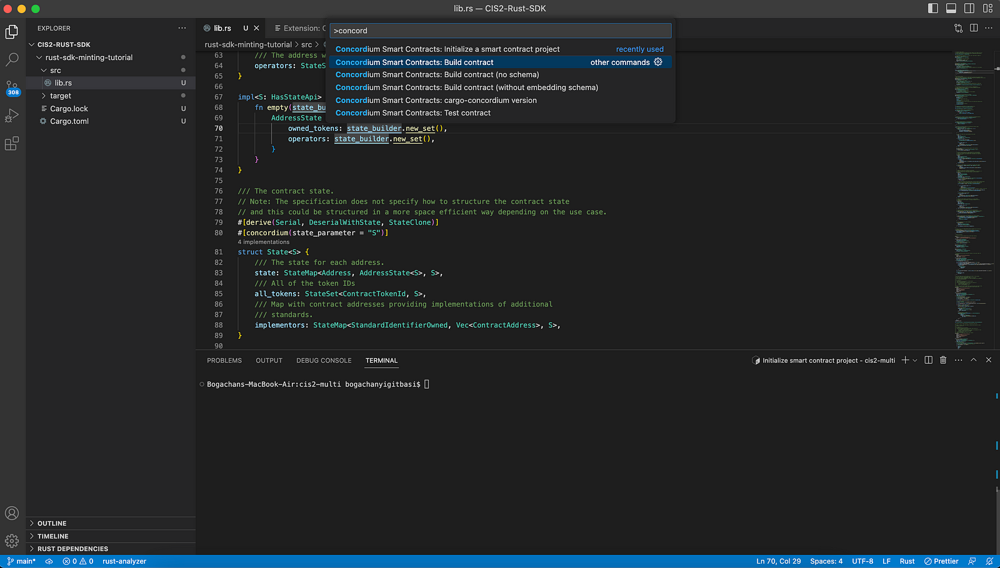

.. _smart-contract-template:

==============================================================
Generate a smart contract with the Concordium VSCode extension
==============================================================

Concordium has a direct extension on VSCode that allows you to set up your projects easily within minutes. Use the search in VSCode to find it and click **Install** and then click **Enable**.

Create the project using the VSCode extension. Open VSCode’s Command Palette and start typing Concordium; you see the list of applicable commands. By default, you can open the command palette using the shortcuts below.

* macOS: Command+Shift+P
* Windows: Ctrl+Shift+P
* Linux: Ctrl+Shift+P

Select **Initialize a smart contract project** and click your folder to set up your project.

Then you will have two template options, including cis2-nft and default. Continue with **cis2-nft**. Give your project a name, specify a URL of your token’s metadata, and add a description.

Now build it. Open the Command Palette again, and select **Build contract**. Note that this option will build your contract and embed your schema in the module.

You can find the module file in the created folder called **concordium-out**.

.. image:: ../../images/mid-vscode-ext6.png
    :alt: visual studio code extension showing build finished
