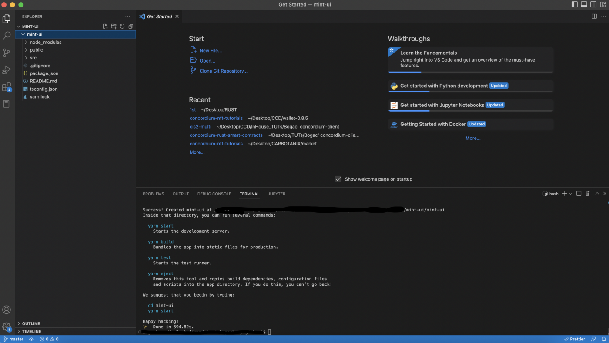
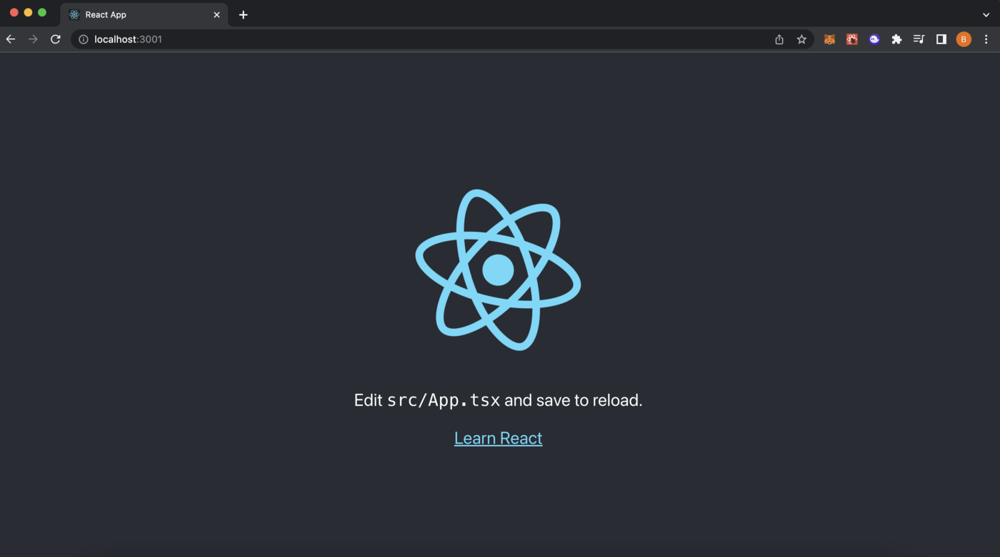
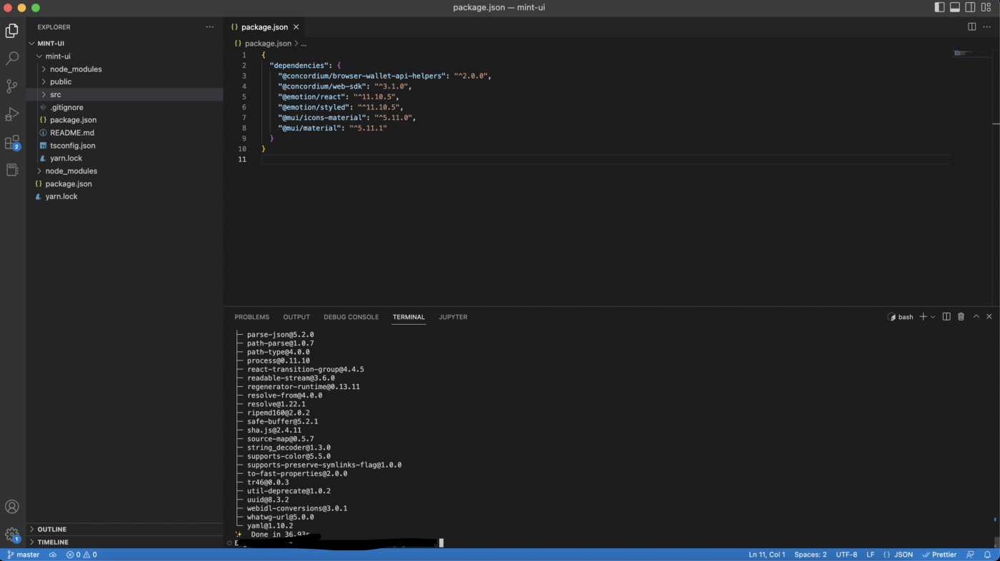
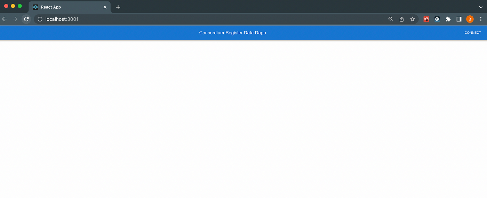
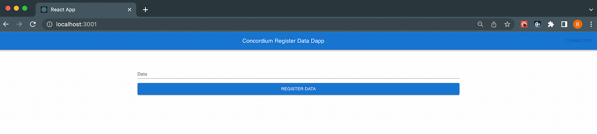
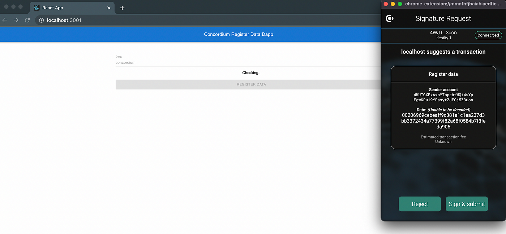
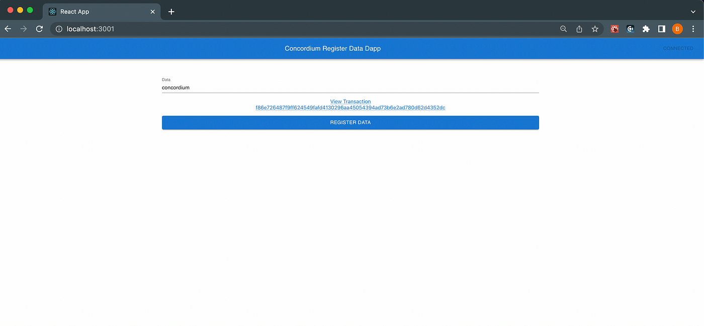
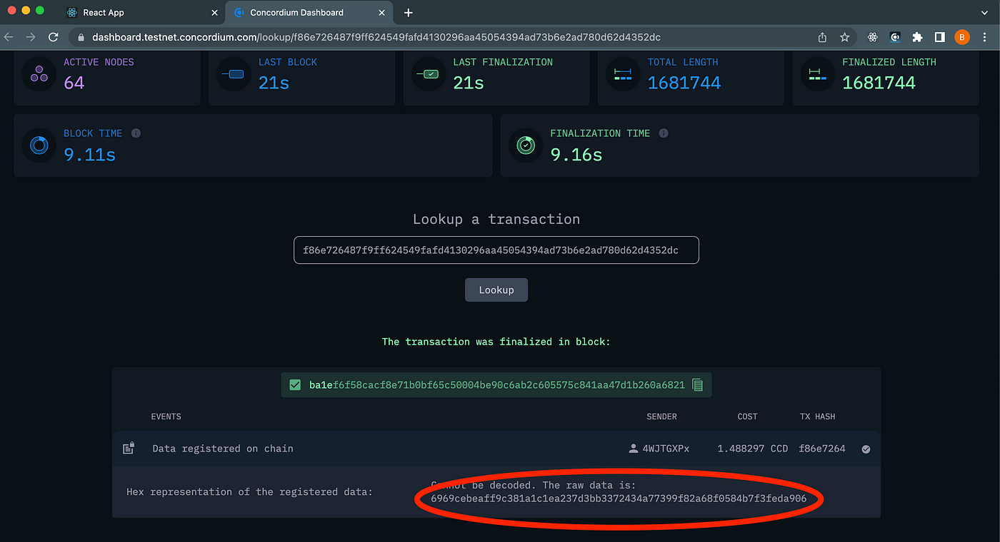
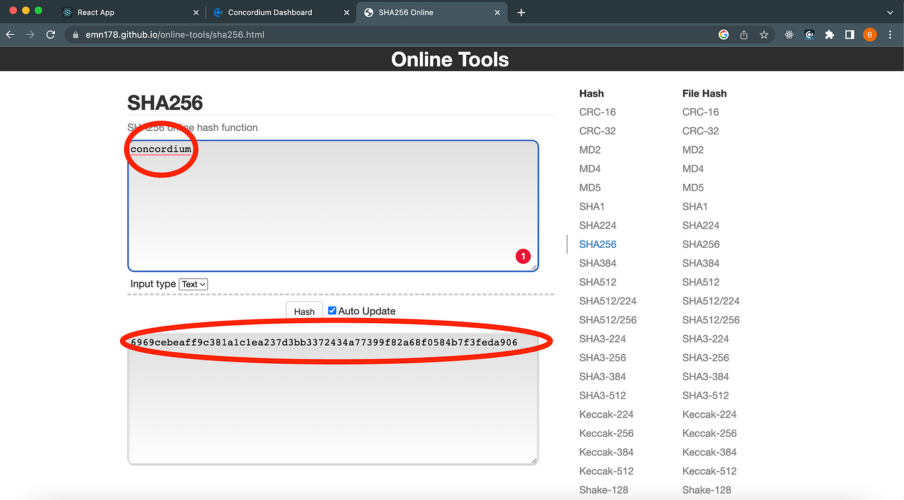

.. _register-data:
.. include:: ../../mainnet/variables.rst

======================
Register Data On-Chain
======================

In this tutorial, you will implement a very basic React application that can connect to the Concordium blockchain. It will not have any smart contract development and/or interaction, and does not even run a node. Concordium provides a very special transaction type to store data on-chain without even coding a smart contract. The simplest use case could be, for example, if you would like to make sure that a data’s integrity is not tampered with, then you can store that data’s hash on-chain and verify it later!

React Project
=============

First, set up a working directory for our dApp and then create an empty react project from the template inside it. The tutorial assumes you already have `yarn` installed in your system and have a text editor. This tutorial uses `vscode` but you can use any code editor. To create a React project run the following command:

.. code-block:: console

    yarn create react-app register-data-dapp --template typescript

It will take some time to fetch and install all packages and dependencies, and when it’s all done you will have something similar to the below.

And when you run it you will see the template application interface.

You will start from scratch with an empty React application that is bootstrapped from a React template and will be using *material-ui*. You will add the dependencies for some React components from *material-ui* and necessary libraries from concordium-web-sdk and concordium-web-wallet-helper. To do that, run the command below and yarn will install all specified packages.

.. code-block:: console

    yarn add @mui/material @emotion/react @mui/icons-material @emotion/styled @concordium/web-sdk @concordium/browser-wallet-api-helpers

Once complete, it creates a **package.json** file that includes all dependencies in it.

Header component
----------------

Create a file called **Header.tsx** that will have a button and handle ``connect()`` to the |bw| and paste the code below into the file.

.. code-block:: console

    import {
    detectConcordiumProvider,
    WalletApi,
    } from "@concordium/browser-wallet-api-helpers";
    import { AppBar, Toolbar, Typography, Button } from "@mui/material";
    import { useState } from "react";
    export default function Header(props: {
    onConnected: (provider: WalletApi, account: string) => void;
    onDisconnected: () => void;
    }) {
    const [isConnected, setConnected] = useState(false);
    function connect() {
    detectConcordiumProvider()
    .then((provider) => {
        provider
        .connect()
        .then((account) => {
        setConnected(true);
        props.onConnected(provider, account!);
        })
        .catch((_) => {
        alert("Please allow wallet connection");
        setConnected(false);
        });
        provider.removeAllListeners();
        provider.on("accountDisconnected", () => {
        setConnected(false);
        props.onDisconnected();
        });
        provider.on("accountChanged", (account) => {
        props.onDisconnected();
        props.onConnected(provider, account);
        setConnected(true);
        });
        provider.on("chainChanged", () => {
        props.onDisconnected();
        setConnected(false);
        });
    })
    .catch((_) => {
        console.error(`could not find provider`);
        alert("Please download Concordium Wallet for Web");
    });
    }
    return (
    <AppBar>
    <Toolbar>
        <Typography variant="h6" component="div" sx={{ flexGrow: 1 }}>
        Concordium Register Data
        </Typography>
        <Button color="inherit" onClick={connect} disabled={isConnected}>
        {isConnected ? "Connected" : "Connect"}
        </Button>
    </Toolbar>
    </AppBar>
    );
    }

Register component
------------------

Now create another file called **Register.tsx**. This component will take input from the user with a text box, calculate its SHA-256, and store it on-chain with a very simple and special type of transaction called ``registerData``.

.. code-block:: console

    import { detectConcordiumProvider } from "@concordium/browser-wallet-api-helpers";
    import {
    AccountTransactionType,
    DataBlob,
    RegisterDataPayload,
    sha256,
    } from "@concordium/web-sdk";
    import { Button, Link, Stack, TextField, Typography } from "@mui/material";
    import { FormEvent, useState } from "react";
    import { Buffer } from "buffer/";

    export default function RegisterData() {
    let [state, setState] = useState({
    checking: false,
    error: "",
    hash: "",
    });

    const submit = async (event: FormEvent<HTMLFormElement>) => {
    event.preventDefault();
    setState({ ...state, error: "", checking: true, hash: "" });
    const formData = new FormData(event.currentTarget);

    var formValues = {
    data: formData.get("data")?.toString() ?? "",
    };

    if (!formValues.data) {
    setState({ ...state, error: "Invalid Data" });
    return;
    }

    const provider = await detectConcordiumProvider();
    const account = await provider.connect();

    if (!account) {
    alert("Please connect");
    }

    try {
    const txnHash = await provider.sendTransaction(
        account!,
        AccountTransactionType.RegisterData,
        {
        data: new DataBlob(sha256([Buffer.from(formValues.data)])),
        } as RegisterDataPayload
    );

    setState({ checking: false, error: "", hash: txnHash });
    } catch (error: any) {
    setState({ checking: false, error: error.message || error, hash: "" });
    }
    };

    return (
    <Stack
    component={"form"}
    spacing={2}
    onSubmit={submit}
    autoComplete={"true"}
    >
    <TextField
        id="data"
        name="data"
        label="Data"
        variant="standard"
        disabled={state.checking}
    />
    {state.error && (
        <Typography component="div" color="error">
        {state.error}
        </Typography>
    )}
    {state.checking && <Typography component="div">Checking..</Typography>}
    {state.hash && (
        <Link
        href={`https://dashboard.testnet.concordium.com/lookup/${state.hash}`}
        target="_blank"
        >
        View Transaction  
        {state.hash}
        </Link>
    )}
    <Button
        type="submit"
        variant="contained"
        fullWidth
        size="large"
        disabled={state.checking}
    >
        Register Data
    </Button>
    </Stack>
    );
    }

Specifically, zoom in on a part of the code shown below. There are two important parts where you need to be careful: first, the connection with the wallet, and second, the transaction parameters. To make sure these are provided, add a control that checks if the wallet is already connected successfully. Then, you need to give the data as a parameter to the ``AccountTransactionType.RegisterData`` transaction. (convert it to sha256) Keep the returning transaction hash (_txnHash)_ to verify our transaction’s state and what it entails.

.. code-block:: console

    const provider = await detectConcordiumProvider();
    const account = await provider.connect();

    if (!account) {
    alert("Please connect");
    }

    try {
    const txnHash = await provider.sendTransaction(
        account!,
        AccountTransactionType.RegisterData,
        {
        data: new DataBlob(sha256([Buffer.from(formValues.data)])),
        } as RegisterDataPayload
    );

    setState({ checking: false, error: "", hash: txnHash });
    } catch (error: any) {
    setState({ checking: false, error: error.message || error, hash: "" });
    }
    };

Open the **App.tsx** file and paste the code below into the file. You are calling these two components from the application’s main function.

.. code-block:: console

    import "./App.css";
    import Header from "./Header";
    import { useState } from "react";
    import { Container } from "@mui/material";
    import RegisterData from "./RegisterData";

    export default function App() {
    const [isConnected, setConnected] = useState(false);

    return (
    

    <Header
        onConnected={() => setConnected(true)}
        onDisconnected={() => setConnected(false)}
    />
    <Container sx={{ mt: 15 }}>{isConnected && <RegisterData />}</Container>
    

    );
    }

If everything is correct, you should see something similar to below.

Connect it and you will have:

Fill it in with the string `concordium` and click **REGISTER DATA**.

The application will print the ``TxnHash`` value for you to track on the block explorer. Click that to verify it.

It redirects you to that partciular block in CCDScan.

If you want to compare the data you stored in the Concordium SHA-256 version, you can use `this online tool <https://emn178.github.io/online-tools/sha256.html>`_ to calculate any text’s SHA-256.

As expected, those two values are matched! Step back for one second and think about what you implemented with this dApp. What you have done is store proof of data on-chain and allow everybody who wants to check that your data’s integrity is preserved or not can go and verify it by looking at this brilliant decentralized network. It is stored on-chain now and no one can change it. Full code can be found `here <https://github.com/bogacyigitbasi/registerdata>`_.
