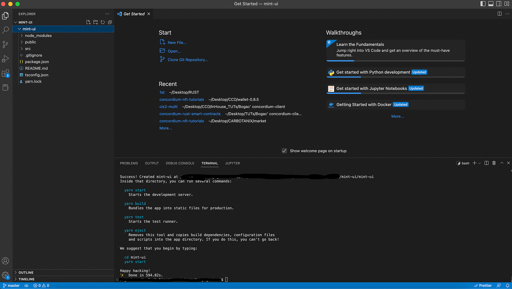
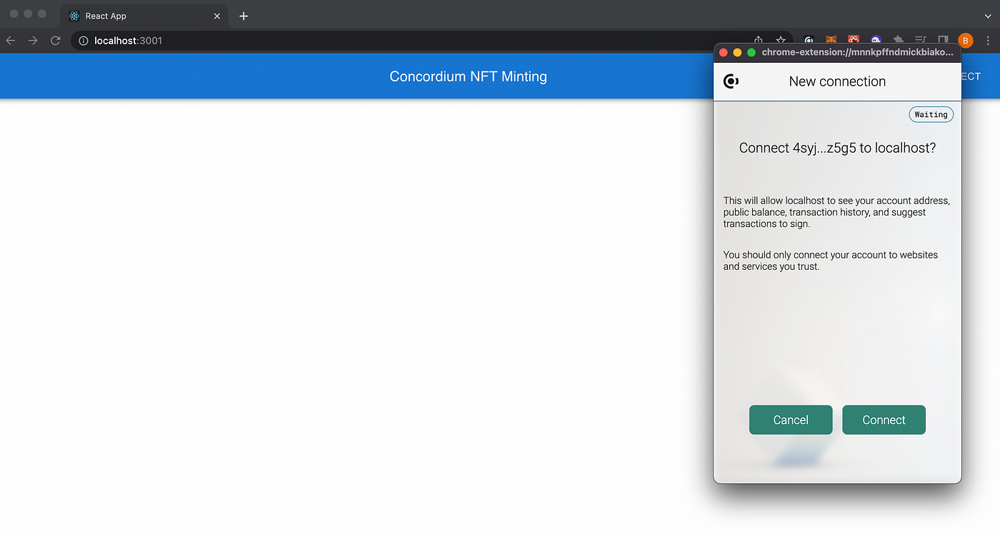
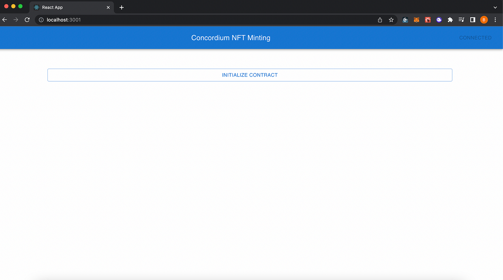
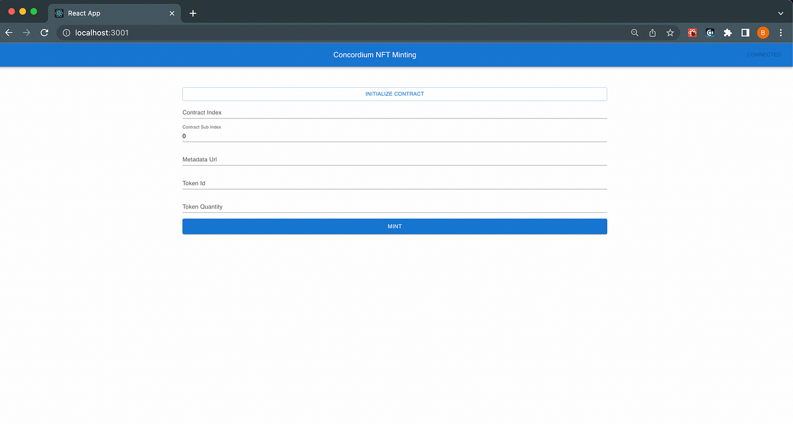

.. _simple-nft-dapp:
.. include:: ../../mainnet/variables.rst

===================
Simple minting dApp
===================

In this tutorial, you are going to implement a very basic NFT Minting dApp that can connect to the Concordium. The application will include three buttons: one to connect it to the web wallet, one to initialize the contract, and the third to mint the NFT. You will learn how to connect your dApp to the Concordium blockchain and how you can invoke a function from an already deployed smart contract.

You will start from scratch with an empty React application that is bootstrapped from a React template and will be using *material-ui*. Within this very basic application, there will be three components for minting, initializing, and connecting the wallet. It is assumed you already set up your development environment and wallet so there will be no explanation about those steps. For that, you can check :ref:`the other tutorials<sc-tutorials>`.

React project
=============

First, set up a working directory for your dApp and then create an empty React project from the template inside it. This assumes you already have *yarn* installed and have a text editor (VSCode is used in this tutorial). To create a React project, run the command below.

.. code-block:: console

   npx create-react-app <YOUR-DAPP-NAME> --template typescript

It will take some time to fetch and install all packages and dependencies, and when it’s all done you will have something simliar to below.

And when you run it you will see the template application interface.

.. image:: ../images/beg-minting-dapp2.png
    :alt: web browser tab with application interface

Then you will add the dependencies for some React components from *material-ui* and necessary libraries from *concordium-web-sdk* and *concordium-web-wallet-helper*. To do that, run the command below and *yarn* will install all specified packages.

.. code-block:: console

   yarn add @mui/material @emotion/react @mui/icons-material @emotion/styled @concordium/web-sdk @concordium/browser-wallet-api-helpers

Once you complete that, it will create a **package.json** file that includes all dependencies in it.

.. image:: ../images/beg-minting-dapp3.png
    :alt: visual studio code window in dark mode with package.json file open

Header component
----------------

Create a file called **Header.tsx** that will have a button and handle the ``connect()`` to the |bw| and paste the code below into the file.

.. code-block:: console

   import {
   detectConcordiumProvider,
   WalletApi,
   } from "@concordium/browser-wallet-api-helpers";
   import { AppBar, Toolbar, Typography, Button } from "@mui/material";
   import { useState } from "react";

   export default function Header(props: {
   onConnected: (provider: WalletApi, account: string) => void;
   onDisconnected: () => void;
   }) {
   const [isConnected, setConnected] = useState(false);

   function connect() {
   detectConcordiumProvider()
      .then((provider) => {
      provider
      .connect()
      .then((account) => {
         setConnected(true);
         props.onConnected(provider, account!);
      })
      .catch((_) => {
         alert("Please allow wallet connection");
         setConnected(false);
      });
      provider.removeAllListeners();
      provider.on("accountDisconnected", () => {
      setConnected(false);
      props.onDisconnected();
      });
      provider.on("accountChanged", (account) => {
      props.onDisconnected();
      props.onConnected(provider, account);
      setConnected(true);
      });
      provider.on("chainChanged", () => {
      props.onDisconnected();
      setConnected(false);
      });
      })
      .catch((_) => {
      console.error(`could not find provider`);
      alert("Please download Concordium Wallet");
      });
   }

   return (
   <AppBar>
      <Toolbar>
      <Typography variant="h6" component="div" sx={{ flexGrow: 1 }}>
      Concordium NFT Minting
      </Typography>
      <Button color="inherit" onClick={connect} disabled={isConnected}>
      {isConnected ? "Connected" : "Connect"}
      </Button>
      </Toolbar>
   </AppBar>
   );
   }

Call the **Header.tsx** component from the **App.tsx** instead of its default values. If you don't already have the |bw| installed you can :ref:`download and set it up<setup-browser-wallet>`. You are almost ready to test your **Connect** button!

.. image:: ../images/beg-minting-dapp4.png
    :alt: web browser tab with application interface waiting to connect

When you click **CONNECT**, a pop-up window opens and asks you to confirm that you’d like to connect to this application.

See how easy it is to connect an application with Concordium!

Now, add more to your dApp. Minting functionality! Remember that in order to call a contract you should have the contract implemented in Rust and deployed on the chain using ``concordium-client``. For information about how to do this, see the :ref:`tutorials<sc-tutorials>`. When you deploy a contract, Concordium gives you a module reference which is a unique hash value. You need that because you are going to invoke that contract from your brand new dApp!

Initialize Component
--------------------

Create another component called **Initialize.tsx**. Using this you will invoke the ``init()_`` function of your deployed CIS-2 NFT contract. You are definitely free (and encouraged) to deploy your *own* contract but you can also use the Concordium CIS-2 template contract. Because remember this data structure is public, transparent, and decentralized. The whole point is to be able to use secure and safe contracts. It is fine to use the new instance of a well-known contract, like the CIS2 template, as you will be the owner of it when you create a new instance.

Concordium strongly suggests you use environment variables to store sensitive values but please do not push sensitive data publicly for any reason to your GitHub repos as well!

.. code-block:: console

   import { detectConcordiumProvider } from "@concordium/browser-wallet-api-helpers";
   import {
   AccountTransactionType,
   CcdAmount,
   InitContractPayload,
   ModuleReference,
   } from "@concordium/web-sdk";
   import { Button, Link } from "@mui/material";
   import { Buffer } from "buffer/";
   import { useState } from "react";

   export default function Initialize() {

   const [hash, setHash] = useState("");

   const initialize = async () => {
   const provider = await detectConcordiumProvider();
   const account = await provider.connect();

   if (!account) {
      alert("Please connect");
   }
   var REACT_APP_CONTRACT_NAME="CIS2-Multi";
   var REACT_APP_MODULE_REF="312f99d6406868e647359ea816e450eac0ecc4281c2665a24936e6793535c9f6";
   const txnHash = await provider.sendTransaction(
      account!,
      AccountTransactionType.InitContract,
      {
      amount: new CcdAmount(BigInt(0)),
      initName: REACT_APP_CONTRACT_NAME,//process.env.REACT_APP_CONTRACT_NAME!,
      moduleRef: new ModuleReference(REACT_APP_MODULE_REF), //new ModuleReference(process.env.REACT_APP_MODULE_REF!),
      param: Buffer.alloc(0),
      maxContractExecutionEnergy: BigInt(9999),
      } as InitContractPayload
   );

   setHash(txnHash);
   };

   return hash ? (
   <Link
      href={`https://dashboard.testnet.concordium.com/lookup/${hash}`}
      target="_blank"
   >
      View Transaction  
      {hash}
   </Link>
   ) : (
   <Button fullWidth variant="outlined" onClick={initialize}>
      Initialize Contract
   </Button>
   );
   }

Call your new component from **App.tsx**. This time you are going to add some UI logic with ``useState``. The activity will depend on whether the wallet is connected.

.. code-block:: console

   import "./App.css";
   import Header from "./Header";
   import Initialize from "./Initialize";
   import { useState } from "react";
   import { Container } from "@mui/material";
   export default function App() {
   const [isConnected, setConnected] = useState(false);
   return (
   

      <Header
         onConnected={() => setConnected(true)}
         onDisconnected={() => setConnected(false)}
      />

         <Container sx={{ mt: 15 }}>
      {isConnected && <Initialize/>}
      </Container>

   

   );
   }

   }

After these changes, the application will look similar to below. Click **INITIALIZE CONTRACT**. A pop up appears in the |bw| to create a new instance.

Minting Component
-----------------

Create a **Mint.tsx** file and paste the code below. It may look a bit longer than expected by looking at the first glance but most of it does validation checks of the necessary inputs for the data that will be read out from the form while minting the NFT.

.. code-block:: console

   import { detectConcordiumProvider } from "@concordium/browser-wallet-api-helpers";
   import {
   AccountTransactionType,
   CcdAmount,
   serializeUpdateContractParameters,
   UpdateContractPayload,
   } from "@concordium/web-sdk";
   import { Button, Link, Stack, TextField, Typography } from "@mui/material";
   import { FormEvent, useState } from "react";
   import { Buffer } from "buffer/";

   export default function Mint() {
   let [state, setState] = useState({
   checking: false,
   error: "",
   hash: "",
   });

   const submit = async (event: FormEvent<HTMLFormElement>) => {
   event.preventDefault();
   setState({ ...state, error: "", checking: true, hash: "" });
   const formData = new FormData(event.currentTarget);

   var formValues = {
      index: BigInt(formData.get("contractIndex")?.toString() || "-1"),
      subindex: BigInt(formData.get("contractSubindex")?.toString() || "-1"),
      metadataUrl: formData.get("metadataUrl")?.toString() || "",
      tokenId: formData.get("tokenId")?.toString() || "",
      quantity: parseInt(formData.get("quantity")?.toString() || "-1"),
   };

   if (!(formValues.index >= 0)) {
      setState({ ...state, error: "Invalid Contract Index" });
      return;
   }

   if (!(formValues.subindex >= 0)) {
      setState({ ...state, error: "Invalid Contract Subindex" });
      return;
   }

   if (!(formValues.quantity >= 0)) {
      setState({ ...state, error: "Invalid Quantity" });
      return;
   }

   if (!formValues.metadataUrl) {
      setState({ ...state, error: "Invalid Metadata Url" });
      return;
   }

   if (!formValues.tokenId) {
      setState({ ...state, error: "Invalid Token Id" });
      return;
   }

   const provider = await detectConcordiumProvider();
   const account = await provider.connect();

   if (!account) {
      alert("Please connect");
   }

   const address = { index: formValues.index, subindex: formValues.subindex };
   const paramJson = {
      owner: {
      Account: [account],
      },
      tokens: [
      [
      formValues.tokenId,
      [
         {
         url: formValues.metadataUrl,
         hash: "",
         },
         formValues.quantity.toString(),
      ],
      ],
      ],
   };

         var REACT_APP_CONTRACT_NAME="CIS2-Multi";
         var REACT_APP_CONTRACT_SCHEMA="FFFF02010000000A000000434953322D4D756C7469000A0000000900000062616C616E63654F6606100114000200000008000000746F6B656E5F69641D0007000000616464726573731502000000070000004163636F756E7401010000000B08000000436F6E747261637401010000000C10011B2500000015040000000E000000496E76616C6964546F6B656E49640211000000496E73756666696369656E7446756E6473020C000000556E617574686F72697A65640206000000437573746F6D010100000015060000000B0000005061727365506172616D7302070000004C6F6746756C6C020C0000004C6F674D616C666F726D65640213000000496E76616C6964436F6E74726163744E616D65020C000000436F6E74726163744F6E6C790213000000496E766F6B65436F6E74726163744572726F7202040000006D696E7404140002000000050000006F776E65721502000000070000004163636F756E7401010000000B08000000436F6E747261637401010000000C06000000746F6B656E7312021D000F1400020000000300000075726C1601040000006861736816011B2500000015040000000E000000496E76616C6964546F6B656E49640211000000496E73756666696369656E7446756E6473020C000000556E617574686F72697A65640206000000437573746F6D010100000015060000000B0000005061727365506172616D7302070000004C6F6746756C6C020C0000004C6F674D616C666F726D65640213000000496E76616C6964436F6E74726163744E616D65020C000000436F6E74726163744F6E6C790213000000496E766F6B65436F6E74726163744572726F72020F0000006F6E526563656976696E67434953320315040000000E000000496E76616C6964546F6B656E49640211000000496E73756666696369656E7446756E6473020C000000556E617574686F72697A65640206000000437573746F6D010100000015060000000B0000005061727365506172616D7302070000004C6F6746756C6C020C0000004C6F674D616C666F726D65640213000000496E76616C6964436F6E74726163744E616D65020C000000436F6E74726163744F6E6C790213000000496E766F6B65436F6E74726163744572726F72020A0000006F70657261746F724F66061001140002000000050000006F776E65721502000000070000004163636F756E7401010000000B08000000436F6E747261637401010000000C07000000616464726573731502000000070000004163636F756E7401010000000B08000000436F6E747261637401010000000C10010115040000000E000000496E76616C6964546F6B656E49640211000000496E73756666696369656E7446756E6473020C000000556E617574686F72697A65640206000000437573746F6D010100000015060000000B0000005061727365506172616D7302070000004C6F6746756C6C020C0000004C6F674D616C666F726D65640213000000496E76616C6964436F6E74726163744E616D65020C000000436F6E74726163744F6E6C790213000000496E766F6B65436F6E74726163744572726F72020F000000736574496D706C656D656E746F72730414000200000002000000696416000C000000696D706C656D656E746F727310020C15040000000E000000496E76616C6964546F6B656E49640211000000496E73756666696369656E7446756E6473020C000000556E617574686F72697A65640206000000437573746F6D010100000015060000000B0000005061727365506172616D7302070000004C6F6746756C6C020C0000004C6F674D616C666F726D65640213000000496E76616C6964436F6E74726163744E616D65020C000000436F6E74726163744F6E6C790213000000496E766F6B65436F6E74726163744572726F720208000000737570706F727473061001160010011503000000090000004E6F537570706F72740207000000537570706F72740209000000537570706F72744279010100000010000C15040000000E000000496E76616C6964546F6B656E49640211000000496E73756666696369656E7446756E6473020C000000556E617574686F72697A65640206000000437573746F6D010100000015060000000B0000005061727365506172616D7302070000004C6F6746756C6C020C0000004C6F674D616C666F726D65640213000000496E76616C6964436F6E74726163744E616D65020C000000436F6E74726163744F6E6C790213000000496E766F6B65436F6E74726163744572726F72020D000000746F6B656E4D657461646174610610011D0010011400020000000300000075726C160104000000686173681502000000040000004E6F6E650204000000536F6D65010100000013200000000215040000000E000000496E76616C6964546F6B656E49640211000000496E73756666696369656E7446756E6473020C000000556E617574686F72697A65640206000000437573746F6D010100000015060000000B0000005061727365506172616D7302070000004C6F6746756C6C020C0000004C6F674D616C666F726D65640213000000496E76616C6964436F6E74726163744E616D65020C000000436F6E74726163744F6E6C790213000000496E766F6B65436F6E74726163744572726F7202080000007472616E7366657204100114000500000008000000746F6B656E5F69641D0006000000616D6F756E741B250000000400000066726F6D1502000000070000004163636F756E7401010000000B08000000436F6E747261637401010000000C02000000746F1502000000070000004163636F756E7401010000000B08000000436F6E747261637401020000000C160104000000646174611D0115040000000E000000496E76616C6964546F6B656E49640211000000496E73756666696369656E7446756E6473020C000000556E617574686F72697A65640206000000437573746F6D010100000015060000000B0000005061727365506172616D7302070000004C6F6746756C6C020C0000004C6F674D616C666F726D65640213000000496E76616C6964436F6E74726163744E616D65020C000000436F6E74726163744F6E6C790213000000496E766F6B65436F6E74726163744572726F72020E0000007570646174654F70657261746F720410011400020000000600000075706461746515020000000600000052656D6F7665020300000041646402080000006F70657261746F721502000000070000004163636F756E7401010000000B08000000436F6E747261637401010000000C15040000000E000000496E76616C6964546F6B656E49640211000000496E73756666696369656E7446756E6473020C000000556E617574686F72697A65640206000000437573746F6D010100000015060000000B0000005061727365506172616D7302070000004C6F6746756C6C020C0000004C6F674D616C666F726D65640213000000496E76616C6964436F6E74726163744E616D65020C000000436F6E74726163744F6E6C790213000000496E766F6B65436F6E74726163744572726F720204000000766965770114000200000005000000737461746510020F1502000000070000004163636F756E7401010000000B08000000436F6E747261637401010000000C1400020000000800000062616C616E63657310020F1D001B25000000090000006F70657261746F727310021502000000070000004163636F756E7401010000000B08000000436F6E747261637401010000000C06000000746F6B656E7310021D00";

   try {
      const schemaBuffer = Buffer.from(
      REACT_APP_CONTRACT_SCHEMA!,
      "hex"
      );
      const serializedParams = serializeUpdateContractParameters(
      process.env.REACT_APP_CONTRACT_NAME!,
      "mint",
      paramJson,
      schemaBuffer
      );
      const txnHash = await provider.sendTransaction(
      account!,
      AccountTransactionType.Update,
      {
      address,
      message: serializedParams,
      receiveName: `${REACT_APP_CONTRACT_NAME!}.mint`,
      amount: new CcdAmount(BigInt(0)),
      maxContractExecutionEnergy: BigInt(9999),
      } as UpdateContractPayload,
      paramJson,
      schemaBuffer.toString("base64")
      );

      setState({ checking: false, error: "", hash: txnHash });
   } catch (error: any) {
      setState({ checking: false, error: error.message || error, hash: "" });
   }
   };

   return (
   <Stack
      component={"form"}
      spacing={2}
      onSubmit={submit}
      autoComplete={"true"}
   >
      <TextField
      id="contract-index"
      name="contractIndex"
      label="Contract Index"
      variant="standard"
      type={"number"}
      disabled={state.checking}
      />
      <TextField
      id="contract-subindex"
      name="contractSubindex"
      label="Contract Sub Index"
      variant="standard"
      type={"number"}
      disabled={state.checking}
      value={0}
      />
      <TextField
      id="metadata-url"
      name="metadataUrl"
      label="Metadata Url"
      variant="standard"
      disabled={state.checking}
      />
      <TextField
      id="token-id"
      name="tokenId"
      label="Token Id"
      variant="standard"
      disabled={state.checking}
      defaultValue="01"
      />
      <TextField
      id="quantity"
      name="quantity"
      label="Token Quantity"
      variant="standard"
      type="number"
      disabled={state.checking}
      defaultValue="1"
      />
      {state.error && (
      <Typography component="div" color="error">
      {state.error}
      </Typography>
      )}
      {state.checking && <Typography component="div">Checking..</Typography>}
      {state.hash && (
      <Link
      href={`https://dashboard.testnet.concordium.com/lookup/${state.hash}`}
      target="_blank"
      >
      View Transaction  
      {state.hash}
      </Link>
      )}
      <Button
      type="submit"
      variant="contained"
      fullWidth
      size="large"
      disabled={state.checking}
      >
      Mint
      </Button>
   </Stack>
   );
   }

In the function above there are two important parts you need to be careful about: first, the connection with the wallet, and second, the transaction parameters. To make sure these are provided, add a control that checks if the wallet is already connected successfully.

Then you need to create the parameters based on the form data, which will be the inputs of your minting function, like ``address``, ``_paramJson``, ``schemaBuffer``, and ``serializedParams``. All of these will be your parameters while invoking the ``mint()`` function with ``provider.sendTransaction()``.

.. code-block:: console

   const provider = await detectConcordiumProvider();
   const account = await provider.connect();

   if (!account) {
      alert("Please connect");
   }

   const address = { index: formValues.index, subindex: formValues.subindex };
   const paramJson = {
      owner: {
      Account: [account],
      },
      tokens: [
      [
      formValues.tokenId,
      [
         {
         url: formValues.metadataUrl,
         hash: "",
         },
         formValues.quantity.toString(),
      ],
      ],
      ],
   };

   var REACT_APP_CONTRACT_NAME="CIS2-Multi";
   var REACT_APP_CONTRACT_SCHEMA="FFFF02010000000A000000434953322D4D756C7469000A0000000900000062616C616E63654F6606100114000200000008000000746F6B656E5F69641D0007000000616464726573731502000000070000004163636F756E7401010000000B08000000436F6E747261637401010000000C10011B2500000015040000000E000000496E76616C6964546F6B656E49640211000000496E73756666696369656E7446756E6473020C000000556E617574686F72697A65640206000000437573746F6D010100000015060000000B0000005061727365506172616D7302070000004C6F6746756C6C020C0000004C6F674D616C666F726D65640213000000496E76616C6964436F6E74726163744E616D65020C000000436F6E74726163744F6E6C790213000000496E766F6B65436F6E74726163744572726F7202040000006D696E7404140002000000050000006F776E65721502000000070000004163636F756E7401010000000B08000000436F6E747261637401010000000C06000000746F6B656E7312021D000F1400020000000300000075726C1601040000006861736816011B2500000015040000000E000000496E76616C6964546F6B656E49640211000000496E73756666696369656E7446756E6473020C000000556E617574686F72697A65640206000000437573746F6D010100000015060000000B0000005061727365506172616D7302070000004C6F6746756C6C020C0000004C6F674D616C666F726D65640213000000496E76616C6964436F6E74726163744E616D65020C000000436F6E74726163744F6E6C790213000000496E766F6B65436F6E74726163744572726F72020F0000006F6E526563656976696E67434953320315040000000E000000496E76616C6964546F6B656E49640211000000496E73756666696369656E7446756E6473020C000000556E617574686F72697A65640206000000437573746F6D010100000015060000000B0000005061727365506172616D7302070000004C6F6746756C6C020C0000004C6F674D616C666F726D65640213000000496E76616C6964436F6E74726163744E616D65020C000000436F6E74726163744F6E6C790213000000496E766F6B65436F6E74726163744572726F72020A0000006F70657261746F724F66061001140002000000050000006F776E65721502000000070000004163636F756E7401010000000B08000000436F6E747261637401010000000C07000000616464726573731502000000070000004163636F756E7401010000000B08000000436F6E747261637401010000000C10010115040000000E000000496E76616C6964546F6B656E49640211000000496E73756666696369656E7446756E6473020C000000556E617574686F72697A65640206000000437573746F6D010100000015060000000B0000005061727365506172616D7302070000004C6F6746756C6C020C0000004C6F674D616C666F726D65640213000000496E76616C6964436F6E74726163744E616D65020C000000436F6E74726163744F6E6C790213000000496E766F6B65436F6E74726163744572726F72020F000000736574496D706C656D656E746F72730414000200000002000000696416000C000000696D706C656D656E746F727310020C15040000000E000000496E76616C6964546F6B656E49640211000000496E73756666696369656E7446756E6473020C000000556E617574686F72697A65640206000000437573746F6D010100000015060000000B0000005061727365506172616D7302070000004C6F6746756C6C020C0000004C6F674D616C666F726D65640213000000496E76616C6964436F6E74726163744E616D65020C000000436F6E74726163744F6E6C790213000000496E766F6B65436F6E74726163744572726F720208000000737570706F727473061001160010011503000000090000004E6F537570706F72740207000000537570706F72740209000000537570706F72744279010100000010000C15040000000E000000496E76616C6964546F6B656E49640211000000496E73756666696369656E7446756E6473020C000000556E617574686F72697A65640206000000437573746F6D010100000015060000000B0000005061727365506172616D7302070000004C6F6746756C6C020C0000004C6F674D616C666F726D65640213000000496E76616C6964436F6E74726163744E616D65020C000000436F6E74726163744F6E6C790213000000496E766F6B65436F6E74726163744572726F72020D000000746F6B656E4D657461646174610610011D0010011400020000000300000075726C160104000000686173681502000000040000004E6F6E650204000000536F6D65010100000013200000000215040000000E000000496E76616C6964546F6B656E49640211000000496E73756666696369656E7446756E6473020C000000556E617574686F72697A65640206000000437573746F6D010100000015060000000B0000005061727365506172616D7302070000004C6F6746756C6C020C0000004C6F674D616C666F726D65640213000000496E76616C6964436F6E74726163744E616D65020C000000436F6E74726163744F6E6C790213000000496E766F6B65436F6E74726163744572726F7202080000007472616E7366657204100114000500000008000000746F6B656E5F69641D0006000000616D6F756E741B250000000400000066726F6D1502000000070000004163636F756E7401010000000B08000000436F6E747261637401010000000C02000000746F1502000000070000004163636F756E7401010000000B08000000436F6E747261637401020000000C160104000000646174611D0115040000000E000000496E76616C6964546F6B656E49640211000000496E73756666696369656E7446756E6473020C000000556E617574686F72697A65640206000000437573746F6D010100000015060000000B0000005061727365506172616D7302070000004C6F6746756C6C020C0000004C6F674D616C666F726D65640213000000496E76616C6964436F6E74726163744E616D65020C000000436F6E74726163744F6E6C790213000000496E766F6B65436F6E74726163744572726F72020E0000007570646174654F70657261746F720410011400020000000600000075706461746515020000000600000052656D6F7665020300000041646402080000006F70657261746F721502000000070000004163636F756E7401010000000B08000000436F6E747261637401010000000C15040000000E000000496E76616C6964546F6B656E49640211000000496E73756666696369656E7446756E6473020C000000556E617574686F72697A65640206000000437573746F6D010100000015060000000B0000005061727365506172616D7302070000004C6F6746756C6C020C0000004C6F674D616C666F726D65640213000000496E76616C6964436F6E74726163744E616D65020C000000436F6E74726163744F6E6C790213000000496E766F6B65436F6E74726163744572726F720204000000766965770114000200000005000000737461746510020F1502000000070000004163636F756E7401010000000B08000000436F6E747261637401010000000C1400020000000800000062616C616E63657310020F1D001B25000000090000006F70657261746F727310021502000000070000004163636F756E7401010000000B08000000436F6E747261637401010000000C06000000746F6B656E7310021D00";

   try {
      const schemaBuffer = Buffer.from(
      REACT_APP_CONTRACT_SCHEMA!,
      "hex"
      );
      const serializedParams = serializeUpdateContractParameters(
      REACT_APP_CONTRACT_NAME!,
      "mint",
      paramJson,
      schemaBuffer
      );
      const txnHash = await provider.sendTransaction(
      account!,
      AccountTransactionType.Update,
      {
      address,
      message: serializedParams,
      receiveName: `${REACT_APP_CONTRACT_NAME!}.mint`,
      amount: new CcdAmount(BigInt(0)),
      maxContractExecutionEnergy: BigInt(9999),
      } as UpdateContractPayload,
      paramJson,
      schemaBuffer.toString("base64")
      );

Don't forget to add your ``Mint`` component to the **App.tsx**.

.. code-block:: console

   <Container sx={{ mt: 15 }}>
      {isConnected && <Initialize/>}
      {isConnected && <Mint/>}
      </Container>

If everything goes well, you will have something similar to below.

Now try it! First, initialize your contract, and fill out the form with the necessary inputs. If you need some help with Metadata you can check :ref:`this tutorial<upload-nft>`.
