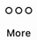

.. include:: ../../variables.rst
.. _change-mw-id-name:

====================
Change identity name
====================

.. dropdown:: |cryptox|

    #. Open *Wallet Settings* by tapping the gear icon in the lower right of the main screen.

    #. Tap **Identities**.

    #. Tap the identity you want to edit.

    #. On the identity card, tap the edit icon next to the identity name.

    #. Enter the new identity name and tap **Save**.

.. dropdown:: |bw|

    #. Open the menu and select ID Cards. If you have more than one identity, select the ID card you want to edit.

    #. Click **Edit Name** next to the identity name.

    #. Change the name and click **Save**.

.. |hamburger| image:: ../images/hamburger.png
             :alt: Three horizontal lines
             :width: 20px
.. |edit|    image:: ../images/edit.png
                    :width: 20px
                    :alt: small square with pencil
.. |save|    image:: ../images/save.png
                    :width: 20px
                    :alt: check mark

