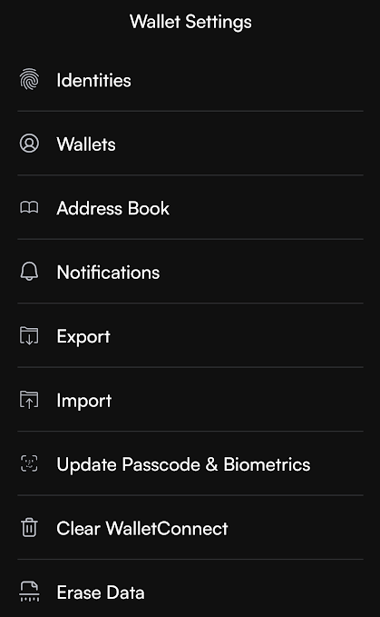
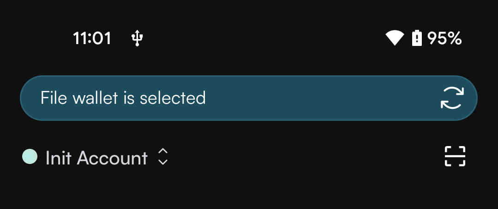
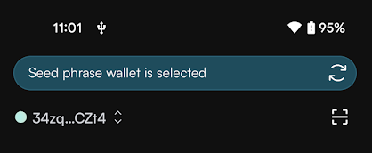
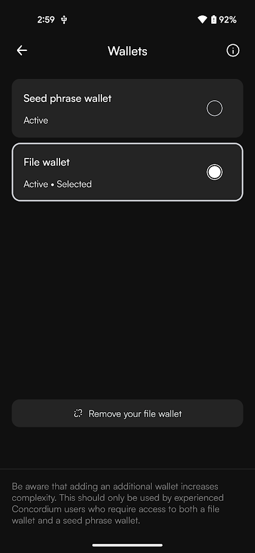

.. include:: ../../variables.rst
.. _import-export-file-wallet:

=========================
Import/export file wallet
=========================

|cryptox| offers you to import or export a backup file of your wallet.

Import or export file in a file based wallet
============================================

If you have :ref:`restored your wallet<backup-import-recover>` from a backup file, you have the import and export functions in the Wallet Settings (tap the gear icon in the lower right of the main screen to open Wallet Settings).

.. raw:: html

   

**To import a file:**

#. Tap **Import**.

#. Browse for the file to import.

#. Select the file and enter the password created when exporting the file. Tap **Continue**.

#. Enter your passcode to authorize the import.

#. Tap **OK**.

After successfully importing the file, you will have access to your identities and accounts from the |cryptox|.

**To export a file:**

#. Tap **Export**.

#. Read the information about backup and export on the Export screen and tap **Export**.

#. Enter your passcode.

#. Enter an export password.
   Remember to store the password securely. You will need it if you want to import your account later, e.g. if you need to recover it.

#. Confirm the export password.

#. Select a location for your exported file.

Add or remove file based wallet to a seed phrase wallet
=======================================================

If you have :ref:`set up your wallet<setup-concordium-wallet>` with a seed phrase or :ref:`restored your wallet<backup-import-recover>` from a seed phrase, you have the opportunity to also add a file based wallet and switch between the seed phrase wallet and the file wallet. Note, however, that you will not be able to create new accounts or identities in your file wallet.

You add the file wallet by navigating to the Wallets screen (tap the gear icon in the lower right of the main screen to open Wallet Settings, and then tap **Wallets**). Then proceed like this:

#. Tap **Add a file wallet**.

   .. image:: ../images/cryptoX/cryptox-add-file-wallet.png
      :width: 50%

#. Read the information about adding a file wallet and tap **Add wallet**.

#. Browse for the file to import.

#. Select the file and enter the password created when exporting the file. Tap **Continue**.

#. Enter your passcode to authorize the import.

#. Tap **OK**.

After importing the file wallet you can switch between this and the seed phrase wallet by tapping the blue banner at the top of the main screen.
The currently selected wallet will be active for all functions - any transactions, balance displays, and operations will apply to this wallet.

.. raw:: html

   

.. raw:: html

   

If you want to remove one of the wallets, you can also do this from the Wallets screen (tap the gear icon in the lower right of the main screen to open Wallet Settings, and then tap **Wallets**). The remove option will be available for the selected wallet.

