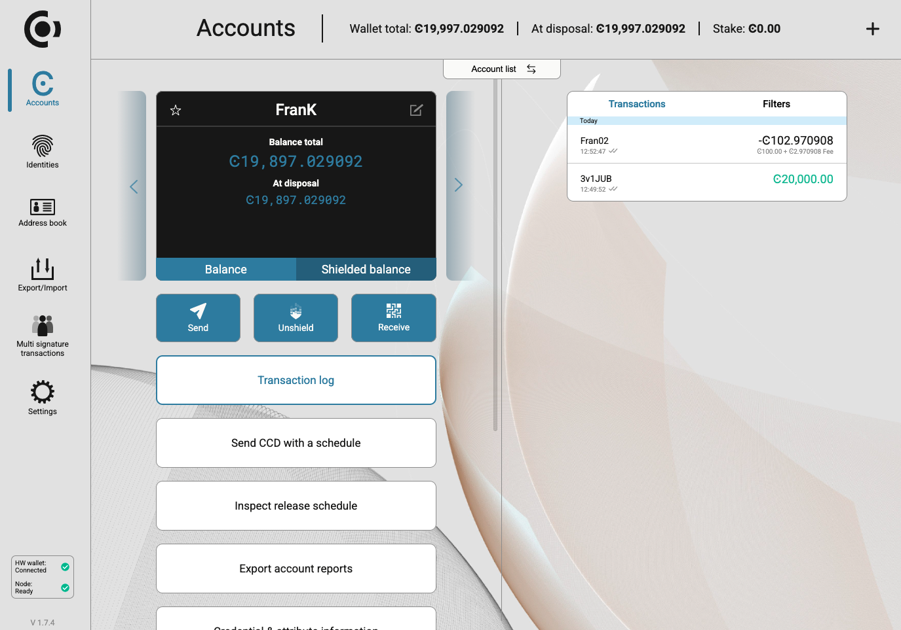

.. _ledger-tutorial:

============================================================
How To Use Your Ledger Device With Concordium Desktop Wallet
============================================================

Introduction
------------

A Ledger Device is a hardware wallet that is considered one of the most secure ways to store your digital assets. Ledger uses an offline, or cold storage, method of generating private keys, making it a preferred method for many crypto users. This guide will help you to connect your Ledger device to the Concordium Desktop Wallet. The Concordium Desktop Wallet enables you to Send and Receive CCD with the Ledger Device.

Quick links
-----------

* :ref:`Set up the Desktop Wallet<overview-desktop>`
* :ref:`Wallet activities<manage-wallets-lp>`
* :ref:`Send CCD<send-CCD-wallets>`
* :ref:`Transfer CCD with a schedule in the Desktop Wallet<CCD-single-schedule-desktop>`
* :ref:`Desktop wallet Navigation and settings<overview-account-desktop>`

Before You Start, Make Sure
---------------------------

* You've `initialized <https://support.ledger.com/article/360000613793-zd?redirect=false>`_ your Ledger Device
* The latest firmware is `installed <https://support.ledger.com/article/360002731113-zd?redirect=false>`_ (Ledger Nano S)
* Ledger Live is `ready to use <https://support.ledger.com/article/4404389503889-zd>`_
* Install the latest version of `Concordium Desktop Wallet <https://www.concordium.com/wallet>`_

Installing the Concordium App on Your Ledger Device
---------------------------------------------------

#. Open the Manager in Ledger Live
#. Connect and unlock your Ledger Device
#. If asked, follow the onscreen instructions and Allow Ledger Manager
#. Find Concordium in the app catalog and install the Concordium app

   .. image:: ../../docs/images/ledger-tutorial/image1.png
      :alt: Concordium app in Ledger Live catalog

#. Click the *Install* button

   a. An installation window will appear
   b. Your device will display Processing…
   c. The app installation is confirmed

   .. image:: ../../docs/images/ledger-tutorial/image2.jpg
      :alt: Concordium app on Ledger device

   .. image:: ../../docs/images/ledger-tutorial/image3.jpg
      :alt: Installation confirmation

#. Close Ledger Live

Connecting to the Concordium Desktop Wallet
-------------------------------------------

#. First, connect and unlock your Ledger Device
#. Open the Concordium App on your Ledger Device

   .. image:: ../../docs/images/ledger-tutorial/image2.jpg
      :alt: Concordium app on Ledger device

   - Ledger Nano S will show "Concordium"

   .. image:: ../../docs/images/ledger-tutorial/image3.jpg
      :alt: Installation confirmation

   Ledger Nano S will show "Application is ready"

#. Open the Concordium Desktop Wallet Application and create your account

   .. image:: ../../docs/images/ledger-tutorial/image6.png
      :alt: Create account screen

#. Click the *Submit* button on the right part of the screen

   .. image:: ../../docs/images/ledger-tutorial/image7.png
      :alt: Submit button location

#. Confirm the exporting of the public key on a device

   .. image:: ../../docs/images/ledger-tutorial/image8.png
      :alt: Public key export confirmation

#. Verify that the address on the Concordium Desktop Wallet matches the address on your Ledger Device

   .. image:: ../../docs/images/ledger-tutorial/image9.png
      :alt: Address verification screen

#. Confirm the Concordium Wallet address details on Ledger

   .. image:: ../../docs/images/ledger-tutorial/image10.png
      :alt: Ledger address confirmation

#. Your New Concordium Desktop Wallet account has been created

   .. image:: ../../docs/images/ledger-tutorial/image11.png
      :alt: New account creation confirmation

.. note::

   For Ledger Nano S: Press the right button to show the address.

.. note::

   For Ledger Nano X: Press the right button to scroll to "Display Account". Then press both buttons to show the address.

View Account Balance
--------------------

Your account balance is shown on the top bar of the Desktop Wallet denominated in CCD amount.

Receiving CCD in the Concordium Desktop Wallet
----------------------------------------------

#. Make sure you have verified your Receive address as shown in Steps 5 and 6 of "Connecting to the Concordium Desktop Wallet"
#. You can get your Receive address by simply copying the address to the clipboard or by scanning the QR Code

   a. You can copy the address by clicking the button next to the address

   .. image:: ../../docs/images/ledger-tutorial/image13.png
      :alt: Copy address button

   .. image:: ../../docs/images/ledger-tutorial/image14.png
      :alt: QR code display

   b. To scan the QR Code, click the QR code, which will show an enlarged QR Code to scan. Please verify that the address matches after you have scanned. Click the button to go back to the Main page

   .. image:: ../../docs/images/ledger-tutorial/image23.png
      :alt: button

   .. image:: ../../docs/images/ledger-tutorial/image16.png
      :alt: Enlarged QR code

   .. image:: ../../docs/images/ledger-tutorial/image15.png
      :alt: Wating for user to finish process

   c. Once you have sent CCD from another Wallet, you will see it in your transaction history and your CCD balance will update

Sending CCD in the Concordium Desktop Wallet
--------------------------------------------

#. Click on the *Send* button on the left side, enter the CCD address and the amount on the right side of the screen, and click the *Continue* Button

   .. image:: ../../docs/images/ledger-tutorial/image17.png
      :alt: Send CCD screen

#. Review the amount you are sending and the Fees for the transaction and click the *Submit* Button

   .. image:: ../../docs/images/ledger-tutorial/image18.png
      :alt: Transaction review screen

#. Review and sign the transaction on your Ledger Device

   For Ledger Nano S:

   .. image:: ../../docs/images/ledger-tutorial/image19.jpg
      :alt: Ledger transaction review

   Press the right button on your Ledger Device to review the transaction details (Amount and Address) until you see "Sign Transaction"

   .. image:: ../../docs/images/ledger-tutorial/image20.jpg
      :alt: Sign transaction screen

   Press both buttons on your Ledger Device to sign the transaction. 

   .. image:: ../../docs/images/ledger-tutorial/image21.jpg
      :alt: Transaction signing confirmation

   For Ledger Nano X: press the right button on your Ledger Device to review the transaction details (Amount and Address) until you see "Accept" then press both buttons

#. Once you sign the Transaction on the Ledger Device, a green banner will appear to show that the transaction was successful and a "Sending" transaction will appear in the Transaction history

   .. image:: ../../docs/images/ledger-tutorial/image22.png
      :alt: Transaction success confirmation

Video Guide
-----------

A video guide is available below:

.. video:: ../../docs/images/ledger-tutorial/Desktop_wallet_x_Ledger.mp4
    :width: 80%
    :align: center

Support
-------

* Telegram: https://t.me/concordium_official
* Github: https://github.com/Concordium
* Support email: support@concoridum.com

How It Was Made
---------------

This guide was made according to the ledger third-party application design guidelines: `Ledger and Third-Party Wallets <https://www.ledger.com/academy/hardwarewallet/ledger-and-third-party-wallets>`_.