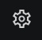

.. include:: ../../variables.rst
.. _overview-desktop:

=========================
Set up the Desktop Wallet
=========================

The Concordium Desktop Wallet is a digital wallet that enables you to create and manage your Concordium identities, credentials, and accounts, and to create transactions such as sending CCD, adding a validator, and exporting and importing account information.

The Desktop Wallet also supports storing of your private keys on a hardware device. Currently, LEDGER NANO S Plus and LEDGER Nano X are supported.

This topic contains an overview of each task you need to complete to set up and start using the Desktop Wallet. The guide assumes that you'll be using the Desktop Wallet in combination with a LEDGER device to generate and store keys and sign transactions.

Before you start
================

Before you start, make sure you’ve completed the following steps:

- You’ve set up the `LEDGER Nano S Plus <https://support.ledger.com/hc/en-us/articles/4416927988625-Set-up-your-Ledger-Nano-S-Plus-?docs=true>`_ or the `LEDGER Nano X <https://support.ledger.com/hc/en-us/articles/360018784134-Set-up-your-Ledger-Nano-X?docs=true>`_ and you have saved your 24-word recovery phrase generated on the LEDGER securely. This is the only backup of your private keys, and you need it to access you accounts if you lose your LEDGER device.

- You’ve downloaded `Ledger Live <https://www.ledger.com/ledger-live/download>`_.

.. dropdown:: Step 1: Set up the node

    The Desktop Wallet must be connected to a running **trusted** node on the Concordium blockchain. The node enables the Desktop Wallet to interact with the Concordium blockchain to receive updates and submit transactions. A default ``grpc.mainnet.concordium.software`` is provided. But you can run a node yourself using :ref:`Windows<run-node-windows>`, :ref:`macOS <run-node-macos>`, and :ref:`with Docker <run-a-node>` or :ref:`a Debian package <run-node-ubuntu>` on Linux. You can also have a third-party provider run a node for you.

.. dropdown:: Step 2: Install the Desktop Wallet

    #. Download the latest version of the Desktop Wallet for :ref:`Mainnet<downloads-desktop-wallet>` or :ref:`Testnet<downloads-desktop-wallet-testnet>`.

    #. Open the Desktop Wallet and create a password that contains at least 6 characters. Keep the password safe. You’ll need it to sign into the Desktop Wallet again.

    #. If this is the first time you're opening the Desktop Wallet, you're asked to connect to a node. If you don't see this message, go to **Settings**, and then select **Node settings**. By default, ``grpc.mainnet.concordium.software`` is inserted, but you can change this to any other node that you prefer or the node provided by your third-party provider. Enter the **Address** and **Port** of the node you’re running. The address is the network address of the node.

    - If you're running the mainnet version of the Desktop Wallet, you must connect to a mainnet node. In the **Address field**, enter *127.0.0.1*, and in the **Port field** enter *20000*.

    - If you're running the testnet version of the Desktop Wallet, you must connect to a testnet node. In the **Address** field, enter *127.0.0.1*, and in the **Port field** enter *20001*.

        .. image:: ../../docs/network/nodes/images/Node-setup-win-9.png
            :width: 60%

    #. Select **Set connection**. If the connection is working properly, there’s a message saying *Successfully connected*.

.. _install-ledger:

.. dropdown:: Step 3: Install the Concordium LEDGER app using LEDGER Live

    The Desktop Wallet requires that you store your keys on a LEDGER device. This is to ensure that your private account keys are kept secure. To be able to use the LEDGER device with the Desktop Wallet, you must install the Concordium LEDGER App on the hardware wallet.

    #. Connect the LEDGER device to your computer, and enter your PIN code to unlock the LEDGER.

    #. In the LEDGER Live app select **My Ledger** in the left side panel.

    #. The LEDGER says **Allow Ledger Manager**. Press both buttons simultaneously to allow the manager on your LEDGER.

    #. Press the right button to navigate to **Install app**, and then press both buttons.

    #. Search for **Concordium Ledger App** in the App catalog in Ledger Live, and then select **Install**.

    .. NOTE::

        The LEDGER app can also be updated from LEDGER Live.

.. dropdown:: Step 4: Set up an identity and an initial account

    Once you've installed the Desktop Wallet, you must set up an :term:`identity` and an :term:`initial account`. If you want to be a validator, Concordium also recommends that you create a separate account to use as a validator account. See :ref:`Create an identity and an initial account in the Desktop Wallet <create-initial-account>` and :ref:`Create an account in the Desktop Wallet<create-account>`.

Once you have completed these four steps, you're ready to start using the Desktop Wallet.

.. Note::

    Without CCD you can't submit transactions on the Concordium blockchain. This includes creating multi-signature accounts and creating validator transactions. However, you can create identities, accounts that only require one signature, and you can add account addresses to your address book.

    You can buy CCD on many exchanges. If you are running on testnet, you can request CCD for testing using a button in the wallet.

.. Warning::

    Currently, it is not possible to exchange identities and accounts between the |mw-gen1| or |mw-gen2| and the Desktop Wallet. If you try to import a file that has been exported from the |mw-gen1| into the Desktop Wallet, the import will fail, and likewise, if you try to import a file exported from the Desktop Wallet into the |mw-gen1|.

If you previously installed the Concordium app by enabling Developer mode
=========================================================================

Users who previously installed the Concordium Ledger app through Developer Mode in Ledger Live can now update to the standard version without needing to enable Developer Mode.

Simply go to My Ledger in Ledger Live and follow the prompt to update the application.
You do not need to disable Developer Mode—the app will be accessible whether Developer Mode is enabled or not.

If you are installing the app for the first time, you can find Concordium in the list of available applications in Ledger Live and install it directly, without requiring Developer Mode.

In both cases, it is essential that Ledger Live and the device firmware are updated to the latest versions before proceeding.
If your device's operating system is outdated, an orange banner will appear, prompting you to update before you can install or update the app.
You do not need to take any additional technical steps—your private keys will remain intact, and there is no need for key restoration.

