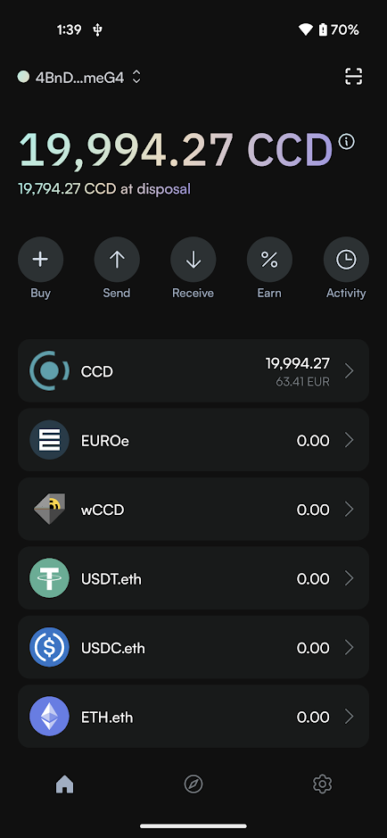
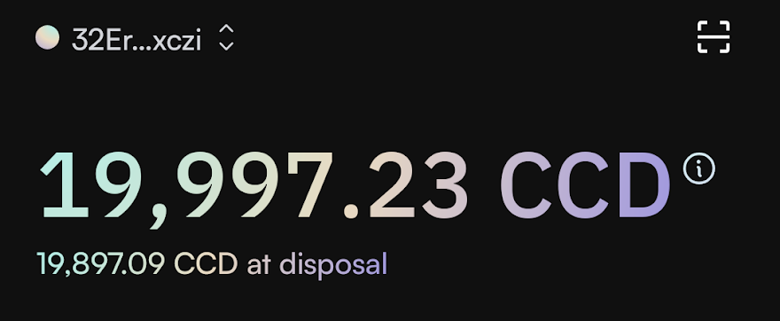
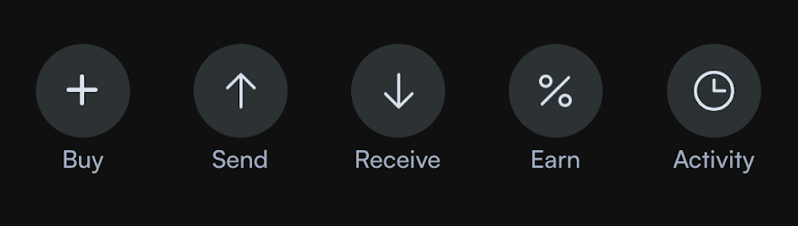
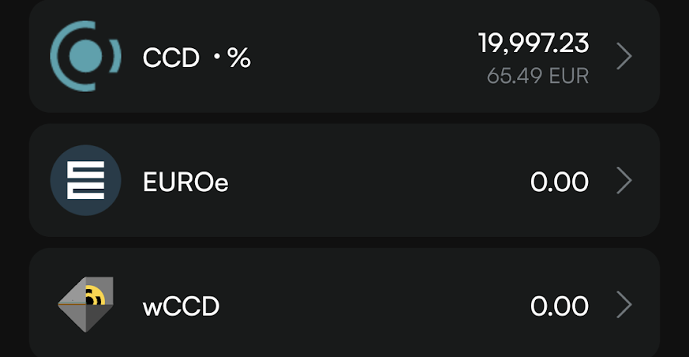
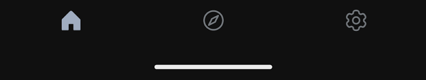
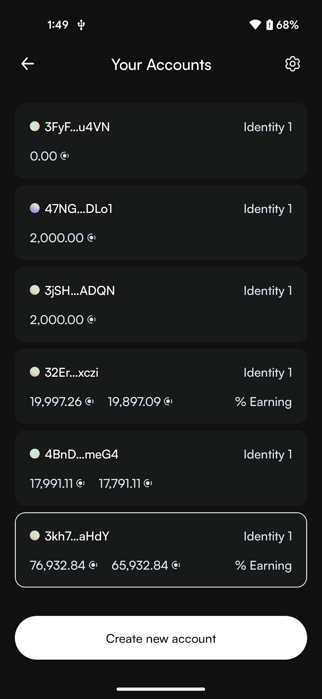

.. include:: ../../variables.rst
.. _setup-cryptox-wallet:

===============================
Set up the |cryptox|
===============================

The |cryptox| is a digital :term:`wallet` that enables you to create and manage your Concordium
:term:`identities<identity>` and :term:`accounts<account>` and to create transactions such as sending CCD, :term:`shielding` and :term:`unshielding` CCD,
and sending :term:`shielded transactions<shielded transfer>`.

To learn more about identities and accounts, see :ref:`identities<reference-id-accounts>` and :ref:`accounts<managing_accounts>`.

Follow this guide to set up your wallet.

Get started
===========

#. Install the |cryptox| on an Android or iOS phone. See :ref:`Downloads<downloads-cryptox>`.

#. Open the |cryptox|. You'll see an introduction screen explaining the key features.

#. Read and accept the Terms and Conditions and Privacy Policy by checking the box.

   You can also choose to allow activity tracking in the app. This tracking only applies to general usage, not funds, transactions, or personal data.

#. Tap **Get started**.

   .. image:: ../images/cryptoX/onboarding/cryptox-onboarding1.png
      :width: 40%
      :alt: screen with terms and conditions

Set up your wallet
==================

The wallet setup consists of three phases: Create a 6-digit passcode, Save seed phrase, and Verify identity.

You can pause between the phases and return later to continue.

Create passcode
---------------

#. Tap **Continue** to begin creating your new wallet.

   .. image:: ../images/cryptoX/onboarding/cryptox-onboarding2.png
      :width: 40%
      :alt: screen with activate account

   .. Note::
      If you already have a wallet to import, you can select **Import a wallet** at the bottom of the screen. This allows you to :doc:`restore using a seed phrase, wallet private key, or backup file <./recover-wallet>`.

#. Create a six-digit passcode or use a full password. Repeat passcode or password.

   .. image:: ../images/cryptoX/onboarding/cryptox-onboarding3.png
      :width: 40%
      :alt: screen with keypad to enter passcode

Save seed phrase
----------------

After setting up your passcode, you'll see the main wallet screen with a progress indicator showing your setup progress. Your progress is automatically saved, so you can close the app now and continue the setup later if you wish.

#. Tap **Save seed phrase** to continue setup.

   .. image:: ../images/cryptoX/onboarding/cryptox-onboarding4.png
      :width: 40%
      :alt: screen with information about saving seed phrase

#. Now you see your seed phrase which is the access key to all the funds in your wallet.

   You can either write it down, make a digital copy, or take a screenshot of it.
   In either case, make sure to keep it somewhere safe in case you need to recover your wallet.

   When done, check the confirmation box and tap **Continue**.

   .. image:: ../images/cryptoX/onboarding/cryptox-onboarding5.png
      :width: 40%
      :alt: screen with information about saving seed phrase

#. Enter your passcode when prompted.

   .. image:: ../images/cryptoX/onboarding/cryptox-onboarding6.png
      :width: 40%
      :alt: screen with identity providers

Verify identity
---------------

After securing your seed phrase, you'll return to the main wallet screen. A progress bar shows that you're now ready for the final step. Your progress is automatically saved, so you can close the app now and continue the setup later if you wish.

#. Tap **Verify identity** to continue setup.

   .. image:: ../images/cryptoX/onboarding/cryptox-onboarding7.png
      :width: 40%
      :alt: screen with identity providers

#. Now you must submit a request for an identity verification. Select an identity provider.

   .. image:: ../images/cryptoX/onboarding/cryptox-onboarding8.png
      :width: 40%
      :alt: screen with identity providers

#. Enter your passcode or password when prompted. An external web page opens within the app.

#. Enter the information requested by the third-party identity provider. The information might vary depending on the identity provider.
   However, they will ask you to provide photos of identification documents and a selfie.

#. When you have submitted the information to the identity provider, the verification or rejection is usually retrieved from the identity provider within minutes, but check your app frequently to retrieve
   the result. The result can be retrieved for up to seven days.

   If your identity request is rejected, you see a message. Tap **Make new identity request** to create a new identity request. You can choose another identity provider.

Create account
==============

Once the identity provider has approved your verification request, you can create your first account. A progress bar shows that you have now completed the setup and can create your first account.

#. Tap **Create account** to set up your first account.

   .. image:: ../images/cryptoX/onboarding/cryptox-onboarding9.png
      :width: 40%
      :alt: screen with identity providers

#. Enter your passcode or password when prompted.

#. Your new account will be visible in the Accounts list.

   .. image:: ../images/cryptoX/onboarding/cryptox-onboarding10.png
      :width: 40%
      :alt: screen showing first account in list

If you want to, you can :ref:`change the name of the account<change-mw-acct-name>`.

Basic navigation
================

The |cryptox| provides the the navigation elements described in the following.

Accounts, balances and QR scan
------------------------------

At the top left of the screen, you find the account selector displaying your shortened account identifier. Tapping this account identifier will take you to the :ref:`Your accounts screen<mw-cryptox-account-navigation>` where you can view and select from all your accounts.

The account identifier shown at the top left represents your currently selected account. All actions on the main screen (sending, receiving, earning through staking or delegation, and viewing transactions) will apply to this selected account. To change account, tap the account identifier and select another account on the Your accounts screen.

In the top right corner, you find the QR code scan button that allows you to :ref:`scan a QR code to connect to a dApp<connect-app-bw>`.

Below the account selector, a large display shows your total CCD balance, and right under that you see your available balance indicated as *CCD at disposal* - this is the amount you can use for transactions.

Quick access buttons
--------------------

Below the balance information, you find a number of quick access buttons to core functionality:

* Buy: purchase CCD
* Send: :ref:`send funds<send-CCD-wallets>` to another account
* Receive: get your address to receive funds
* Earn: access :ref:`validation<baker-concept>` or :ref:`delegation<delegation-concept>` functionality
* Activity: view transaction history

Token list
----------

The central part of the screen displays your token list, showing all digital assets in your wallet including their current balances. Tapping on any token entry will take you to a detailed view for that specific token, where you can perform token-specific actions.

Navigation bar
--------------

At the bottom of the screen, you find the navigation bar with three main options:

* Home (house icon): return to the main wallet screen
* Browser (compass icon): access Concordium News
* :ref:`Settings (gear icon) <mw-cryptoX-wallet-settings>`: configure wallet preferences and security options

.. _mw-cryptoX-wallet-settings:

Wallet settings
---------------

Tapping the gear icon in the bottom right part of the screen opens up the *Wallet Settings* screen with the following options:

- Identities: view all identities in the wallet and details of the identities, :ref:`edit identity names<change-mw-id-name>`, and :ref:`create new identities<create-initial-account>`.
- Wallets: manage different wallet types (seed phrase or file wallet), add existing wallets, and switch between them.
- Address book: :ref:`manage your address book<address-book-mw>`.
- Notifications: enable or disable notifications for CCD and CIS-2 token transactions.
- Recovery: :ref:`recover your wallet<recover-wallet>`.
- Seed phrase: :ref:`show seed phrase<show-seed-phrase>`
- Update passcode and biometrics: :ref:`change your wallet passcode or activate biometrics<change-passcode-mw>`.
- Clear WalletConnect: disconnect all active WalletConnect sessions.
- Erase data: remove all wallet data from this device (can be restored using seed phrase or backup file).
- Analytics: enable or disable app usage tracking (no personal data or transaction information is collected).
- NFT: view and manage your NFT collections, and discover new NFTs.
- About: access app version, support information, website links, legal documents, and social media channels.

In case you have created your wallet from a backup file, you will not have the Recovery and  Show my seed phrase options, but instead the options :ref:`Import<import-export-file>` and :ref:`Export<import-export-file>`.

.. _mw-cryptoX-account-navigation:

Account navigation
------------------

When you tap your account identifier at the top of the main screen, you access the *Your accounts* screen. Here, you see a list of all your accounts.

You can:

* Tap an account to select it and return to the main screen
* Create a new account using the button at the bottom of the screen

When you select an account, all actions on the main screen (sending, receiving, earning through staking or delegation, and viewing transactions) will apply to this selected account.

To access account-specific settings, tap the gear icon in the top right corner of the screen. The Account settings screen provides these options:

* Transfer filters: configure filters to show or hide rewards
* Release schedule: :ref:`inspect a release schedule<inspect-release-schedule-mw>`
* Export private key: :ref:`export your private key<export-key>` for testing smart contracts, for example
* Export transaction logs: :ref:`export transaction logs<export-transaction-logs>`
* Change account name: :ref:`customize account names<change-mw-acct-name>`

