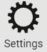

.. include:: ../../variables.rst
.. _change-passcode-mw:

===========================================
Update your passcode and biometric settings
===========================================

If you want to change your passcode or enable/disable your biometrics (on a mobile device), following the directions below for your wallet.

.. Note::
   You can't change your passcode, password, or biometrics if you have pending identities or accounts in your wallet.

.. dropdown:: |cryptox|

   #. Open *Wallet Settings* by tapping the gear icon in the lower right of the main screen.

   #. Tap **Update Passcode & Biometrics**.

   #. On the next screen tap **Continue**.

      .. image:: ../images/cryptoX/cryptox-update-passcode-and-biometrics.png
         :width: 50%
         :alt: screen with settings menu

   #. Enter your old passcode or biometrics.

   #. Enter a new six-digit passcode, or choose **Use full password instead** if you’d rather use a full password.

   #. Choose whether or not to enable biometrics.

.. dropdown::  Desktop Wallet

   #. Click |dw-wallet-settings| to go to the Settings page.

   #. Click **Change wallet password**.

   #. Enter your current password. **You cannot change the password unless you know the current password.** Then enter your new password and confirm your new password. Click Change password.

      .. image:: ../images/desktop-wallet/dw-change-pw.png
         :width: 50%
         :alt: password change dialog

.. dropdown:: |bw|

   #. Open the menu and select **Passcode**.

   #. Enter current passcode.

   #. Enter and confirm new passcode.

   #. Click **Change passcode**.

.. |morepage| image:: ../images/more-ellipsis.png
             :alt: Three dots button
             :width: 40px

.. |hamburger-bw| image:: ../images/browser-wallet/hamburger-menu.png
                    :width: 20px
                    :alt: three horizontal lines
