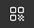
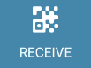

.. include:: ../../variables.rst
.. _share-address-mw:

===================================
Find and share your account address
===================================

If you need to share your account address with someone, you can find the address on the account page.

.. dropdown:: |cryptox|

   #. Tap **Receive** on the main screen.

   #. You see a QR code and your address. To share your address:

      - You can let someone scan your QR code if they have |cryptox| installed.

      - You can tap **Share** and then share the address using one of the share options.

      - You can tap **Copy** to copy the address and then paste it somewhere of your own choosing.

      .. image:: ../images/cryptoX/cryptox-QR-code-new.png
         :width: 50%
         :alt: screen with QR code and account address shown

.. dropdown:: |bw|

   #. Select your account in the dropdown menu and click **Receive**.

   #. Share your address:

      - You can let someone scan your QR code if they have the |cryptox| installed.

      - You can click **COPY** to copy the address and then paste it somewhere of your own choosing.

