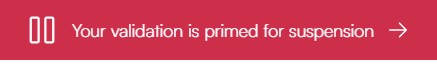

.. include:: ../../variables.rst
.. _suspend-unsuspend-validator:

=============================
Suspend/Unsuspend a validator
=============================

A validator can be suspended in two ways:

- **Self-suspension**: You can manually suspend your validator, for example during planned node maintenance.
- **Automatic suspension**: The protocol may suspend your validator if it fails to produce blocks a certain number of times when selected as a round leader.

When a validator is suspended, regardless of the cause:

- The validator stops earning rewards
- Delegators to the validator stop earning rewards
- Delegators are notified about the suspension

Self-suspension
---------------

You can manually suspend your validator when needed, such as during node maintenance, and reactivate it when your node is operational again. This gives you control over your validator's status without risking an automatic suspension due to inactivity.
When your validator is suspended, a red banner will appear at the bottom of your wallet interface stating **Your validation has been suspended**.

.. image:: ../images/browser-wallet/new/suspended_banner.png
           :width: 50%

To unsuspend a self-suspended validator, you can simply access your wallet, navigate to the validator section, and select "Resume" to reactivate your validation. This allows you to seamlessly return to active participation in the network once your maintenance is complete.

Automatic suspension
--------------------

Automatic suspension occurs when a validator remains inactive for an extended period, missing multiple opportunities to produce blocks. The inactivity threshold varies based on stake size; larger validators may face suspension within hours, while smaller validators might take several days to reach the threshold.

When a validator becomes inactive, it first enters a *primed for suspension* state.
During this period, a red warning banner appears at the bottom of your wallet interface stating **Your validation is primed for suspension**.

The validator then has until the next snapshot epoch to demonstrate activity by either producing a block or having its signature included in a quorum certificate. If it remains inactive, the suspension takes effect at the following payday, and the red banner will change to indicate the suspended status.

.. image:: ../images/browser-wallet/new/suspended_banner.png
           :width: 50%

If your validator has been automatically suspended, you'll need to follow a two-step process to resume validation. First, you must address the underlying issue with your node that caused the inactivity. Check your node's status, identify what caused the suspension, fix these issues, and restart your node to ensure it's properly connected to the network. Once your node is operational again, you can then proceed to your wallet and follow the resume procedure by selecting **Resume** in the validation section.

Self-suspend a validator
------------------------

.. dropdown:: |cryptox|

    #. In the dropdown list, select the account for which you want to suspend validation and tap **Earn**.

    #. On the Validator status screen, tap **Change validating status**.

       .. image:: ../images/cryptoX/cryptox-change-validating-status.png
            :width: 50%
            :alt: screen showing validator status

    #. You now see the options for changing the validating status. Tap **Suspend valdiation**.

       .. image:: ../images/cryptoX/cryptox-change-validating-status-options.png
            :width: 50%
            :alt: screen showing options for changing validating status

    #. On the next screen, read the information about the consequences of suspending your validator. Tap **Continue** to proceed with the suspension or go back if you need to reconsider.

    #. Review the transaction details for suspending your validator. Note that the suspension will take effect from the next payday. Tap **Submit validator transaction** to confirm and send your suspension transaction to the blockchain.

    #. The |cryptox| shows that the transaction has been submitted to the chain. Tap **Finish**.

    After successfully suspending your validator, you'll notice several clear indicators throughout the wallet interface:

    On your account overview screen, a prominent red banner appears at the bottom stating *Your validation has been suspended*. This banner serves as both a notification and a shortcut. Additionally, a red dot appears on the **Earn** button, providing a visual indicator that your validator requires attention.

    .. image:: ../images/cryptoX/cryptox-validator-suspended-banner-new.png
            :width: 50%
            :alt: screen showing validator suspended banner

    **Note:** If you have both a suspended validator and a suspended delegator, a banner will be shown for each.

    In the account list view, suspended validators are marked with a red indicator dot to the left of the account address.

    .. image:: ../images/cryptoX/cryptox-validator-suspended-account-list.png
            :width: 50%
            :alt: screen showing suspended alidator in accountlist

    When viewing your validator status information, a warning message clearly states *Your validation has been suspended* along with information that your node is not currently earning rewards.

    .. image:: ../images/cryptoX/cryptox-validator-suspended-validator-status.png
            :width: 50%
            :alt: screen showing suspended validator in validator status screen

.. dropdown:: |bw|

    #. In the dropdown list, select the account for which you want to suspend the validator and click **Earn**.

    #. On the next screen, click **Suspend**.

       .. image:: ../images/browser-wallet/new/update_validation1.png
           :width: 50%

    #. On the next screen, read the information about the consequences of suspending your validator. Click **Continue** to proceed with the suspension or go back if you need to reconsider.

       .. image:: ../images/browser-wallet/new/suspend_validator1.png
           :width: 50%

    #. Review the transaction details for suspending your validator. Note that the suspension will take effect from the next payday. Click **Send** to confirm and send your suspension transaction to the blockchain.

       .. image:: ../images/browser-wallet/new/suspend_validator_send.png
           :width: 50%

    #. The wallet displays a confirmation screen with a green checkmark, indicating your validation settings have been successfully updated. You can click **Transaction details** to view more information about the transaction, or **Return to account** to go back to your account overview.

       .. image:: ../images/browser-wallet/new/suspend_validator3.png
           :width: 50%

    After successfully suspending your validator, you'll notice several clear indicators throughout the wallet interface:

    On your account overview screen, a prominent red banner appears at the bottom stating *Your validation has been suspended*. This banner serves as both a notification and a shortcut. Additionally, a red dot appears on the **Earn** button, providing a visual indicator that your validator requires attention.

    .. image:: ../images/browser-wallet/new/suspend_validator4.png
           :width: 50%

    **Note:** If you have both a suspended validator and a suspended delegator, a banner will be shown for each.

    .. image:: ../images/browser-wallet/new/suspended_validator_and_delegator.png
           :width: 50%

    In the account list view, suspended validators are marked with a red indicator dot to the left of the account address.

    .. image:: ../images/browser-wallet/new/suspend_validator6.png
            :width: 50%

    When viewing your validator details, a red message clearly states *Your validation has been suspended* along with information that your node is not currently earning rewards.

    .. image:: ../images/browser-wallet/new/suspend_validator5.png
           :width: 50%

    **Important**: The suspension notification banner on your account overview screen will remain visible across your entire wallet experience, even when you have selected different accounts in the dropdown menu. Clicking this banner will immediately take you to the suspended validator's details page, regardless of which account is currently selected or displayed.

    This persistent notification ensures you're always aware of the suspension status and provides quick access to resume validation when you're ready.

Unsuspend a self-suspendet validator
------------------------------------

.. dropdown:: |cryptox|

    #. Navigate to the unsuspendet validator. Tapping the suspension notification banner will immediately take you to the suspended validator's status page.

    #. Tap **Change validating status**.

       .. image:: ../images/cryptoX/cryptox-validator-suspended-validator-status.png
            :width: 50%
            :alt: screen showing suspended validator in validator status screen

    #. Then, tap **Resume validation**.

       .. image:: ../images/cryptoX/cryptox-resume-validation.png
            :width: 50%
            :alt: screen showing resume validation action for suspended validator

    #. Review the resume validation info and tap **Submit validator transaction** to proceed.

    #. The CryptoX Concordium Wallet shows that the transaction has been submitted to the chain. Tap **Finish**.

.. dropdown:: |bw|

    #. Navigate to the unsuspendet validator. Clicking the suspension notification banner will immediately take you to the suspended validator's details page.

    #. Click **Resume**.

       .. image:: ../images/browser-wallet/new/unsuspend_validator2.png
              :width: 50%

    #. Review the transaction details for resuming your validator. Click **Send** to confirm and send your resume transaction to the blockchain.
       Note that the resumption will be effective from the next payday.

       .. image:: ../images/browser-wallet/new/unsuspend_validator_send.png
              :width: 50%

    #. The wallet displays a confirmation screen with a green checkmark, indicating your validation has been successfully resumed. You can click **Transaction details** to view more information about the transaction, or **Return to account** to go back to your account overview.

       .. image:: ../images/browser-wallet/new/unsuspend_validator4.png
              :width: 50%

Unsuspend an automatically suspendet validator
----------------------------------------------

.. dropdown:: |cryptox|

    When your validator becomes inactive, it first enters a *primed for suspension* state. During this period, a red warning banner appears at the top of your wallet interface stating "Your validation is primed for suspension".

    Additionally, a red dot appears on the Earn button, providing a visual indicator that your validator requires attention.

    .. image:: ../images/cryptoX/cryptox-validator-primed-for-suspension-banner.png
            :width: 50%
            :alt: screen showing suspended validator in validator status screen

    Your node has until the next snapshot epoch to show activity. If your node remains inactive, full suspension takes effect at the next payday.

    If your validator has been suspended:

    #. First check your node and resolve the underlying issues: Identify what caused the automatic suspension, fix the identified issues on your node, and restart your node.

    #. Then, navigate to the unsuspendet validator. Tapping the suspension notification banner will immediately take you to the suspended validator's details page.

    #. Tap **Change validating status**.

       .. image:: ../images/cryptoX/cryptox-validator-suspended-validator-status.png
            :width: 50%
            :alt: screen showing suspended validator in validator status screen

    #. Then, tap **Resume validation**.

       .. image:: ../images/cryptoX/cryptox-resume-validation.png
            :width: 50%
            :alt: screen showing resume validation action for suspended validator

    #. Review the resume validation info and tap **Submit validator transaction** to proceed.

    #. The CryptoX Concordium Wallet shows that the transaction has been submitted to the chain. Tap **Finish**.

.. dropdown:: |bw|

    When your validator becomes inactive, it first enters a *primed for suspension* state. During this period, a red warning banner appears at the bottom of your wallet interface stating "Your validation is primed for suspension".

    Additionally, a red dot appears on the Earn button, providing a visual indicator that your validator requires attention.

    .. image:: ../images/browser-wallet/new/validation_primed_for_suspension_banner.png
           :width: 50%

    Your node has until the next snapshot epoch to show activity. If your node remains inactive, full suspension takes effect at the next payday.

    If your validator has been suspended:

    #. First check your node and resolve the underlying issues: Identify what caused the automatic suspension, fix the identified issues on your node, and restart your node.

    #. Then, navigate to the unsuspendet validator. Clicking the suspension notification banner will immediately take you to the suspended validator's status page.

    #. Click **Resume**.

       .. image:: ../images/browser-wallet/new/unsuspend_validator2.png
              :width: 50%

    #. Review the transaction details for resuming your validator. Click **Send** to confirm and send your resume transaction to the blockchain.
       Note that the resumption will be effective from the next payday.

       .. image:: ../images/browser-wallet/new/unsuspend_validator_send.png
              :width: 50%

    #. The wallet displays a confirmation screen with a green checkmark, indicating your validation has been successfully resumed. You can click **Transaction details** to view more information about the transaction, or **Return to account** to go back to your account overview.

       .. image:: ../images/browser-wallet/new/unsuspend_validator4.png
              :width: 50%

