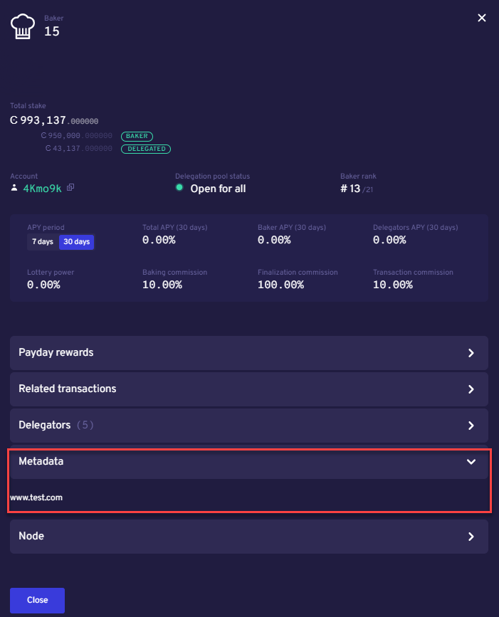

.. include:: ../../variables.rst
.. _baker-pool:

====================
Validator management
====================

A :ref:`validator <baker-concept>` is a node that participates in the network by producing new blocks that are added to the chain. There are some recommended best practices around validation, particularly when a validator runs a :term:`staking pool`. A validator can choose to open a staking pool to which others can :ref:`delegate<delegation-concept>` some of their stake.

Best practices for validation
=============================

As a validator you should manage your validator node responsibily for the benefit of all users of the blockchain. The recommendations for validators are:

- Make sure your node is running 24/7/365 in a reliable place.
- Protect your validator keys so that they are not lost or compromised.
- Check regularly to make sure that you are not close to the bounding cap for max capital for a validator. If you're getting close to the max capital, you can split and make another validator to divide the capital.
- Open a staking pool. This allows others to delegate stake to you, thus increasing your effective stake and your odds of getting selected to produce a block. You also receive a commission on the delegator's rewards.
- Subscribe to the `Mainnet status page <https://status.mainnet.concordium.software/>`_ and the `release information on Discourse <https://support.concordium.software/c/releases/9>`_ to stay informed about updates and changes that may affect you as a validator, including node software releases and protocol updates. To subscribe to updates on the Mainnet status page click **Subscribe** to get all updates or click **Get updates** to choose to get all updates or only updates for specific products.

Recommendations for staking pool owners
---------------------------------------

If you are running a staking pool, you are responsible for managing your pool to maximize returns, both for yourself and those who have delegated stake to your pool.

To help potential delegators with their choice, it is a good idea to create a site with information and add this URL to your staking pool configuration. This information is published on :ref:`CCDScan<home-screen-baker>` so that potential delegators can read about the pool and understand your goals. Having a URL on your staking pool configuration is not required.

Research a staking pool
=======================

Before delegating stake to a staking pool, it is important to research the pool and get an idea of performance and how it is managed.

The first thing to check before delegating stake to a staking pool is the URL for the staking pool. This is information that the validator can provide about the pool. It is not required that the validator provide this, but recommended. You can find the URLs on :ref:`CCDScan<home-screen-baker>`.

Make sure that the pool isn't close to having too many delegators or close to max capital. Another indicator of good management is reliability, such as whether the node is upgraded to the latest version.

Once you have made a delegation, it is a good idea to monitor validator performance regularly and adjust if needed.

CCDScan
=======

The tool for both validator management and research is CCDScan. For more information, see :ref:`CCDScan<ccd-scan>`.

.. toctree::
   :hidden:
   :maxdepth: 1

   guides/baker-windows
   guides/baker-macos
   guides/baker-ubuntu
   guides/baker-docker
   guides/become-baker
   guides/validation-with-wallets

