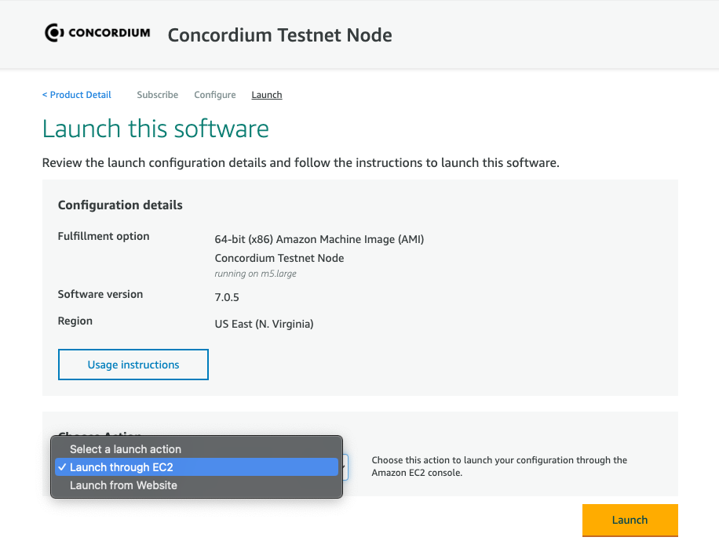
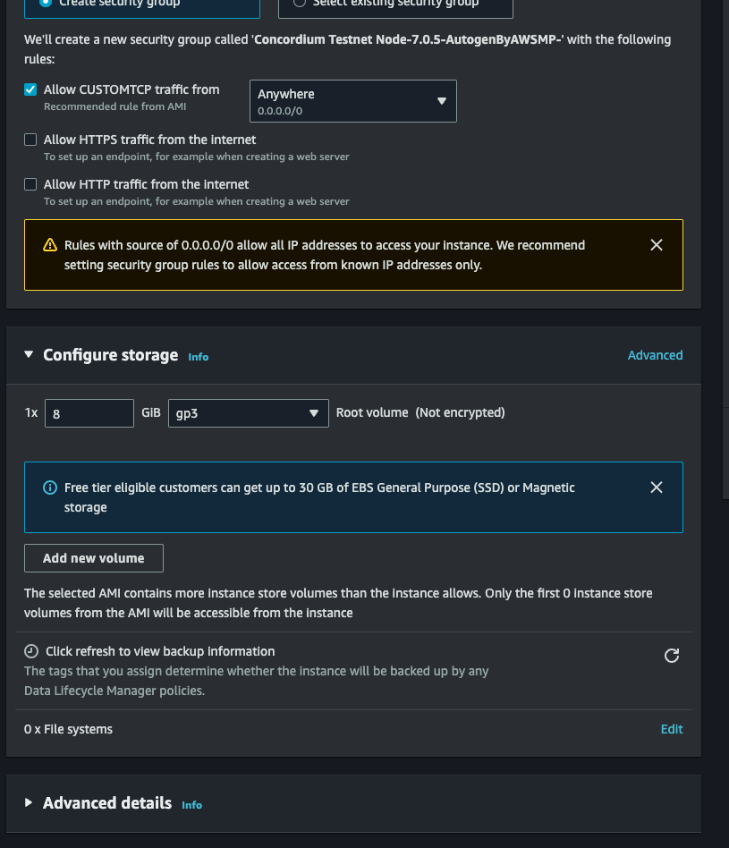
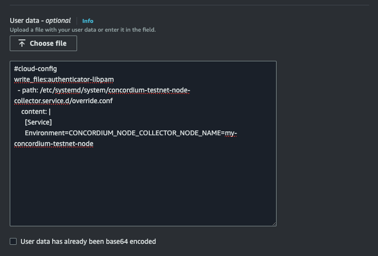

.. _Discord: https://discord.gg/xWmQ5tp

.. _run-a-node-aws:

=======================================
Run a node on Amazon Web Services (AWS)
=======================================

In this guide, you will learn how to set up a node on an AWS Virtual Private Server (VPS), using the marketplace product.
The node will be running on the minimum required hardware, but you will be able to configure it to be running on more powerful hardware.

Before you begin
================

Before continuing, you will need to have an AWS account.

.. _running-a-node-aws:

Running/upgrading a node
========================

Concordium provides two AWS Marketplace products, a `mainnet <https://aws.amazon.com/marketplace/pp/prodview-vfyzjfpphcciu?sr=0-1&ref_=beagle&applicationId=AWSMPContessa>`_ one and a `testnet <https://aws.amazon.com/marketplace/pp/prodview-i6wlb6ys5ucwo?sr=0-2&ref_=beagle&applicationId=AWSMPContessa>`_ one.

On the AWS marketplace, you should choose 'Continue to subscribe' and follow the instructions. When you reach the 'Launch this software' step, you should click the 'Choose action' drop-down and choose 'Launch through EC2' as shown.

After clicking 'Launch' you will be sent to the EC2 console, where you can configure the VPS.
You should find the storage section and increase the storage to a minimum of 1000 GiB.
You will find a section called 'Advanced details', expand this section.

After expanding, you can scroll to the bottom of the page to find the 'user data' and paste in the configuration and remember to change networkname to either testnet or mainnet and also change node-name to the name you would like to change to

.. code-block:: yaml

  #cloud-config
  write_files:authenticator-libpam
    - path: /etc/systemd/system/concordium-<networkname>-node-collector.service.d/override.conf
      content: |
        [Service]
        Environment=CONCORDIUM_NODE_COLLECTOR_NODE_NAME=<node-name>

In the user data section, you can also change other configuration parameters or you can do it afterwards by adding one of the following parameters to the configuration files.
The following parameters can be configured in the configuration file located at ``/etc/systemd/system/concordium-<networkname>-node-collector.service.d/override.conf``.
.. code-block::

  CONCORDIUM_NODE_COLLECTOR_ARTIFICIAL_START_DELAY
  CONCORDIUM_NODE_COLLECTOR_COLLECT_INTERVAL
  CONCORDIUM_NODE_COLLECTOR_URL
  CONCORDIUM_NODE_COLLECTOR_GRPC_HOST
  CONCORDIUM_NODE_COLLECTOR_GRPC_TIMEOUT
  CONCORDIUM_NODE_COLLECTOR_INFO
  CONCORDIUM_NODE_COLLECTOR_NO_LOG_TIMESTAMP
  CONCORDIUM_NODE_COLLECTOR_NODE_NAME
  CONCORDIUM_NODE_COLLECTOR_PRINT_CONFIG
  CONCORDIUM_NODE_COLLECTOR_TRACE

These parameters can be configured in the configuration file located at ``/etc/systemd/system/concordium-<networkname>-node.service.d/override.conf``
.. code-block::

  CONCORDIUM_NODE_CONSENSUS_ACCOUNTS_CACHE_SIZE
  CONCORDIUM_NODE_BAKER_BLOCK_CONSTRUCTION_TIMEOUT
  CONCORDIUM_NODE_CONNECTION_BOOTSTRAP_NODES
  CONCORDIUM_NODE_BOOTSTRAPPER_TIMEOUT_BUCKET_ENTRY_PERIOD
  CONCORDIUM_NODE_CONNECTION_BOOTSTRAPPING_INTERVAL
  CONCORDIUM_NODE_BUCKET_CLEANUP_INTERVAL
  CONCORDIUM_NODE_CONNECTION_CATCH_UP_BATCH_LIMIT
  CONCORDIUM_NODE_CONNECTION_CLEAR_BANS
  CONCORDIUM_NODE_CLEAR_PERSISTED_PEERS
  CONCORDIUM_NODE_CONFIG_DIR
  CONCORDIUM_NODE_CONNECTION_REQUESTS_BATCH_LIMIT
  CONCORDIUM_NODE_CONNECTION_CONNECT_TO
  CONCORDIUM_NODE_DATA_DIR
  CONCORDIUM_NODE_LOG_LEVEL_DEBUG
  CONCORDIUM_NODE_VALIDATOR_DECRYPT_CREDENTIALS
  CONCORDIUM_NODE_CONNECTION_DEDUP_SIZE_LONG
  CONCORDIUM_NODE_CONNECTION_DEDUP_SIZE_SHORT
  CONCORDIUM_NODE_CONNECTION_DEDUPLICATION_HASHING_ALGORITHM
  CONCORDIUM_NODE_CONNECTION_DESIRED_NODES
  CONCORDIUM_NODE_CONNECTION_DISALLOW_MULTIPLE_PEERS_ON_SAME_IP
  CONCORDIUM_NODE_CONNECTION_DNS_RESOLVER
  CONCORDIUM_NODE_CONSENSUS_DOWNLOAD_BLOCKS_FROM
  CONCORDIUM_NODE_CONSENSUS_DOWNLOAD_BLOCKS_TIMEOUT
  CONCORDIUM_NODE_DROP_REBROADCSAT_PROBABILITY
  CONCORDIUM_NODE_GRPC2_DRY_RUN_CONCURRENCY
  CONCORDIUM_NODE_GRPC2_DRY_RUN_TIMEOUT
  CONCORDIUM_NODE_GRPC2_ENABLE_GRPC_WEB
  CONCORDIUM_NODE_GRPC2_ENDPOINT_CONFIG
  CONCORDIUM_NODE_CONNECTION_EVENTS_QUEUE_SIZE
  CONCORDIUM_NODE_EXTERNAL_PORT
  CONCORDIUM_NODE_RUNTIME_HASKELL_GC_LOGGING
  CONCORDIUM_NODE_CONSENSUS_GENESIS_DATA_FILE
  CONCORDIUM_NODE_GRPC2_CERT_PRIVATE_KEY
  CONCORDIUM_NODE_GRPC2_LISTEN_ADDRESS
  CONCORDIUM_NODE_GRPC2_LISTEN_PORT
  CONCORDIUM_NODE_GRPC2_X509_CERT
  CONCORDIUM_NODE_CONNECTION_HARD_CONNECTION_LIMIT
  CONCORDIUM_NODE_GRPC2_HEALTH_MAX_FINALIZED_DELAY
  CONCORDIUM_NODE_GRPC2_HEALTH_MIN_PEERS
  CONCORDIUM_NODE_CONNECTION_HOUSEKEEPING_INTERVAL
  CONCORDIUM_NODE_ID
  CONCORDIUM_NODE_CONSENSUS_IMPORT_BLOCKS_FROM
  CONCORDIUM_NODE_LOG_LEVEL_INFO
  CONCORDIUM_NODE_GRPC2_INVOKE_MAX_ENERGY
  CONCORDIUM_NODE_GRPC2_KEEPALIVE_INTERVAL
  CONCORDIUM_NODE_GRPC2_KEEPALIVE_TIMEOUT
  CONCORDIUM_NODE_LISTEN_ADDRESS
  CONCORDIUM_NODE_LISTEN_PORT
  CONCORDIUM_NODE_LOG_CONFIG
  CONCORDIUM_NODE_CONNECTION_MAX_ALLOWED_NODES
  CONCORDIUM_NODE_CONNECTION_MAX_ALLOWED_NODES_PERCENTAGE
  CONCORDIUM_NODE_GRPC2_MAX_CONCURRENT_REQUESTS
  CONCORDIUM_NODE_GRPC2_MAX_CONCURRENT_REQUESTS_PER_CONNECTION
  CONCORDIUM_NODE_GRPC2_MAX_CONCURRENT_STREAMS
  CONCORDIUM_NODE_GRPC2_MAX_CONNECTIONS
  CONCORDIUM_NODE_CONNECTION_MAX_LATENCY
  CONCORDIUM_NODE_BOOTSTRAPPER_MAX_NODES
  CONCORDIUM_NODE_MAX_NORMAL_KEEP_ALIVE
  CONCORDIUM_NODE_GRPC2_MAX_THREADS
  CONCORDIUM_NODE_BAKER_MAXIMUM_BLOCK_SIZE
  CONCORDIUM_NODE_MINIMUM_PEERS_BUCKET
  CONCORDIUM_NODE_CONSENSUS_MODULES_CACHE_SIZE
  CONCORDIUM_NODE_NETWORK_ID
  CONCORDIUM_NODE_CONNECTION_NO_BOOTSTRAP_DNS
  CONCORDIUM_NODE_NO_CONSENSUS_LOG
  CONCORDIUM_NODE_NO_LOG_TIMESTAMP
  CONCORDIUM_NODE_NO_NETWORK
  CONCORDIUM_NODE_BOOTSTRAPPER_PEER_LIST_SIZE
  CONCORDIUM_NODE_POLL_INTERVAL
  CONCORDIUM_NODE_PRINT_CONFIG
  CONCORDIUM_NODE_PROMETHEUS_INSTANCE_NAME
  CONCORDIUM_NODE_PROMETHEUS_JOB_NAME
  CONCORDIUM_NODE_PROMETHEUS_LISTEN_ADDRESS
  CONCORDIUM_NODE_PROMETHEUS_LISTEN_PORT
  CONCORDIUM_NODE_PROMETHEUS_GRPC_RESPONSE_TIME_BUCKETS
  CONCORDIUM_NODE_PROMETHEUS_PUSH_GATEWAY
  CONCORDIUM_NODE_PROMETHEUS_PUSH_GATEWAY_INTERVAL
  CONCORDIUM_NODE_PROMETHEUS_PUSH_GATEWAY_PASSWORD
  CONCORDIUM_NODE_PROMETHEUS_PUSH_GATEWAY_USERNAME
  CONCORDIUM_NODE_BOOTSTRAPPER_REGENESIS_BLOCK_HASHES_FILE
  CONCORDIUM_NODE_CONNECTION_RELAY_BROADCAST_PERCENTAGE
  CONCORDIUM_NODE_GRPC2_REQUEST_TIMEOUT
  CONCORDIUM_NODE_RUNTIME_HASKELL_RTS_FLAGS
  CONCORDIUM_NODE_CONNECTION_SOCKET_READ_SIZE
  CONCORDIUM_NODE_CONNECTION_SOCKET_SO_LINGER
  CONCORDIUM_NODE_CONNECTION_SOCKET_WRITE_SIZE
  CONCORDIUM_NODE_GRPC2_TCP_KEEPALIVE
  CONCORDIUM_NODE_CONNECTION_THREAD_POOL_SIZE
  CONCORDIUM_NODE_TIMEOUT_BUCKET_ENTRY_PERIOD
  CONCORDIUM_NODE_LOG_LEVEL_TRACE
  CONCORDIUM_NODE_CONSENSUS_TRANSACTION_INSERTIONS_BEFORE_PURGE
  CONCORDIUM_NODE_CONSENSUS_TRANSACTION_KEEP_ALIVE
  CONCORDIUM_NODE_CONSENSUS_TRANSACTIONS_PURGING_DELAY
  CONCORDIUM_NODE_VALIDATOR_CREDENTIALS_FILE
  CONCORDIUM_NODE_BOOTSTRAPPER_WAIT_UNTIL_MINIMUM_NODES

When done, you can press the "Launch Instance" button and wait for the AWS EC2 instance to be running and you have a Concordium node running.
