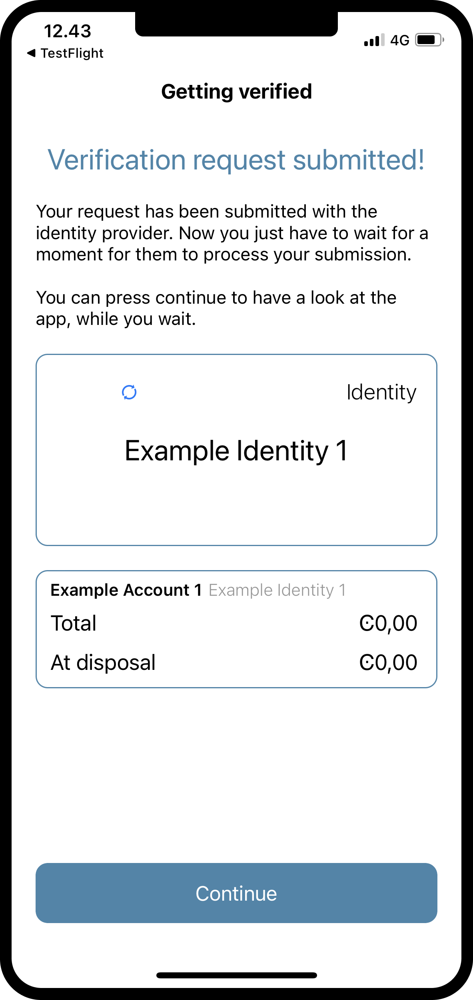
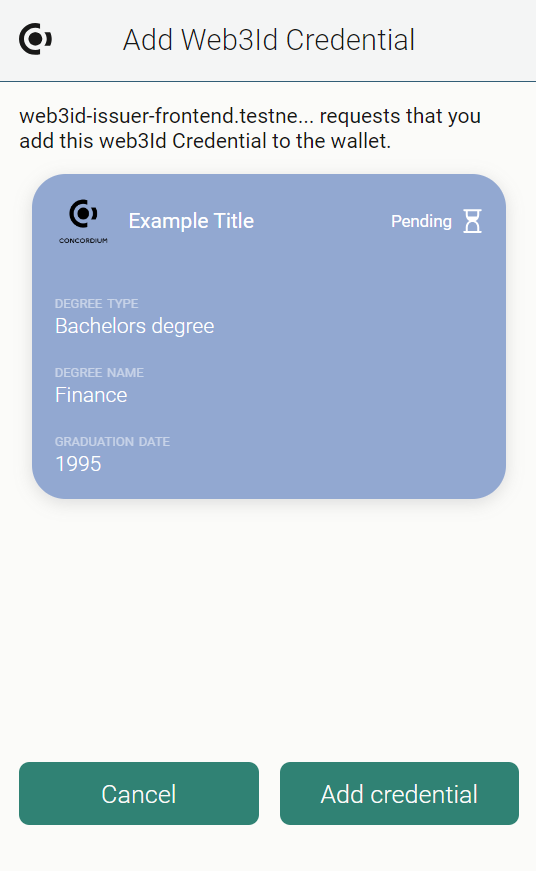
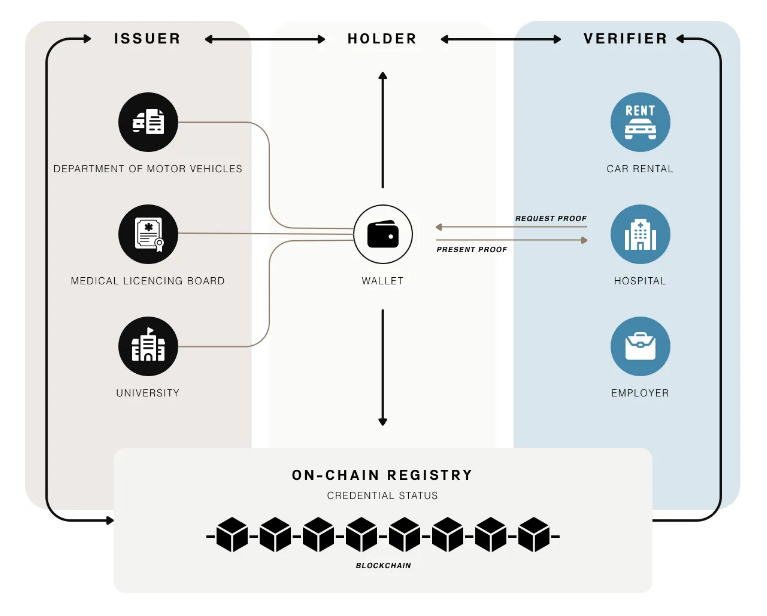
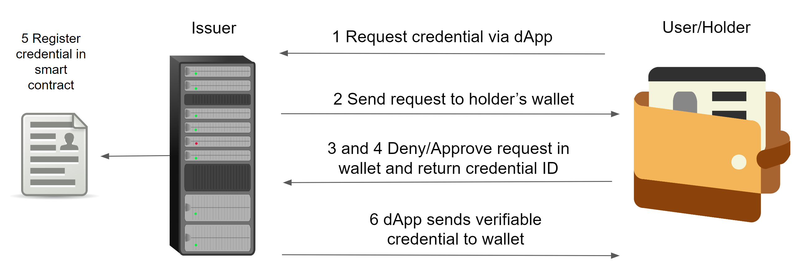

.. _web3id-index:
.. include:: ../../../variables.rst

.. meta::
    :description lang=en:
        ID is an integral part of the Concordium blockchain. Web3 ID expands on our ID layer and allows anyone to become a credential issuer.

======================
Identity on Concordium
======================

Concordium’s identity layer is built into the protocol. Every account on the chain has one or more credentials issued by specially sanctioned identity providers who are expected to be able to provide full disclosure of the identity in concert with the :term:`Privacy Guardians<Privacy Guardian (PG)>`. ID 2.0 made it possible to use these identities off-chain: wallets allow using identities to prove properties about the holder, such as their nationality or age. These are known as :term:`account credentials<account credential>`.

|

You can read more about the identity provider issued account credentials in :ref:`Identity framework on Concordium<reference-identity>`.

You can find a complete list of available ID attributes and their formats in :ref:`ID attributes reference<id-attributes-reference>`.

Web3 ID
=======

Web3 ID is an extension of the existing ID 2.0 infrastructure in Concordium to allow issuance of many different types of :term:`verifiable credentials<verifiable credential>` in addition to the existing :term:`account credentials<account credential>`. Web3 ID allows you to add :term:`verifiable credentials<verifiable credential>` to your |bw|, such as club memberships, education credentials, employment history, rewards programs, customer loyalty programs, and more. :term:`Proofs<zero-knowledge proof>` can be made to verify these credentials, if necessary.

Web3 ID is an extension of the core protocol identity with other types of credentials that don’t have stringent requirements and won't be part of the identity disclosure process, but can also prove a number of other attributes of the holder. Examples of this could be club membership credentials, reward programs, etc. There are no requirements imposed on who can be an issuer of these credentials, and in contrast to protocol identities, the verifiable credentials can be revoked according to the logic imposed by the issuer. This could be that the credential holder can revoke it, the credential expires, or the issuer or some other third party has rights to revoke it.

Verifiable credentials, like account credentials, will contain commitments to a variety of attributes. :term:`Zero-knowledge proofs<zero-knowledge proof>` can be constructed to verify the committed values. The |bw| supports construction of these proofs. The proofs can contain a mix of verifiable credentials and account credentials.

Entities
========

The core entities of the Web3 ID ecosystem are :term:`issuers<issuer>` which issue and manage the lifetime of verifiable credentials, and :term:`holders<credential holder>` that have verifiable credentials in their wallets, and use them to prove properties about themselves to :term:`verifiers<verifier>`.

The issuer is an entity that issues verifiable credentials. Issuers have a smart contract that holds credential lifetime metadata, a backend service that has logic for identifying users and sending transactions to the smart contract, and a dApp that interacts with the user’s wallet and the backend to facilitate issuance of credentials.

Verifiers ask holders for proofs about their attributes, such as proof of club membership, and holders respond with zero knowledge proofs created using their verifiable credentials. Verifiers have a backend service that checks :term:`verifiable presentations<verifiable presentation>` and provides a service, And a dApp that facilitates interaction with the wallet, making requests.

A user/wallet holds verifiable credentials, produces verifiable presentations, and interacts with the issuer and verifier. Verifiable credentials themselves never leave the user's wallet.

Issuance flow for verifiable credentials
========================================

The following diagram shows the issuance flow for verifiable credentials.

#. A user initiates a request for a verifiable credential from an :term:`issuer's<issuer>` dApp.
#. The issuer makes a request to the user's wallet for adding Web3ID credential. The request contains attributes and metadata.
#. After reviewing what has been sent by the issuer, the user accepts or rejects the request.  If denied, the process stops here.
#. If accepted, they generate a fresh credential holder ID and the wallet sends their credential ID (public key) to the issuer backend.
#. The issuer verifies the request, and if OK, registers the credential metadata (validity period, styling, logo, colors) in the smart contract under the received credential ID.
#. The issuer signs the attributes and returns a verifiable credential to the dApp which then sends it to the wallet, thus making the user a :term:`holder<credential holder>`.

Support for issuers and verifiers
=================================

Concordium understands that issuers and verifiers may not have the resources to create a smart contract from scratch and the other tooling needed to issue and prove verifiable credentials.
So tooling is provided that enables you to become an issuer and verify credentials as painlessly as possible.

Issuer
------

An issuer will typically consist of the following components.

1. Some existing way of identifying users.
2. A dApp that integrates with the wallet and allows the holder to request credential.
3. A smart contract that manages the credential lifetime. When a verifiable credential is issued the metadata is stored in the contract, and the attributes and other secrets, the full verifiable credential, are returned to the dApp to be stored in the wallet.

To ease the process of becoming an issuer, Concordium has created the `Concordium Web3 ID Issuer Frontend <https://web3id-issuer-onboarding.mainnet.concordium.software/>`__ where you can quickly and easily become an issuer.

In order to simplify issuance as much as possible Concordium provides a `template smart contract <https://github.com/Concordium/concordium-rust-smart-contracts/tree/main/examples/credential-registry>`_ that is expected to suffice for most of the issuers, but can be modified if custom logic is required.

As an alternative to the Concordium Web3 ID Issuer Frontend, Concordium additionally provides an `issuer service <https://github.com/Concordium/concordium-web3id/tree/main/services/web3id-issuer>`_ that is designed to handle all of the chain-specific interactions, and provides a simple REST API, so that only the custom business logic of the issuer must be implemented. Note that the service must be run by the issuer themselves, since only they have the secret keys necessary to run it.

Regardless of whether you use the Concordium Web3 ID Issuer Frontend or the issuer service, the issuer must provide JSON schemas for their credentials, and metadata. These schemas and metadata are used by the holder's wallet to display the credentials in the wallet.

Verifier
--------

A verifier is expected to be a business or another use-case that will only provide a service provided specific proofs can be provided by the holder, for example proof of ownership of specific credential, such as a concert ticket.
This will typically consist of two components.

1. A dApp that will interact with the wallet to request from the user to attest to specific properties of their credentials. The result of such a request is a :term:`verifiable presentation`.
2. A backend component that will verify the provided verifiable presentation and allow the desired action or not.

Verification of presentations has two components, the cryptographic verification of the zero-knowledge proofs contained within, which establish that the holder indeed owns the relevant credentials and they are issued by the stated issuer, and the business logic checking that the required property was attested.
In particular, a key part of the business logic is whether the verifier trusts a particular issuer, which is identified by a smart contract address and the public key registered therein.

Concordium runs an instance of the verifier for `Mainnet <https://web3id-verifier.mainnet.concordium.software/v0/verify>`_ or `Testnet <https://web3id-verifier.testnet.concordium.com/v0/verify>`__. Using Concordium hosted services means that the verifier places trust in Concordium, but simplifies the implementation of the verifier. You still have to provide a user interface or frontend (usually a dApp) that calls the Concordium hosted verifier. Otherwise, if you want to run the verification service yourself, Concordium simplifies the checking of the cryptographic part by providing a `verifier service <https://github.com/Concordium/concordium-web3id/tree/main/services/web3id-verifier>`_. To read more about the verification service, see :ref:`Tool to verify credentials<verifier-tool>`.

An example backend can be found in `the Web3 ID repository <https://github.com/Concordium/concordium-web3id/tree/main/examples/some-verifier>`__.

.. toctree::
   :hidden:
   :maxdepth: 1

   issuer
   Wallet identity provider interfaces <identity-provider-interfaces>
   ../guides/create-proofs
   id-attributes-reference

