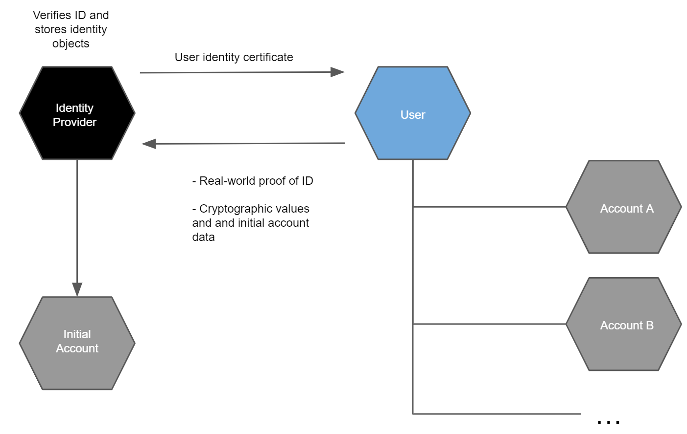

.. include:: ../../variables.rst
.. _account-creation:

================
Account creation
================

Once you have an :term:`identity` and a user identity certificate from an :term:`identity provider`, you can use it to create more accounts on the Concordium platform. This is typically done using an :ref:`app or wallet<tools>` that will guide you through the account creation process. The creation of an account is an :term:`on-chain` action that requires sending a transaction to a :term:`node` that participates in the Concordium network.

.. Note::
   |cryptoX| does not submit the transaction directly to a node, but via a proxy. |cryptox| does not need to be connected to a node.

The input to the transaction is a *credential*, which contains a number of cryptographic proofs. The proofs reveal no information about the owner of the account. In particular, the identity provider itself cannot determine the owner of the account.

.. Note::
   It is possible to create a shared account where multiple users share one account. For more information, see :ref:`Overview of shared accounts with multiple credentials<overview-shared-accounts>`.

Any time you create a new account using Desktop Wallet, you should make a :ref:`backup<backup-import-recover>`. Backups protect your account keys, ensuring that you do not lose access to your CCDs.

Each identity contains a number of cryptographic values. The cryptographic values are
a number of public and private keys, a signature from the identity provider, as
well as a number of secret values the user must use to be able to use the
identity to create accounts.

Every account on the chain must be derived from an identity that is verified and
signed by an approved identity provider. It is publicly visible which identity
provider issued an identity for an account and who the :term:`privacy guardians<Privacy Guardian (PG)>` are
for the account and the identity. This means that anybody can check it
before interacting with an account to judge the level of risk in the transaction.

Initial account
===============

.. Note::

   Initial accounts are not created by the identity provider when using |cryptox| or |bw|. You create all accounts yourself.

The user gets an :term:`initial account` at the same time as an :ref:`identity<reference-identity>` has been issued by an :term:`identity provider`. As the initial account is submitted to the chain by the identity provider, the identity provider knows the owner of the initial account. For this reason, you may not want to use the initial account and create a regular account instead. There can only be one initial account for one identity.

The user additionally :ref:`creates account keys<backup-import-recover>` for an initial account, which the user stores privately. The identity provider then verifies the validity of the user identity information
and stores it locally in an identity object that is specific to the user. Identity objects are only held by identity providers. The identity provider then opens an
account, the initial account, on behalf of the user. At the end of the identity verification process, the user receives a user identity certificate that can be used for creating
additional accounts and the user gets access to the initial account on the Concordium Platform. These certificates are valid for a given period. You can obtain a new certificate
by creating a new identity and going through the identity verification process again with an identity provider.

Based on the user identity certificate the user can subsequently create other accounts (see below) that can only be linked to the user if the :term:`Privacy Guardians<Privacy Guardian (PG)>` and the identity provider are
involved. This gives a user a way to create accounts with an additional layer of privacy protection compared to that in the initial account. The owner of a regular account is not known to the identity providers or any other single entity. To facilitate compliance with relevant regulations, a regular account can only be created from an *identity* which is issued :term:`off-chain` by an Identity provider. While an account has to be created from an identity, the user's privacy is still protected, and the account owner's identity can only be revealed via the process of :ref:`disclosing an identity<reference-identity-disclosure-processes>`, which can only happen under stringent regulations. In particular, a key feature of the design of identities and accounts is that the identity provider cannot reveal the identity of an account on their own.

.. _tools:

Tools
=====

Wallets
-------

You can use one of the :ref:`Concordium wallets<wallets-lp>` to create and manage your Concordium identities, credentials, and accounts and to create transactions.

To learn more about the differences between the wallets, see :ref:`Deciding between the wallets<choosing-wallet>`.

Command-line tool
-----------------

The Concordium distribution ships with a command-line tool named
:ref:`concordium-client<concordium-client>`. It is designed as a low-level interface to the
Concordium blockchain. It cannot be used to create identities, but it can
:ref:`import accounts<concordium-client-import-accounts-keys>` exported from the |cryptox|. Once an account has been
imported, the tool can be used to do CCD transfers from the account, as well as
send all other :ref:`transaction<transactions>` types supported by the Concordium blockchain.

