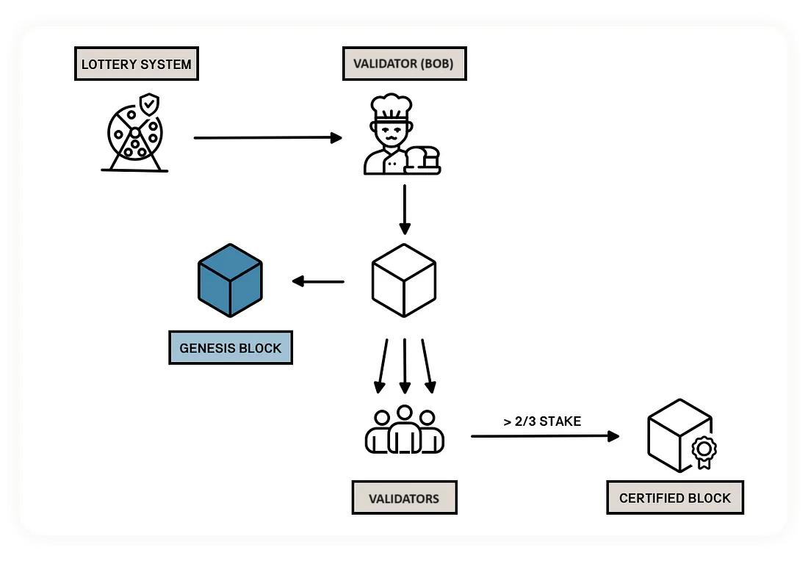
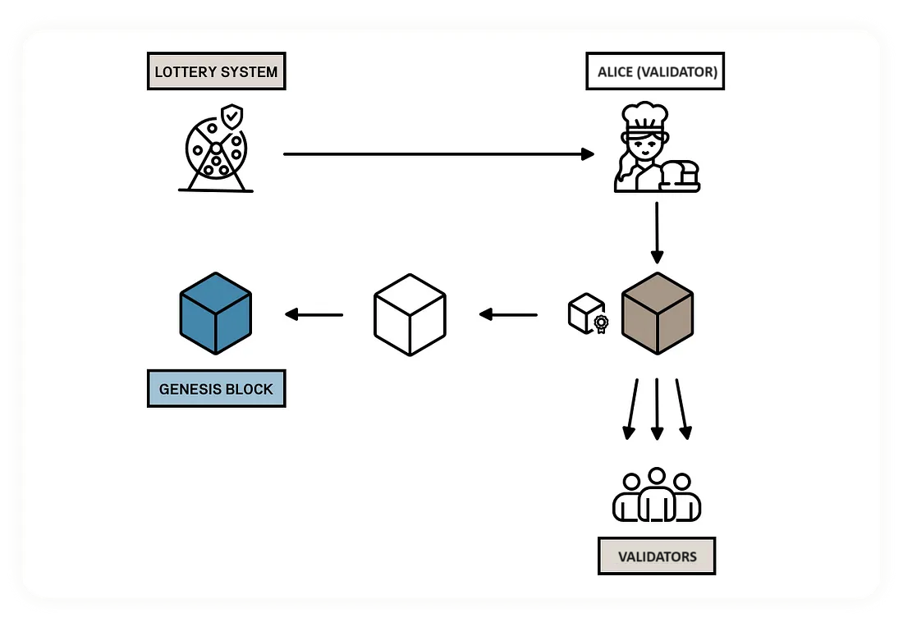

.. include:: ../../variables.rst
.. _baker-concept:

==========
Validation
==========

Validation is key to the Concordium blockchain. A :term:`node` is a validator node when it participates actively in the network by creating new :term:`blocks<block>` that are added to the chain. The blockchain consists of multiple :term:`validator` nodes. A :term:`validator` collects, orders, and validates the :term:`transactions<transaction>` that are included in a block to maintain the integrity of the blockchain. The validators sign each block that they produce so that the block can be verified and executed by the other validators in the network.

.. _concepts-baker-stake:

Stake and lottery
=================

A validator needs to :term:`stake<staked amount>` a part of its CCD balance on the validator account---at least 500'000 CCD---which is then locked. At any point, the validator can manually release a part of the staked amount---as long as the minimum 500'000 CCD remain staked---or close down the validator and release everything. Unstaked CCD goes through a :term:`cool-down<cool-down period>`, during which it does not earn rewards. Once the cool-down is over, the CCD is unlocked and available in the wallet to be moved or transferred.

.. note::

   If an account owns an amount that was transferred with a release schedule, the amount can be staked even if it hasn't been released yet.

All validators automatically take part in a *lottery* every round, to decide who will produce the next block, see :term:`leader election<leader election>`. The greater the validator's stake, the greater the validator's chance of :term:`winning the lottery<lottery power>` and being selected to produce a block.

Overview of the validation process
==================================

#. A Proof-of-stake based lottery system produces a list of round leaders for the epoch. The higher the validator's stake, the higher the probability of being included on the list more often.

#. The first validator on the list (Bob) makes a new block that appends to the genesis block.

#. Bob then broadcasts the block to all peers.

#. If the block is valid, i.e., it is well-formed and correctly placed in the chain, the validators will sign it.

#. If the combined effective stake of the validators who sign the block is *greater than or equal to* two-thirds of the total stake, the block gets a :term:`Quorum Certificate` (QC) that certifies that this is a valid block. Without the QC the new round cannot progress.

6. The next validator (Alice) now uses the QC to produce the next block. The new block can only extend the previous block when a QC is presented to Alice.

If there are no issues, the protocol repeats this process from step 3.

In the case of a faulty validator who does not produce a block or produces an invalid block, a timeout mechanism handles the process. If Bob does not produce a block within a certain time, a :term:`Timeout Certificate` (TC) is issued to move the process forward. Alice can now use the TC to skip the previous round and extend an older block for which she has a QC.

Time concepts
=============

The Concordium blockchain divides time into :term:`epochs<epoch>`.

When considering the rewards and other validation-related concepts, the concept of an *epoch* is used as a unit of time that defines a period in which the set of current validators and stakes are fixed.
Epochs have a duration of 1 hour and the duration is fixed at the :term:`Genesis block`. Each epoch has a nominal ending, and when a block is finalized after this nominal ending then epoch transition occurs.

Epochs are subdivided into :term:`rounds<round>`. In each round either a block is produced by the elected leader and validated by (2/3 of) the other validators,
or a timeout is produced if the timeout time is reached before a block and its :term:`quorum certificate` are produced.
In the case of a timeout, a :term:`timeout certificate` is produced for the block. The timeout time for the next round may shrink or grow depending on whether a block was finalized or a timeout occurred in the previous round.
Using :term:`consensus protocol<Concordium Byzantine Fault Tolerance (BFT) protocol>`, a validator has to add the new block after the block from the previous round,
unless a timeout occurred in the previous round, in which case they can add their block to an older round.
The list of lottery winners that are :term:`elected to be the leader for every round in that epoch<Leader Election>` is established at the beginning of the epoch.

A :term:`pay day` is the point at which new CCDs are minted and rewards are distributed to validators and delegators.
The stakes of validators and delegators are updated each pay day (but the changes for each pay day are fixed one epoch before).
Pay day is thus when new validators begin producing blocks, and updates to delegation and validation take effect.
Pay day is every 24 hours (i.e., 24 epochs) at approximately 09:00 UTC on Mainnet and approximately 12:00 UTC on Testnet.

In the case of decreasing stake or removing delegation or validation there is a :term:`cool-down period` of three weeks during which the unstaked funds are frozen.
For example, if you decrease a valiator's stake, the stake will be decreased at the first pay day but the funds will not be released to your disposable balance until after the cool-down period ends.

Validator keys
==============

A node uses a set of :term:`cryptographic keys<private keys>` called validator keys to sign the blocks that it produces. The validator keys are uniquely determined from the associated account. The validator keys are used for signing the block that the node produces and for verifying whether the validator has won the :term:`lottery <lottery power>` as described below. To become a validator node, the node must be configured with a set of validator keys. You generate the validator keys in the wallet when you add validation to an account. The validator node will start validation after the next :term:`pay day` once the transaction has been approved.

Validator account
-----------------

Each account can use a set of validator keys to register a validator. Whenever a validator produces a valid block that gets included in the chain, a reward is paid to the validator's account (and the staking pool delegators if they have a pool) at :term:`pay day`. The reward is derived from transaction fees paid for transactions included in the block and its predecessors, as well as from newly-minted CCDs.

The account can be viewed in the |cryptox|, the Desktop Wallet, or the |bw| depending on where the account was created.

Rewards are added to the staked amount by default. However, you can choose to receive the rewards in the account balance instead of staking them automatically.

.. Note::

   It is not possible to have multi-signature validator accounts in |cryptox| or |bw|. If you need this functionality, you need to run the Desktop Wallet.

Staking pool
============

You have the option to open a :term:`staking pool`. A staking pool allows others who want to earn rewards to do so without the need to run a node or become a validator themselves. To do this they :ref:`delegate<delegation-concept>` an amount of stake to your staking pool which then increases your stake and your :term:`chances of winning the lottery<winning probability>` to produce a block. You can also choose not to open a pool, in which case only your own stake applies toward the lottery. You can always open a pool later.

The maximum size of a pool is 5% of all stake. Any stake above this limit will not contribute towards earning rewards. It isn't possible to add more stake to exceed the limit, but reward restaking can push it over the limit, or if a lot of other validators unstake and the thresholds change, the staking pool can exceed the limit.

.. todo::

   If a validator misses producing a block, it is known which validator missed it. This is useful information for delegators when choosing a staking pool to delegate to, and node runners.

When is a block final?
======================

A block is final when it cannot be rolled back any more, i.e., part of the authoritative chain. Validators sign a block when they have verified that it is valid, and their collective signatures are aggregated to form a :term:`quorum certificate`. This quorum certificate is then included in the next block. When two blocks that are parent-child are in consecutive rounds in the same epoch and both have a quorum certificate, then the block in the first of these rounds (together with its ancestors) is considered final. Why isn't the child block considered to be final if it has a QC? This is to cover edge cases where network delays cause the QC of a block to not be received by the next block producer before a timeout. In that case, the block gets skipped by the next block producer and it cannot be considered final. To resolve this, only  the first among two consecutive certified blocks is considered to be final.

A block is final at a minimum of two seconds after its creation. A new block has to be created descended from that block for the new block to be final.

