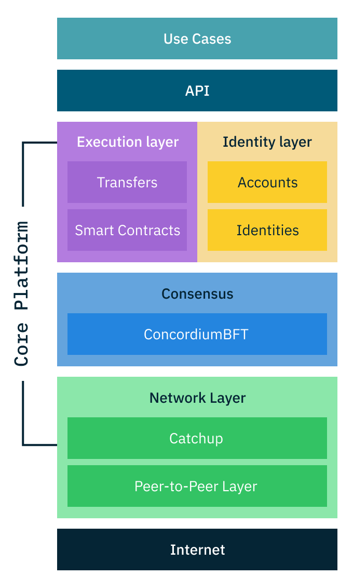

.. include:: ../../variables.rst

.. _reference-concordium-protocol:

===============================
What is the Concordium Protocol
===============================

Concordium is a public and permissionless blockchain platform designed for both business applications and public use. It combines privacy-preserving features with regulatory compliance, fast transaction processing, and cost-effective operations.

Core features
=============

Identity layer
--------------
Concordium provides a new solution to blockchain privacy through its identity layer. When users create an account, they first verify their identity with an authorized :term:`identity provider`. On the blockchain, their transactions remain private, but their identity can be revealed through a regulated legal process if required by authorities.

Fast and final transactions
---------------------------
The Concordium blockchain confirms transactions within seconds. Once confirmed, these transactions cannot be reversed. This is achieved through a :term:`proof-of-stake<Proof-of-stake>` consensus mechanism called :term:`ConcordiumBFT<Concordium Byzantine Fault Tolerance (BFT) protocol>`, where :term:`validators<validator>` who stake :term:`CCD` tokens help secure and maintain the network.

Predictable costs
-----------------
Transaction costs on Concordium are designed to be stable in Euro terms. This means that even if the CCD token price changes, the actual cost of using the network remains predictable. This feature helps businesses plan their blockchain operations effectively.

Protocol architecture
=====================
The Concordium Protocol operates through four main layers:

Network layer
-------------
The network layer handles communication between :term:`nodes<node>`. It includes a peer-to-peer system for sharing messages and a catchup mechanism that helps nodes stay synchronized with the network, even after being offline.

Consensus layer
---------------
The consensus layer ensures all nodes agree on the state of the blockchain using :term:`ConcordiumBFT<Concordium Byzantine Fault Tolerance (BFT) protocol>`, a novel proof-of-stake Byzantine fault tolerance consensus protocol. This protocol selects validators to create blocks based on their stake, verifies these blocks, and finalizes them quickly. The system remains secure as long as less than one-third of all staked CCD is controlled by malicious actors.

Identity layer
--------------
The identity layer manages user verification and privacy. It works with external identity providers who verify users' real-world identities. This information is stored securely off-chain, while on-chain transactions maintain user privacy. Only through a regulated process involving multiple authorities can identities be revealed.
At no point does Concordium see or hold any identiy information about its users, nor does the identity provider know which accounts are opened by which users.

Execution layer
---------------
The execution layer allows users to interact with the platform through its API, processing transactions and running :term:`smart contracts<Smart contract>`. It uses :term:`WebAssembly` as its foundation, allowing developers to write smart contracts in Rust.

Economics and validation
========================
The protocol uses :term:`CCD` (ConCorDium) as its native token. CCD serves multiple purposes:

- Paying for transaction fees
- Staking by :term:`validators<Validator>`
- Rewards for network participation

Validators must stake CCD to participate in block production. Other CCD holders can delegate their tokens to validators to earn rewards without running a node themselves. The maximum size of a validator's staking pool is capped at 5% of the total stake to maintain decentralization.

Build on Concordium
===================
Concordium is designed to make blockchain development straightforward and efficient. The predictable costs, fast transaction finality, and built-in identity features provide a solid foundation for building real-world applications.

The platform provides comprehensive tools for developers:

* `Smart contract development tools <https://docs.concordium.com/en/mainnet/tools/index.html>`_ with first-class Rust support
* Testing frameworks for thorough contract validation
* Wallet integration options for easy user onboarding
* Programming language support through WebAssembly
* Clear documentation and code examples

Developers can deploy both on :term:`Testnet` for development and :term:`Mainnet` for production. All core components of the Concordium Platform are open source and available on GitHub.
