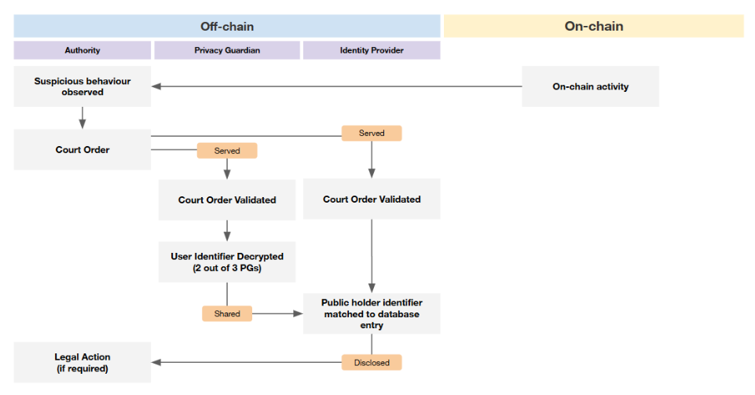
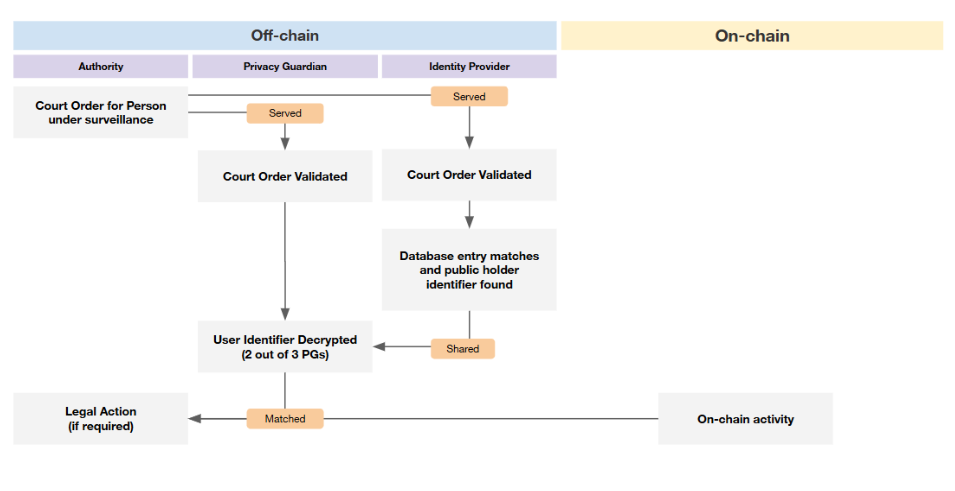

.. include:: ../../variables.rst

.. _reference-identity-disclosure-processes:

=============================
Identity disclosure processes
=============================

An important feature of Concordium is the ability to disclose a user's identity and any associated accounts if there is a legal need. This is reserved for exceptional cases of malpractice, and requires a court order to authorise the request. There are two legal scenarios in the context of Identity Disclosure: investigation of on-chain activity (initialized with an account number) and investigation of a person of interest (initialized with off-chain identifying data).

To maintain process integrity, all communication occurs through the Authority - there is no direct communication between Identity Providers and Privacy Guardians.

Legal scenario 1: Investigation of on-chain activity
====================================================

1. The Authority that is conducting the investigation must obtain a court order from the legal jurisdiction of the Privacy Guardian (PG).

2. The Authority initiates the identity disclosure process by presenting an official court order to the PGs from their respective jurisdictions, along with the encrypted public holder identifier (obtained from blockchain data) corresponding to the account being investigated.

3. Each PG uses its private decryption key to decrypt its share of the public holder identifier and transmits the resulting string back to the Authority.

4. Upon receiving the necessary threshold of valid responses (currently 2 out of 3 threshold), the Authority combines the decrypted shares to reconstruct the public holder identifier.

5. The Authority issues a formal request and submits the reconstructed public holder identifier to the relevant Identity Provider (IDP). If the IDP is in a different jurisdiction than the PG, an additional court order needs to be obtained by the Authority from the home country of the IDP.

6. The Identity Provider searches its internal database for a match to the public holder identifier provided by the Authority. Upon having located the database entry corresponding to the public holder identifier, the IDP sends the account holder identity record to the Authority. At this point, the disclosure process has successfully revealed a verified identity for an account or wallet address.

Once the identity has been revealed, it is possible to find additional accounts that are linked to it. This can be done via a full person to accounts disclosure scenario (detailed below) or via encrypted mapping information stored in the IDP. Both are dependent on a court order.

Legal scenario 2: Investigation of person of interest
=====================================================

1. A court order is required to start the disclosure process by the Authority in the jurisdiction(s) of the IDPs. The Authority sends the identifying data of a real-life person together with the official request to all IDPs on Concordium.

2. The IDPs check their system for account holders that match the identity data they received from the Authority.

3. If the IDP(s) can identify one or several database entries matching the user, then the IDP(s) sends all the corresponding account holder identity records to the Authority. Each record contains an encrypted :term:`linking key<Linking key>`, which allows the identity to be linked to the accounts opened with this identity.

4. These linking keys are then sent to the PGs along with a court order from their jurisdiction by the Authority. The PGs decrypt their share of each linking key and return the resulting strings to the Authority.

5. Once the Authority has collected the required threshold of shares (currently 2 out of 3 threshold) for a key from the PGs, it reconstructs the full key.

6. Using the reconstructed keys, the Authority retrieves the list of all accounts associated with each account holder identity record across all IDPs.

7. The Authority takes appropriate action based on the retrieved account and transaction information.

