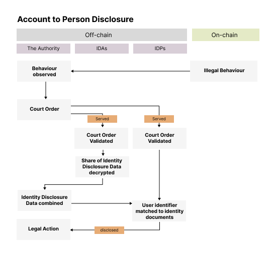

.. include:: ../../variables.rst

.. _reference-identity:

================================
Identity framework on Concordium
================================

Concordium's identity solution is designed to provide secure blockchain infrastructure that maintains accountability while preserving user privacy. The approach balances these requirements, enabling blockchain adoption across jurisdictions and ensuring regulatory compliance.

Concordium features two independent but interrelated identity layers that work together to provide a complete identity solution:

ConcordiumID
============

The ConcordiumID (also known as Base ID or Core ID) is the protocol-level identity system on Concordium. All users must obtain a ConcordiumID through identity verification with an approved identity provider before they can create and use accounts on the blockchain.

After successful identity verification, the account holder receives a ConcordiumID, which enables them to:

- Create accounts on the Concordium blockchain
- Conduct transactions within the network
- Prove certain identity attributes (such as age or citizenship) using zero-knowledge proofs without revealing the underlying data

The ConcordiumID is foundational to the accountability and privacy features of the Concordium blockchain.

Web3 ID
=======

The Web3 ID suite (also referred to as Portable ID) is a system for issuing and managing Verifiable Credentials, based on the W3C standard. This next-generation portable ID tool can be used for:

- Issuance, management, and verification of digital certifications
- Portable KYC
- Professional certifications
- Various other use cases requiring verified digital credentials

While interaction with the Concordium blockchain always requires a ConcordiumID, Web3 ID verifiable credentials can be used both within the Concordium ecosystem and in off-chain environments.

Key participants
================
The identity solution on Concordium involves several key participants, each with specific roles and responsibilities in the process.

* **Users**: Individuals or businesses who interact on the Concordium blockchain. Users must complete an identity verification process to create an account and become participants on the network.

* **Identity Providers (IDPs)**: Third-party organizations that provide off-chain identity verification. They issue structured identity objects while storing verification data securely. IDPs for both individuals and businesses can be added to the network as needed.

* **Identity Disclosure Authority (IDAs)**: Authorized entities that participate in Concordium's Identity Disclosure process when legally required. Typically legal firms adept at handling disclosure requests in compliance with court orders, they play a crucial role in the decryption process.

* **The Authority**: The entity that has obtained a court order to request identity disclosure. The court order must originate in the governing jurisdiction where the IDA is based, with a second court order from the IDP's jurisdiction also required. The Authority initiates the identity disclosure process when there is a legal need, such as in cases of fraud or criminal activity.

Key concepts
============

Understanding Concordium's identity framework requires familiarity with several key concepts:

* **Account**: An account is used to send and receive funds on the Concordium chain. The associated account credential defines the cryptographic keys that control the account. The account credential also contains information necessary for the identity disclosure. Multiple accounts can be created underneath an identity credential.

* **Identity Credential**: An identity credential contains attributes on a user's identity and is used to open accounts on-chain. It is issued by IDPs during user onboarding based on identity documents (e.g. passports). It is stored in both the user's wallet and IDP's database, but never accessible to Concordium. Users can share verified attributes using zero-knowledge proofs without revealing the underlying data.

* **Identity Disclosure**: In fraudulent and criminal cases, a process can be followed with multiple stakeholders (Authorities, IDPs and IDAs) to disclose the identity of the user of a given account or the finding of all accounts of a given user. This process requires court orders and involves multiple participants to protect user privacy under normal circumstances.

* **Identity Disclosure Data**: Each account credential contains encrypted identifiers linking it to the owner's identity record at the IDP. This data, along with encrypted linking information that can reveal all accounts of a user, requires decryption by multiple IDAs. This ensures that no single party—not even the IDP—can connect identities to accounts outside the proper disclosure process.

* **Wallet**: A wallet is a secure application where users manage their accounts, hold and transfer tokens, and store identity credentials. Wallets enable users to generate zero-knowledge proofs to share verified information without revealing personal data. Wallets hold cryptographic addresses that control the accounts.

* **Seed (phrase)**: A seed phrase is secret randomness created during wallet initialization. All cryptographic material needed for identity and account credentials is derived from this seed, allowing users to recover their Concordium accounts if needed.

Principles of privacy
=====================
Concordium's identity system has been designed to be privacy first, and applies the following principles:

Protection of personal identifiable information
-----------------------------------------------

Users personal identifiable information (PII) such as name, birthdate etc, are never available on chain, either encrypted or unencrypted. PII is only stored locally within the user's wallet and with the IDP for compliance purposes. For avoidance of doubt, Concordium does not have access to any of this user information.

Separation of powers
--------------------

No single party can link a user's Identity to the accounts they have on Concordium. This can only be done through the Identity Disclosure Process.

- IDPs cannot identify a user's account (or on chain wallet address). They cannot connect an identity to on chain activity or an address.

- A single IDA cannot decrypt a user's Identity Disclosure Data, this means they cannot access the mapping between a user's identity and their on-chain presence. In addition they do not have access to the PII which is stored within the IDPs systems.

- It is only possible to connect a user's PII identity to an account by following the identity disclosure process.

Selective disclosure through zero-knowledge proofs
--------------------------------------------------

With Concordium users can choose to reveal zero knowledge proof verifications of attributes of their identity across both ConcordiumID and Web3 ID, without revealing the underlying data (e.g. proving they are over 18 without revealing their birth date).

User processes
==============
Users must complete an identity verification process to create an account and become a participant on the Concordium network. This guards against unknown actors, hackers or fraudsters abusing the network. Wallets in the Concordium ecosystem hold both identities (stored as identity credentials), and accounts (which contain cryptographic addresses). Every account must be linked to a ConcordiumID Identity credential.

The account creation process follows these steps:

1. A user downloads their chosen wallet application, mobile, browser and desktop are available.

2. Within the wallet, the user initiates a request for the creation of an Identity credential by selecting their IDP of choice.

3. The user is prompted by the IDP to scan a passport or an identity document and to provide a selfie. Businesses can also identify through a similar process, but the requirements vary and need additional KYB (Know Your Business) documentation.

4. The IDP follows their standard identity verification process and verifies the validity of the identity document and any liveness checks.

5. For new users the IDP creates an identity credential which is stored in two places, in the user's wallet application and within the IDP's systems ("the identity record") for compliance and for reference as required for their participation in the Identity Disclosure Process. It's important to note that the IDP does not store associated wallet addresses alongside the Identity Credentials. IDPs are not able to unilaterally map identities to addresses.

6. Once the Identity Credentials have been verified and stored (within the user's wallet and IDP system), the user can create an associated account, this contains a public and private key, to send and receive tokens. Multiple accounts can be created underneath an identity credential.

7. For returning users the IDP recreates an identity credential. A user can then use their existing accounts or create a new one.

8. Users can add multiple Identity credentials within the same wallet application. However to create a new identity, as opposed to a new account, a user will need to complete an additional identity verification process with their chosen IDP.

.. image:: ./images/account-creation-new.png
   :alt: graphic drawing showing how creation of a user account

Verifiable credentials with Web3 ID
===================================
As an additional supplementary feature to the base identity provided on wallet creation, verified credentials can be issued to a user to power enhanced use cases.

Web3 ID is based on the W3C standards for verifiable credentials. This makes them portable and interoperable. Verifiable credentials can be used for KYC, compliance and regulation, for example to identify accredited investor status. Identity data, both ConcordiumID and Web3 ID verifiable credentials, can be used for off chain uses such as zero knowledge age verification.

The Web3 ID suite can be used for:

- Issuance, management, and verification of digital certifications
- Portable KYC implementations
- Professional certifications
- Membership verification
- Age verification without revealing birth date
- Other use cases requiring verified digital credentials

This verifiable credential system works in conjunction with the ConcordiumID base layer but can also function independently. The credentials benefit from Concordium's transparent on-chain event logs while maintaining the privacy protections inherent in the Concordium identity framework.

Identity disclosure process
===========================
An important feature of Concordium is the ability to disclose a user's identity and any associated accounts if there is a legal need. This is reserved for exceptional cases of malpractice, and requires a court order to authorise the request. A disclosure can take two forms, one identifying a person from an on-chain account, and the other a person identified via their registered document to all their accounts on-chain.

From an account on Concordium Blockchain to a real-world identity
-----------------------------------------------------------------

Individually, an IDA or the IDP can not reveal the identity of a user mapped to a Concordium account. But using the identity disclosure process, IDAs and the Authority work together to decrypt an identifier in the account. With this identifier the identity provider can find the user's identity record that contains information on the real-world identity.

A detailed breakdown of the process to reveal a user's identity from an account address is as follows:

1. The Authority initiates the identity disclosure process by presenting an official court order, along with the corresponding encrypted Identity Disclosure Data to the Identity Disclosure Authorities (IDAs).

2. Each IDA uses its private decryption key to decrypt its share of the Identity Disclosure Data and transmits the resulting partial data back to the Authority.

3. Upon receiving a threshold number of valid responses (i.e n out of t), the Authority combines the decrypted shares to reconstruct the unencrypted Identity Disclosure Data.

4. The Authority issues a formal request and submits the reconstructed Identity Disclosure Data to the relevant Identity Provider (IDP).

5. The Identity Provider searches its internal database for a match to the provided public identity credential. Upon locating the associated Identity Credentials which matches the unencrypted Identity Disclosure Data, the IDP returns the identifying information and linking information key to the Authority. At this point, the disclosure process has successfully revealed a verified identity for an account or wallet address.

6. To find all accounts associated with the identity, the Authority forwards the encrypted linking information to the IDAs, requesting decryption shares.

7. Each IDA processes the encrypted linking information and returns its partial decryption share to the Authority.

8. Once the Authority obtains the required threshold of decryption shares (minimum two out of three), it reconstructs the complete linking information required to connect the account to an identity document. This linking information allows the Authority to identify all accounts linked to the individual created with the same identity credential.

From a real-world identity to Concordium accounts
-------------------------------------------------
It is possible to find account addresses associated with a user's identity. Typically this process would only reveal identities created with the same document. In certain cases a wider scope could be required, such as all identities matching the name and birthdate. This would be specified in the court order.

The following approach discloses an account from an identity document:

1. Again, a court order is required to start the disclosure process. The Authority sends the identifying data of a real-life person together with the official request to all IDPs.

2. IDPs check their system for users that match the identity data they received from the Authority.

3. If the IDP is able to identify a matching user within its system, then the IDP sends the account holder's identity, including the encrypted linking information to the Authority.

4. This encrypted linking information is then sent to the IDAs, who decrypt their share of the linking information and return it to the Authority.

5. Once the Authority collects the minimum (at least n out of t) shares from the IDAs, it reconstructs the full linking information.

6. Using all decrypted linking information, the Authority retrieves the list of all accounts associated with the identified user across all IDPs.

.. image:: ./images/person-to-account-disclosure.png
   :alt: graphic drawing showing the process for identity disclosure from person to account
