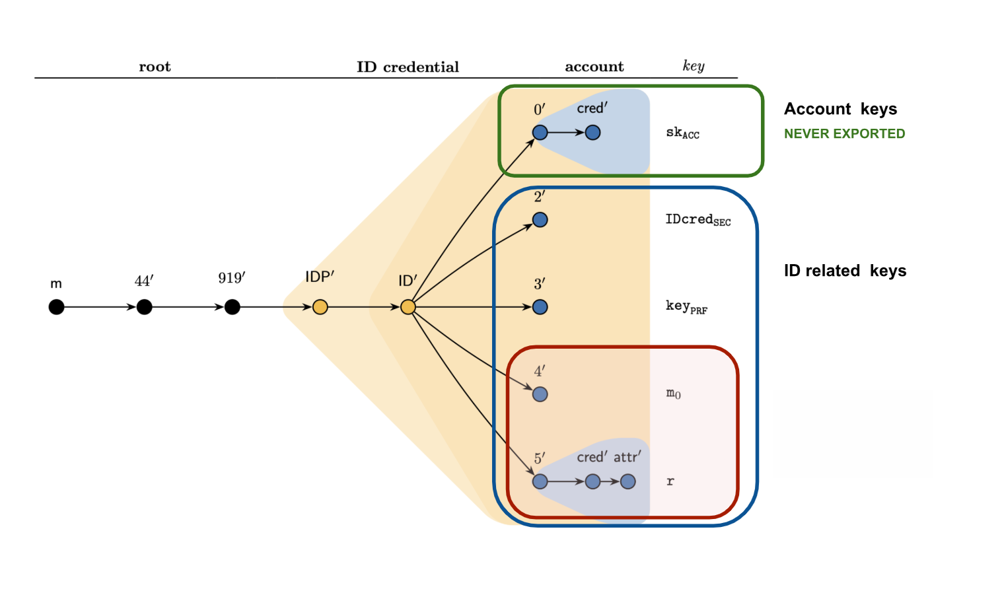
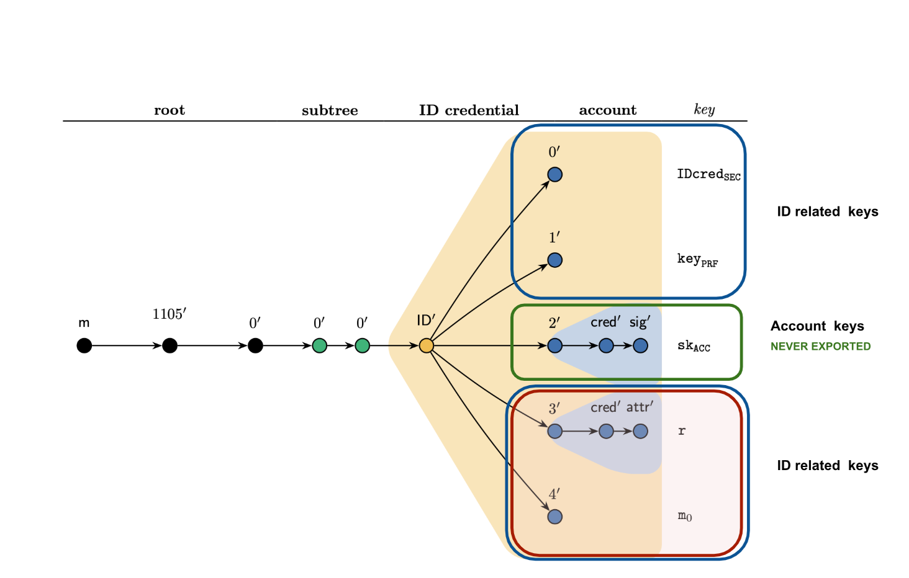

.. include:: ../../variables.rst
.. _key-derivation:

=========================
Key derivation and usage
=========================

Concordium uses a `SLIP-10/BIP32 <https://github.com/satoshilabs/slips/blob/master/slip-0010.md>`_ style key derivation scheme to generate all the cryptographic key material necessary to open and operate accounts on the blockchain.

Each account is associated with an identity credential issued to the user by an :term:`identity provider (IDP)<identity provider>`.
This structure is also reflected in the derivation tree shown below, where there is a subtree for each identity provider, which itself contains a subtree for each identity credential the user got issued from that IDP.

The subtree of a single identity credential consists of:

* A subtree dedicated to account signature keys (those are the ones used to sign transfers)
* Multiple subtrees that generate cryptographic material for the ID object itself

Secrets in the ID related subtrees have to be exported either due to the complexity of the involved cryptographic operations, e.g. Bulletproofs, or as they need to be sent to an external party (in encrypted form). Note that even if all ID related secrets get leaked, the account keys cannot be compromised (assuming the key derivation scheme SLIP-10/BIP32 is sound).

Derivation structure
====================

All cryptographic keys related to an identity object and the related accounts are generated from a subtree with prefix=m/44'/919'/IDP'/ID' where IDP is the index of the identity provider and ID is the index of the ID, e.g. ID=0 for the first identity issued to the user.

Account keys
------------

Subtree 0' is used to derive signature keys for accounts related to the ID objects. That is, prefix/0'/cred' is the key for the account with index cred' (starting at 0).

**Impact of Potential Leakage:** An attacker could control accounts related to the given ID.

.. important::
   We never export secrets from this subtree! Therefore, no crypto assets can be moved (without having access to secure key storage).

Holder Identifier
-----------------

Subtree 2' defines the holder identifier (essentially a public/private key pair) which is used as a user identifier in Concordium's identity disclosure scheme. Technically, the public identifier IDcredPub is an element in G1 of BLS12-381 and the secret identifier IDcredSec is a field element in the corresponding finite field.

Why we export
^^^^^^^^^^^^^

Each account created with the given identity contains the public identifier in encrypted form (technically, secret shared where each share is ElGamal encrypted under the public key of an identity disclosure authority). Generating the encryption requires knowledge of the secret identifier. The correctness of this encryption is proven in zero-knowledge as part of a larger  zero-knowledge proof for the account opening. The proof is a combination of Bulletproofs and Sigma protocols over BLS12-381. For generating the zero-knowledge proof, one needs the secret identifier.

Impact of potential leakage
^^^^^^^^^^^^^^^^^^^^^^^^^^^

The attacker learns the identifier used to store the user's record at the identity provider. This alone is useless without collusion by the identity provider. It does not allow the attacker to take control of the account.

Pseudo-random function Key
--------------------------

Subtree 3' defines the PRF key used to generate the addresses of accounts. Technically the account address is PRF(PRF key, x) where x is the account index. Knowing the PRF key allows identifying all accounts that have been generated from a given identity.

Why we export
^^^^^^^^^^^^^

When an identity is issued, the identity provider will store an encrypted copy of the PRF key (same encryption scheme as mentioned above for the holder identifier). The correctness of this encryption is proven to the identity provider in zero-knowledge. The proof is again a combination of Bulletproofs and Sigma protocols over BLS12-381.

Furthermore, in the account opening proof one also needs to prove that the account address was correctly computed. This also requires knowledge of the PRF key.

Impact of potential leakage
^^^^^^^^^^^^^^^^^^^^^^^^^^^

The attacker can link all accounts on-chain that have been opened from the identity. It does not allow the attacker to take control of the account.

Blind signature randomness
--------------------------

Subtree 4' defines randomness m0 used in a blind signature protocol between the identity provider and the user when issuing a new identity. This allows the user to get a signature on both the identity attributes (e.g. name, birthdate) and things like the PRF key and the IDcredSec without the identity provider learning the secret values.

Why we export
^^^^^^^^^^^^^

The randomness m0 is needed as part of the ID issuance protocol. As part of this protocol the user needs to prove knowledge of m0. This is part of the same zero-knowledge proof as mentioned in the PRF key section.

We observe that the randomness could be generated from scratch by the wallet during the ID issuance process. However, by having it generated from the seedphrase, the user can recover the signature from the identity provider at a later point (without having to do another blind signing ceremony).

Impact of potential leakage
^^^^^^^^^^^^^^^^^^^^^^^^^^^

The attacker could recover the ID signature if they know the blinded version stored at the identity provider. It does not allow the attacker to take control of the account.

Pedersen commitment randomness
------------------------------

Subtree 5' defines the randomness (aka opening information) used in the Pedersen commitments that commit the account to the attributes of the identity. These commitments can be used to prove (ideally, off-chain) statements about the account holder.

Why we export
^^^^^^^^^^^^^

The randomness in these commitments is used to prove statements about the account holder in zero-knowledge proofs.

As part of the account opening proof, the user also needs to show that the commitments have been generated correctly from the ID attributes signed by the identity provider. This again requires knowledge of the commit randomness.

The advantage of generating the commit randomness from the seed phrase is that the user can recover the commitment opening information.

Impact of potential leakage
^^^^^^^^^^^^^^^^^^^^^^^^^^^

The opening information on its own does not allow an attacker to learn the committed values directly (assuming that the dlog problem is hard on the used curve; however, they could brute force some of the information with low entropy, e.g. date of birth). It does not allow the attacker to take control of the account.

Legacy derivation tree
----------------------

Some older wallets use a legacy derivation tree. The only differences between this and the derivation tree described above is the prefix m/1105'/0/0'/0'/ID', which omits the identity provider index, and the use of different indices for the key subtrees in the identity credential subtree. For example, the account signature keys are located in subtree 2' instead of 0'. It is important to note that the split of keys into subtrees is equivalent to those in the above tree. Thus one cannot control the account given the exported keys.

