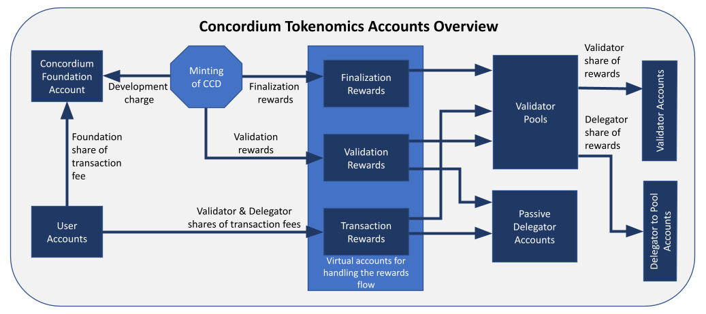

.. include:: ../../variables.rst

.. _tokenomics:

============================
Concordium tokenomics system
============================

CCD
===
CCD is the native token on the Concordium platform. CCD can be used for a variety of purposes, including :term:`smart contract` execution fees, transfers between users, and commercial transactions. 10 billion CCD have been created in the genesis block. After this, the only mechanism to create more CCD is the minting process. The number of CCD that exists on the platform at any time is defined and publicly known. It can be found on `CCDscan <https://ccdscan.io/>`_.

CCD are minted daily at a rate of 4% growth annually, with the goal of reaching 2% in the long term. These are distributed as rewards to validators and delegators. The mint rate will decrease when the number of transactions increases, assuring that the validators receive adequate rewards.

Transactions
============
To submit a :doc:`transaction <transactions>` to the blockchain, a :doc:`fee <transaction-fees>` must be paid in CCD. The price of transactions is fixed in EUR, not in CCD. This means that they are not subject to the fluctuations of CCD. Businesses can thus plan the cost of their operations.

The cost of a basic CCD transfer is set at 0.01 EUR. The costs of more complex operations such as smart contract calls depend on a variety of parameters, including the computational complexity of the operation and the amount of data handled.

Validators
==========
Validators are the heart of a decentralized blockchain. Their role is to order the transactions submitted to the chain by grouping them into :term:`blocks<block>` and adding new blocks at the end of the chain.

To become a validator, a user has to stake at least 500,000 CCD, which is then locked in their wallet. They can then run the required software and have a probability of creating blocks and receiving :ref:`rewards<tokenomics-rewards>` which is proportional to their relative stake. If they decide to shut down their validator, the stake is unlocked after a :term:`cool-down period`.

Staking pools
=============
Validators can decide to open a pool. The stake in a pool consists of the stake of the validator and any stake added by delegators. The validator can choose whether the pool is open to all delegators, closed to new delegators (but the existing ones can stay), or closed to all delegators (existing delegators are removed). Furthermore, the validator can choose the commission that their delegators pay to them. These parameters can be changed by the validator at any time.

The probability of a validator winning the lottery to create the next block is proportional to their relative pool size. The rewards earned for creating the block are distributed to all users with stake in the pool as described in the :ref:`Rewards<tokenomics-rewards>` section below.

The sizes of pools are limited in the following ways. Firstly, the stake in a pool is capped at 5% of all staked CCD. The purpose of this bound is to foster decentralization and avoid too large a fraction of stake going offline if a machine fails or the software is updated. If this limit is exceeded, then only 5% counts towards the :term:`lottery power` and rewards. If a user wishes to stake more than this amount, they can run a second validator with a different pool. To improve the stability of the system, the second validator should be run on a different machine in a different location.

The second bound on pool sizes states that the total stake in a pool can be at most 6 times the stake of the validator. Here too, any stake exceeding this amount will not be counted towards the lottery power and rewards. The purpose of this bound is to preserve the fundamental principle of :term:`proof-of-stake`, namely that the probability of creating a block should be related to the stake of the validator. The assumption that at least a given threshold (e.g., 2/3) of the stake is controlled by honest people is justified by them having their own money in the game. If there is no bound on how much can be delegated, then a validator could be controlling only other people’s funds and the incentive to behave honestly is weaker.

Delegators
==========
Users that do not wish to run validators have the option of delegating CCD to validators and profiting from some of the rewards. A delegator has two options: delegating to a specific validator’s pool or choosing passive delegation.

Delegating to a pool has been mentioned in the section above: a delegator adds their stake to the pool of a validator, increasing this validator’s probability of adding new blocks to the chain and earning rewards. These rewards are then shared with all pool members. Each staker in the pool gets a share proportional to their stake, minus the delegation commission that is given to the validator.

Passive delegation
------------------
Passive delegation is an innovation of Concordium. It provides rewards to the delegator equivalent to what one would get if one were to split one’s stake amongst all pools proportionally to the pools’ stake, but with a fixed commission of 25% that is shared amongst all pools.

By choosing passive delegation, the return will be the average rewards over all pools (minus the fixed passive commission), which mitigates the risk of picking a validator that performs poorly or goes offline. This security comes at an increased cost: a delegator to a pool can choose one with a commission below 25%. More details are provided below.

.. _tokenomics-rewards:

Rewards
=======
The reward distribution explained in this section is illustrated in the figure below. Rewards are computed and distributed once a day. This currently takes place around 9:00 UTC. The period between two payouts is called a :term:`pay day`.

Reward sources
--------------

Rewards given to validators and delegators come from two sources:

- **Transaction fees**: 90% of these are distributed to validators and delegators, and the remaining 10% go to the Concordium Foundation.
- **Minted CCD**: 90% of this is rewarded to validators and delegators for the blocks that they produce. The remaining 10% go to the Concordium Foundation.

Reward types
------------
There are two types of rewards distributed to :term:`staking pools<Staking pool>` and passive delegators:

- **Transaction rewards**: 45% of the transaction fees of all transactions in a block are directly given to the pool that makes the corresponding block. Another 45% are added to an accumulation account, which is gradually distributed to the pools creating the next blocks. This smooths the distribution of transaction rewards between pools. The remaining 10% are the Foundation’s share, as mentioned above.

- **Block rewards**:  the 90% of the minted CCD that go to pools as rewards for creating blocks are distributed at the end of a :term:`pay day`. The amount of CCD available is divided by the number of valid blocks created on that day, and each staking pool is rewarded for the number of blocks that they have created.

Validator and delegator split
-----------------------------

For each type of reward (namely, transaction and block rewards) there is a different delegation commission that can be set by the validator. These rewards earned by a pool are distributed to all pool members proportionally to their stake in the pool. Then an amount corresponding to the delegation commission is taken from each type of the delegator rewards, and is paid out to the validator running the pool.

The calculation for passive delegators is similar to that of delegators to pools, but the block and transaction commissions are fixed at 25%, and are distributed to all pools.

Rewards can be automatically re-staked. This option can be changed by the validators and delegators at any time.

Cool-downs
==========

Any increase to a validator’s or a delegator’s stake is effective after the next :term:`pay day`, given that the transaction was executed at least an hour before the end of the pay day.

If a validator or delegator wishes to decrease their stake, e.g., shut down their validator, there is a 7-day cool-down period for validators before the change is effective. Note that while in cool-down, the stake is not effective, meaning that it does not count towards the :term:`lottery power` of the pool nor does it earn rewards.

During this period the validators and delegators continue to earn rewards with their full stake. The stake cannot be changed anymore until the end of the cool-down period. The amount unstaked is unlocked and made available in their wallet at the first pay day after the cool-down period.

Return on investment
====================

The return on investment (ROI) depends on multiple parameters. Naturally, if a validator fails to produce a block when it is their turn, that pool won’t get the corresponding rewards. Furthermore, the total amount of staked CCD impacts the ROI, because if more CCD is staked but the total rewards are stable (i.e., the minted CCD and transaction fees are unchanged), then the rewards per CCD staked decrease. For current numbers for every pool, see `CCDscan <https://ccdscan.io/>`_.

Note that the actual value of the ROI might deviate strongly from the average value for smaller pool sizes and shorter periods of time, because in these cases the variance due to the lottery is much greater. There is, however, no variance in the rewards for passive delegation. So the only change from one day to the next is due to the different amount of rewards per CCD staked generated that day.

Penalties
=========

Validators are not currently punished for faulty behavior, but they only receive rewards if their block is valid and makes it to the chain. Validators that consistently fail to participate in the protocol are removed from the committee and will therefore not be selected to propose blocks nor can they earn rewards any longer. They can resume validating at the next pay day by submitting the corresponding transaction to the chain. This is not intended to punish validators, but to protect the chain from accidents or carelessness that are not resolved fast enough. Details on the suspension mechanism can be found in the `Concordium White Paper <https://docs.concordium.com/governance/whitepaper/Concordium%20White%20Paper.pdf>`_ (v. 1.11 and above).

