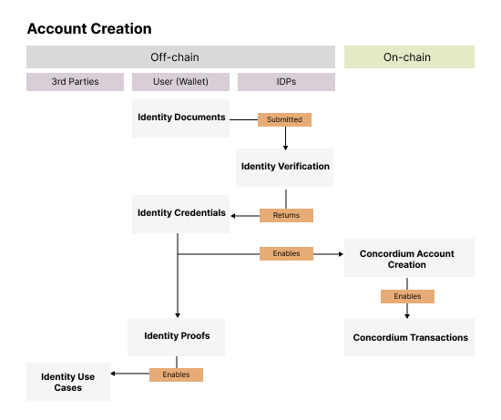

.. include:: ../../variables.rst

.. _reference-user-processes:

==============
User processes
==============

Account creation
================

Users must complete an identity verification process to :doc:`create an account <manage-accounts>` and become a participant on the Concordium network. This guards against unknown actors, hackers or fraudsters abusing the network. Wallets in the Concordium ecosystem hold both identities (stored as :term:`Identity Credentials<Identity Credential>`), and accounts (which contain cryptographic addresses). Every account must be linked to a Concordium ID Identity Credential.

The account creation process follows these steps:

1. A user :doc:`downloads <../installation/downloads>` their chosen wallet application. :doc:`Mobile, browser and desktop versions are available <../guides/deciding-wallet>`.

2. Within the wallet, the user initiates a request for the creation of an Identity Credential by selecting their :term:`IDP<Identity Provider>` of choice.

3. The user is prompted by the IDP to scan a passport or an identity document and to provide a selfie. Businesses can also identify through a similar process, but the requirements vary and need additional :term:`KYB (Know Your Business)<KYB>` documentation.

4. The IDP follows their standard identity verification process, verifies the validity of the identity document, and completes any other checks.

5. For new users the IDP creates an Identity Credential which is stored in two places, in the user's wallet application and within the IDP's systems ("the identity record") for compliance and for reference as required for their participation in the Identity Disclosure Process. It's important to note that the IDP does not store associated wallet addresses alongside the Identity credentials. IDPs are not able to unilaterally map identities to addresses.

6. Once the Identity Credentials have been verified and stored (within the user's wallet and IDP system), the user can create an associated account. This account contains a public and private key, to send and receive tokens. Multiple accounts can be created underneath an Identity Credential.

7. For returning users, the IDP recreates an Identity Credential. A user can then use their existing accounts or create a new one.

8. Users can add multiple Identity Credentials within the same wallet application. However to create a new identity, as opposed to a new account, a user will need to complete an additional identity verification process with their chosen IDP.

Verifiable credentials with Web3 ID
===================================

As a supplementary feature to the base identity provided on wallet creation, verified credentials can be issued to a user to power enhanced use cases.

:ref:`Web3 ID <web3-id>` is based on the W3C standards for verifiable credentials. This makes them portable and interoperable. verifiable credentials can be used for KYC, compliance and regulation, for example to identify accredited investor status. Identity data, both Concordium ID and Web3 ID verifiable credentials, can be used for off-chain uses such as zero-knowledge age verification.

The Web3 ID suite can be used for:

- Issuance, management, and verification of digital certifications
- Portable :term:`KYC` implementations
- Professional certifications
- Membership verification
- Age verification without revealing birth date
- Other use cases requiring verified digital credentials

Web3 ID can leverage Concordium ID, but doesn't have to. The verifiable credentials can, in principle, be used off-chain, but benefit from both the Concordium ID, as well as transparent events logs on-chain.
