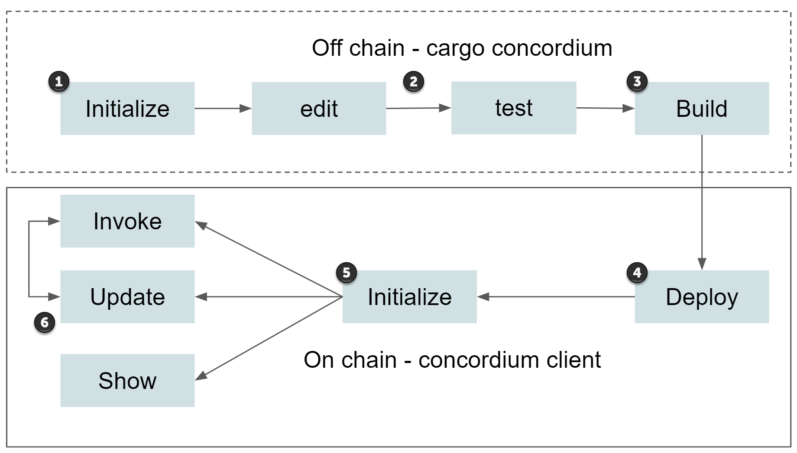

.. _sc-lifecycle:

==============================
Life cycle
==============================

A smart contract is first deployed to the chain as part of a :ref:`contract
module <contract-module>`. After this a smart contract can be *initialized* to
obtain a :ref:`smart contract instance <contract-instances>`. Finally a smart
contract instance can be repeatedly updated according to its own logic.
Before you can follow this guide, you need to :ref:`setup the development environment <setup-env>`.

#. In ``cargo-concordium`` :ref:`run the init command<setup-contract>` to start a new project.

#. Edit your contract, including the entrypoints, functions, and parameters necessary to execute what is needed. If :ref:`using a schema<build-schema>`, make sure that the contract is prepared for this. You can also run your code off-chain for testing purposes with the :ref:`integration testing library<integration-test-contract>`.

#. In ``cargo-concordium`` :ref:`run the build command<compile-module>` to build the Wasm module that can be deployed on chain.

#. In ``concordium-client`` :ref:`run the deploy command<deploy-module>` to deploy the Wasm module. This makes the contract available on chain.

#. In ``concordium-client`` :ref:`run the init command<initialize-contract>` to initialize the contract on chain. This gives you a new instance of the smart contract with a fresh state.

#. In ``concordium-client`` you can then :ref:`run invoke<invoke-instance>` to simulate your contract and see how much energy it uses or to call a view entrypoint which returns some data derived from the contract state; use :ref:`show<inspect-instance>` to see the schema or parameters in the contract, or :ref:`update<interact-instance>` to execute transactions and update the state.

You can also watch a video about the smart contract lifecycle.

.. raw:: html

    <iframe src="https://www.youtube.com/embed/84_-C-4cK4E?si=v0xd-fkVl63tl2Vg" title="YouTube video player" frameborder="0" allow="accelerometer; autoplay; clipboard-write; encrypted-media; gyroscope; picture-in-picture; web-share" allowfullscreen></iframe>
