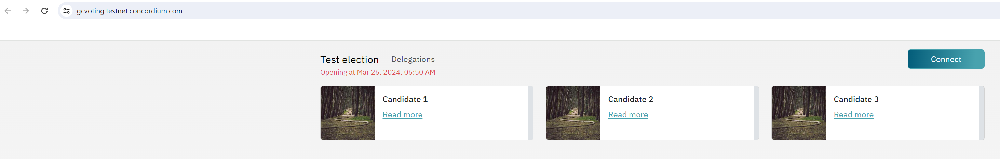

.. _voting:
.. include:: ../../variables.rst

===========
How to vote
===========

To paritcipate in voting, voters need a wallet on the Concordium blockchain with enough CCD to cover transaction fees. Once this is set up, the voting process works as described below.

For |cryptox| and |bw| wallet holders
=====================================

#. Navigate to the voting dApp.

#. The voting dApp presents a list of candidates. Each candidate has a small graphic and a link to a description of their choice. **The image below is only an example.**

    .. image:: ../images/voting/voting-dapp.png
                :alt: example voting dapp site
                :width: 100%

#. When the election is open, select zero or more candidates and then, select **Submit**. It is possible to vote multiple times.

#. When prompted, **connect** the wallet to the voting dApp and send the update transaction to the smart contract. The voting weight is calculated based on the account's average CCD balance during the months, as specified in the `election rules <https://docs.concordium.com/governance/rules/ElectionRules2024.pdf>`_.

    .. image:: ../images/voting/voting-dapp-connected.png
                :alt: voting dapp sidebar when connected to wallet
                :width: 100%

The voting dApp also has a separate page where voters can see a list of all their (encrypted) ballot submissions.

Voting from multiple accounts
-----------------------------

Since the votes are weighted by the number of CCD on the account, for a user to vote with their full weight they need to vote from all their accounts.

For |cryptox| wallet users: Simply disconnect and reconnect to select a different account.

For |bw| users: Disconnecting and connecting will reconnect to the same account. To change accounts, follow the instructions below.

.. dropdown:: |bw|

    #. In the wallet, click **Accounts** in the menu.

    #. Under the account that is currently connected to the voting dApp, click **See list** next to *Connected sites*.

        .. image:: ../images/voting/connected_account_new.png
                    :alt: account connected to a dApp
                    :width: 50%

    #. This opens the **Connected sites** page, showing which sites are connected to this account.

        .. image:: ../images/voting/connected_files.png
                    :alt: account connected to a dApp
                    :width: 50%

    #. Click **disconnect** next to the address of the voting dApp.
    #. Return to the account list by clicking **To Accounts list**
    #. Return to the main wallet window by clicking **To main page**.
    #. Select the account with which you wish to vote.
    #. Disconnect and reconnect in the voting dApp. After reconnecting, you will be connected to the account that is currently open in the wallet.
    #. Repeat the steps above to vote with all accounts.

For Desktop wallet and Concordium Client wallet holders
=======================================================

These wallets do not have the capability to connect to dApps. But you do have an option to exercise your vote.

.. dropdown:: Desktop wallet

    Users need to create a new account in |bw| or |cryptox| and delegate their vote from their Desktop wallet account(s) to the new account, then vote from the new account. You can create the new account in |bw| or |cryptox| at any time before delegating your vote. But the memo transaction, which effectively delegates the vote, and the vote from the new account both need to take place within the official voting window.

    **To delegate your vote:**

    #. In the account from which you want to vote, click **Send**.

    #. Enter any amount of CCD (1 micro-CCD is enough). The target account in |bw| or |cryptox| is the recipient (in the image below the recipient account has been added to the address book and named My vote delegation). Add a transaction memo that says **delegatevote2025**.

        .. image:: ../images/voting/dw-vote-delegation.png
            :alt: send CCD window in desktop wallet showing how to delegate vote
            :width: 100%

    #. Continue with the transaction by signing it using your LEDGER device as with all other transactions.

        .. image:: ../images/voting/dw-transaction-submitted.png
            :alt: send CCD window in desktop wallet showing how to delegate vote
            :width: 100%

    #. It is possible to check from the Voting DApp that the delegation worked. The window for delegating votes is the same as voting with the DApp.

.. dropdown:: Concordium Client

    Users need to create a new account in |bw| or |cryptox| and delegate their vote from their Concordium Client wallet account(s) to the new account, then vote from the new account. You can create the new account in |bw| or |cryptox| at any time before delegating your vote. But the memo transaction, which effectively delegates the vote, and the vote from the new account both need to take place within the official voting window.

    **To delegate your vote:**

    .. code-block:: console

        $concordium-client --secure --grpc-ip grpc.mainnet.concordium.software transaction send --amount AMOUNT --receiver A --sender B --memo delegatevote2025

    #. Enter the command above in the Concordium Client, where AMOUNT is the number of CCD to be sent (1 micro-CCD is enough), A is the name/address of the account to which the vote is delegated, and B is the sender name/address. Note the memo *delegatevote2025* for the delegation to be valid. Furthermore, there is no service license agreement for the grpc endpoint.

    #. Vote from the account that has received the delegation.

How to see delegations
======================

It is possible to see delegations to an account in the voting dApp. Anyone can check the delegations on an account. You do not need to connect a wallet to do this.

To see delegations, click **Delegations**. Enter or paste the Concordium account number for which you want to see all delegations.

