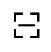
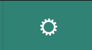

.. include:: ../../variables.rst
.. _connect-app-bw:

===================================
Connect dApps to wallets
===================================

You can connect the |bw| and |mw-gen2| to a `dApp <https://en.wikipedia.org/wiki/Decentralized_application>`__ that has a front end interface so that you can pay for services. You can initiate the request from within the |bw| or |mw-gen2|, or the dApp can initiate a connection request that you must confirm. Connection can be made by either scanning a QR code or from a link to the dApp service.

.. dropdown:: |bw|

   To initiate a request to connect to a dApp within the |bw|:

   #. In the browser navigate to your dApp's front end interface.

   #. Go to the **Accounts** page.

   #. Click |gear|.

   #. Click **Connected Sites**.

   #. Your site appears in the list. Click **Connect**.

      .. image:: ../images/browser-wallet/connect-site.png
               :width: 50%
               :alt: window with a site and Connect text

   The status of the account changes to *Connected*. If you need to disconnect, click **Disconnect** to disconnect the account from the dApp.

.. dropdown:: |mw-gen2|

   |mw-gen2| uses WalletConnect to connect to dApps.

   .. Note::

      Currently, only |mw-gen2| for Android devices supports WalletConnect.

   To connect your |mw-gen2| to a dApp:

   #. Tap the scan QR code button in the Accounts overview |scan-qr-overview| or Transactions overview |scan-qr-acct|.
   #. Scan the QR code provided by the dApp. If you tap the scan QR code button |scan-qr-overview| in the Accounts overview, tap the account that you want to connect to the dApp as shown below. If you are accessing the dApp on your phone, click on the link provided in the dApp.

      .. image:: ../images/mobile-wallet-gen2/dapp-select-acct.png
            :alt: screen with text boxes for each account
            :width: 50%

   #. Provide your |mw-gen2| passcode or biometrics when prompted.
   #. When prompted, you can tap **Connect** to continue using your account with the dApp or **Decline** if you do not want to use the account with the dApp.

      .. image:: ../images/mobile-wallet-gen2/dapp-connect.png
         :alt: screen with information about session and options to accept or decline
         :width: 50%

   When you you make a purchase in a dApp, you must confirm the purchase in the |mw-gen2|. On the approve transaction screen review the transaction details. Tap **Submit** if you approve the transaction or **Reject** if you do not approve. If you submit the transaction, tap **Okay** to return to the connection screen.

   .. image:: ../images/mobile-wallet-gen2/dapp-transaction.png
         :alt: screen with tranaction details and option to submit or reject
         :width: 50%

   To disconnect when you have completed your transactions, tap **Disconnect** in the service screen to disconnect your |mw-gen2| from the dApp. When prompted to confirm, tap **Disconnect** to end the connection or **Stay** if you want to stay connected to the service.

   .. image:: ../images/mobile-wallet-gen2/dapp-disconnect.png
         :alt: screen with session information and disconnect button
         :width: 50%

   .. Note::

      While you are connected to a dApp you cannot perform other transactions in the |mw-gen2|. You must disconnect the dApp before you can do other transactions.

.. note::

      If you want to try to connect to a dApp to see how the functionality works, go to https://wccd.testnet.concordium.com/ and connect to it following the steps above. You can then use the dApp to connect to your account and see the behavior.

.. toctree::
   :hidden:

   ../guides/proofs

