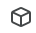
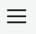

.. include:: ../../variables.rst
.. _setup-browser-wallet:

=========================
Set up the |bw|
=========================

The |bw| is a digital wallet that enables you to create and manage your Concordium
:term:`identities<identity>` and :term:`accounts<account>` and to create transactions, such as sending CCD.

To learn more about identities and accounts, see :ref:`identities<reference-id-accounts>` and :ref:`accounts<managing_accounts>`.

Read the following guide to learn how to set up the wallet.

.. Note::

   The |bw| extension is not supported in any of the web browsers below when used on a mobile phone or tablet.

.. _setup-bw:

Get started
===========

#. Download the |bw| extension for your browser.

.. dropdown:: Chrome

   #. Go to the `Chrome Web Store <https://chrome.google.com/webstore/category/extensions>`__ and search for Concordium Wallet.

   #. Click **Add to Chrome** from the Chrome Web Store.

   #. If prompted, click **Add extension**.

   #. Click on the puzzle icon. Click **Concordium Wallet** to start the extension.

   #. Create a six-digit passcode or use a full password.

   #. Choose whether you are creating a new wallet or :ref:`recovering an existing one<recover-wallet>`.

      .. image:: ../images/browser-wallet/wallet-choice.png
            :alt: screen with option to create or restore
            :width: 50%

.. dropdown:: Edge

   Extensions designed for Google Chrome can also be used in Microsoft Edge. To add an extension to Microsoft Edge from the Chrome Web Store:

   #. In Microsoft Edge, go to the `Chrome Web Store <https://chrome.google.com/webstore/category/extensions>`__.

   #. Select **Allow extensions from other stores** in the banner at the top of the page, then click **Allow** to confirm.

   #. Search for Concordium Wallet and select **Add to Chrome**.

   #. At the prompt showing permissions required by the extension carefully review the permissions, and then click **Add extension** if you wish to proceed. You'll see a final prompt confirming the extension has been added.

   #. Click on the Concordium icon to start the extension.

   #. Create a six-digit passcode or use a full password.

   #. Choose whether you are creating a new wallet or :ref:`recovering an existing one<recover-wallet>`.

      .. image:: ../images/browser-wallet/wallet-choice.png
            :alt: screen with option to create or restore
            :width: 50%

   For more information, see the `Microsoft support site <https://support.microsoft.com/en-us/microsoft-edge/add-turn-off-or-remove-extensions-in-microsoft-edge-9c0ec68c-2fbc-2f2c-9ff0-bdc76f46b026#:~:text=1%20Open%20Microsoft%20Edge%20and%20go%20to%20the,confirming%20the%20extension%20has%20been%20added.%20See%20More>`_.

.. dropdown:: Opera

   #. In Opera, go to the `Chrome Web Store <https://chrome.google.com/webstore/category/extensions>`__ and search for Concordium Wallet.

   #. Click **Add to Opera**.

   #. At the prompt showing permissions required by the extension carefully review the permissions, and then click **Add extension** if you wish to proceed. You'll see a final prompt confirming the extension has been added.

   #. Click on the cube icon in your Opera toolbar. Click **Concordium Wallet** to start the extension.

   #. Create a six-digit passcode or use a full password.

   #. Choose whether you are creating a new wallet or :ref:`recovering an existing one<recover-wallet>`.

      .. image:: ../images/browser-wallet/wallet-choice.png
            :alt: screen with option to create or restore
            :width: 50%

.. dropdown:: Brave

   #. Go to the `Chrome Web Store <https://chrome.google.com/webstore/category/extensions>`__ and search for Concordium Wallet.

   #. Click **Add to Chrome** from the Chrome Web Store.

   #. If prompted, click **Add extension**.

   #. Click on the puzzle icon. Click **Concordium Wallet** to start the extension.

   #. Create a six-digit passcode or use a full password.

   #. Choose whether you are creating a new wallet or :ref:`recovering an existing one<recover-wallet>`.

      .. image:: ../images/browser-wallet/wallet-choice.png
            :alt: screen with option to create or restore
            :width: 50%

Recovery phrase setup
=====================

If you are creating a new wallet, you must set up a :term:`secret recovery phrase`. This is a 24 word phrase that stores your private keys, identities, and accounts. You must write down and confirm your recovery phrase. It is important to keep this secret recovery phrase in a safe location in case you need to recover your wallet on a new device.

#. Once you click on **Create** you are shown the 24 word secret recovery phrase. Write it down and click **Continue**.

   .. image:: ../images/browser-wallet/recovery-phrase.png
            :alt: screen with recovery phrase and continue option
            :width: 50%

#. Enter all 24 words of your secret recovery phrase to confirm it. Click **Continue**.

#. Choose whether to connect to Mainnet or Testnet to create your wallet.

Request your identity
=====================

Having set up your passcode, you must then submit a request for an identity.

#. Select a third-party identity provider from the list. An external web page opens within the app.

#. Enter the information requested by the third-party :term:`identity provider`. The information might vary depending on the identity provider. However, they will ask you to provide photos of identification documents and a selfie.

#. When you have submitted the information to the identity provider, you will have a pending identity in your app.  The verification or rejection is usually retrieved from the identity provider within minutes, but check frequently to retrieve the result. The result can be retrieved for up to seven days.

Create an account
=================

#. To switch to the accounts page, click |hamburger-bw| and select **Accounts**.

#. Click the Accounts drop-down. Then click **Add new**.

#. Select the Identity to use for the account. Click **Add account**.

Basic navigation
================

Click |hamburger-bw| to change between pages.

.. image:: ../images/browser-wallet/page-menu.png
      :alt: menu at top of window with drop-down expanded to show options
      :width: 50%

Transactions overview
---------------------

In the Accounts page, click |log| to see an overview of the transactions. If you want to see details for the transaction, click on the transaction.

Find and share your account address
-----------------------------------

#. Go to the **Accounts** page.

#. On the account you want to find the address to tap |receive|.

#. Share your address:

    - You can let someone scan your QR code if they have the |mw-gen1| or |mw-gen2| installed.

    - You can tap **COPY** to copy the address and then paste it somewhere of your own choosing.

.. _switch-network:

Change network
--------------

You can use the wallet on both Mainnet and Testnet without the need for a separate application. Use the **Network Settings** to switch between Mainnet and Testnet.

.. Note::

    Accounts and identities are NOT shared between mainnet and testnet.

#. Click on the Concordium logo and select **Wallet Settings**.

#. Click **Network settings**.

#. Select the Network you want to connect to: Mainnet or Testnet. Note that the color of the user interface items in Mainnet is blue and the color of the user interface items in Testnet is green.

Light/dark mode toggle
----------------------

At the bottom of the Wallet settings page you can toggle between light and dark mode.

.. |gear| image:: ../images/browser-wallet/account-settings.png
             :alt: gear wheel
             :width: 50px

.. |log| image:: ../images/browser-wallet/transaction-log.png
             :alt: gear wheel
             :width: 50px

.. |copy| image:: ../images/copy.png
             :alt: two documents
             :width: 40px

Remove the |bw|
===============

Removing your wallet does not remove your data on the Concordium blockchain.

.. Warning::

   Before proceeding, if you wish to continue to access your wallet and accounts, make sure you have your secret recovery phrase.

.. dropdown:: Chrome

   #. Click |chrome-ext|. Click |chrome-options| to the right of **Concordium Wallet**.

   #. Click **Remove from Chrome**.

.. dropdown:: Edge

   #. Click |edge-exts|. Click |edge-options| to the right of **Concordium Wallet**.

   #. Click **Remove from Microsoft Edge**.

   #. Click **Remove** to confirm removal.

.. dropdown:: Opera

   #. Click |opera-exts|. Click |opera-options| to the right of **Concordium Wallet**.

   #. Click **Remove extension**.

   #. Click **Remove** to confirm removal.

.. dropdown:: Brave

   #. Click |brave-exts|. Click |brave-options| to the right of **Concordium Wallet**.

   #. Click **Remove from Brave**.

   #. Click **Remove** to confirm removal.

.. Note::

   If you forget your passcode for your installed |bw|, you will need to remove the extension in your internet browswer and reinstall it, choosing the option to :ref:`recover your wallet<recover-wallet>`. Use your secret recovery phrase to recover the wallet.

.. |chrome-ext|    image:: ../images/browser-wallet/chrome-extensions-icon.png
                    :width: 20px
                    :alt: puzzle piece

.. |chrome-options| image:: ../images/browser-wallet/chrome-options-icon.png
                    :width: 20px
                    :alt: three vertical dots

.. |edge-options| image:: ../images/browser-wallet/edge-options.png
                    :width: 20px
                    :alt: three horizontal dots

.. |brave-exts|    image:: ../images/browser-wallet/brave-exts.png
                    :width: 20px
                    :alt: puzzle piece

.. |brave-options| image:: ../images/browser-wallet/brave-options.png
                    :width: 20px
                    :alt: three horizontal lines

.. |opera-options| image:: ../images/browser-wallet/opera-actions.png
                     :width: 20px
                     :alt: three vertical dots

