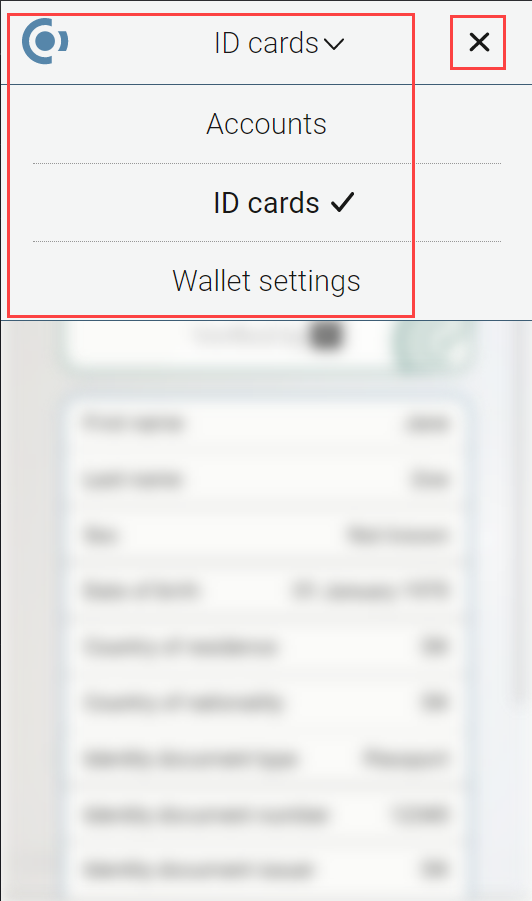

.. include:: ../../variables.rst
.. _use-browser-wallet:

=============================
How to use the |bw|
=============================

This guide covers navigation and basic usage of the |bw|.

Basic navigation
================

Click |hamburger-bw| to change between pages.

Transactions overview
=====================

In the Accounts page, click |log| to see an overview of the transactions. If you want to see details for the transaction, click on the transaction.

Find and share your account address
===================================

#. Go to the **Accounts** page.

#. On the account you want to find the address to tap |receive|.

#. Share your address:

    - You can let someone scan your QR code if they have the |mw-gen1| or |mw-gen2| installed.

    - You can tap **COPY** to copy the address and then paste it somewhere of your own choosing.

Change your passcode
====================

#. Click |hamburger-bw| and select **Wallet Settings**.

#. Click **Change passcode**.

#. Enter and confirm your new passcode.

.. _switch-network:

Change network
==============

You can use the wallet on both Mainnet and Testnet without the need for a separate application. Use the **Network Settings** to switch between Mainnet and Testnet.

.. Note::

    Accounts and identities are NOT shared between mainnet and testnet.

#. Click on the Concordium logo and select **Wallet Settings**.

#. Click **Network settings**.

#. Select the Network you want to connect to: Mainnet or Testnet. Note that the color of the user interface items in Mainnet is blue and the color of the user interface items in Testnet is green.

Export your private key
=======================

You may need to export your private key to import it to a site you are developing.

#. Go to Accounts.

#. Click |gear|.

#. Click **Export private key**.

#. Enter your passcode.

#. Click **Show private key**.

#. When your private key is shown, copy it with the |copy| button to get the key's value, or click the Export button to get a file compatible with other tools like Concordium Client.

Light/dark mode toggle
======================

At the bottom of the Wallet settings page you can toggle between light and dark mode.

.. |gear| image:: ../images/browser-wallet/account-settings.png
             :alt: gear wheel
             :width: 50px

.. |copy| image:: ../images/copy.png
             :alt: two documents
             :width: 40px

.. |hamburger-bw| image:: ../images/browser-wallet/hamburger-menu.png
                    :width: 20px
                    :alt: three horizontal lines

