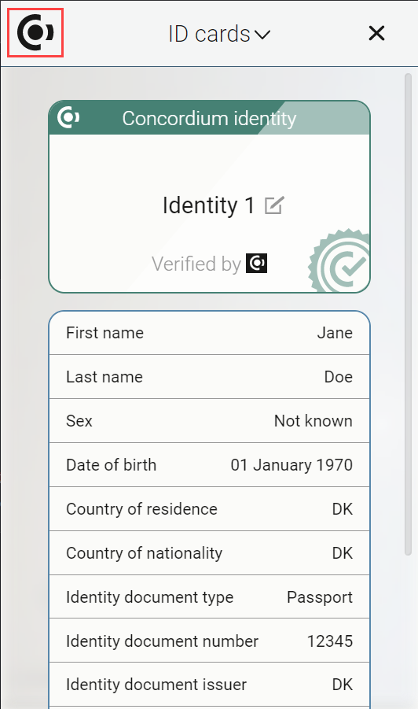

.. include:: ../../variables.rst
.. _use-browser-wallet:

=============================
How to use the |bw|
=============================

This guide covers navigation and basic usage of the |bw|.

Basic navigation
================

Click on the Concordium logo to change between pages.

.. image:: ../images/browser-wallet/page-menu.png
                :width: 25%

Click X to cancel out of an action or close a page.

Change your passcode
====================

Click on the Concordium logo and select Wallet Settings.

Click Change passcode.

Change network
==============

Click on the Concordium logo and select Wallet Settings.

Click Network settings.

Select the Network you want to connect to: Mainnet, Testnet, or Stagenet.

Export your private key
=======================

Go to Accounts.

Click |gear|.

Click **Export private key**.

Enter your passcode.

Click **Show private key**.

When your private key is shown, copy it with the |copy| button.

.. |gear| image:: ../images/browser-wallet/account-settings.png
             :alt: gear wheel

.. |copy| image:: ../images/copy.png
             :alt: two documents
