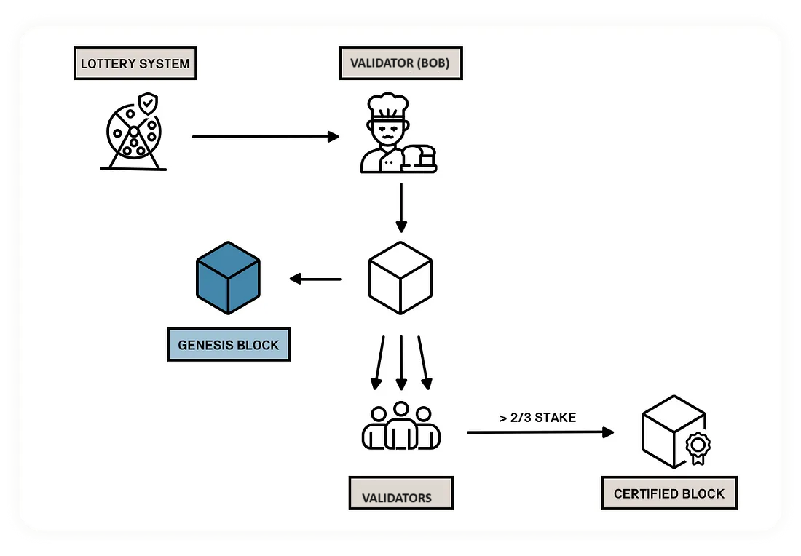
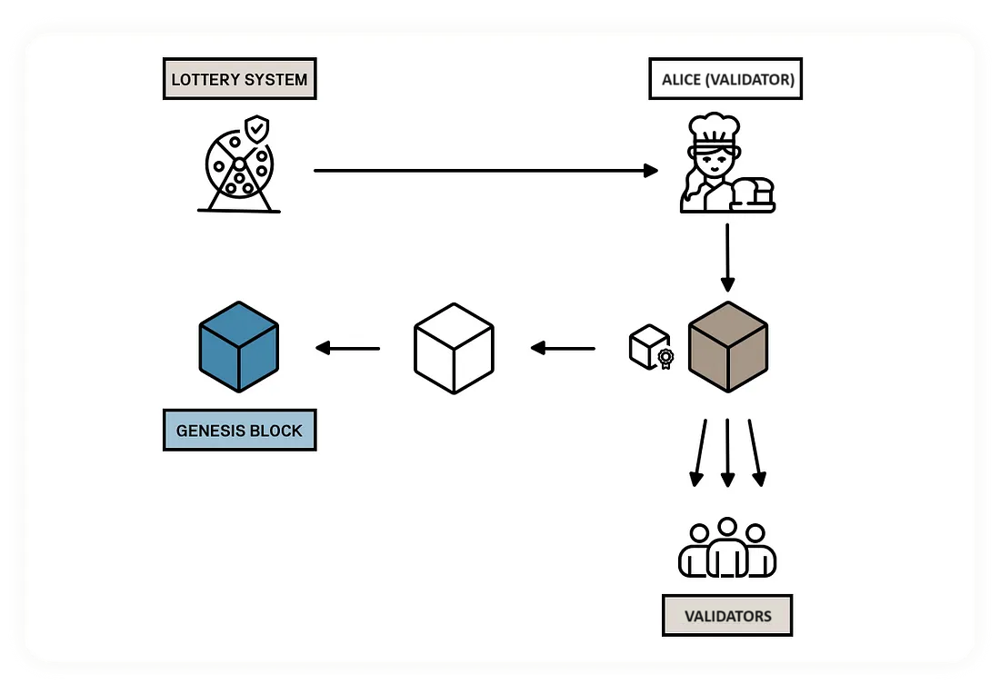

.. include:: ../../variables.rst
.. _baker-concept:

======
Bakers
======

Baking is key to the Concordium blockchain. A :ref:`baker <baker-concept>` is a :ref:`node<glossary-node>` that participates in the network by :ref:`baking<glossary-baker>` (creating) new :ref:`blocks<glossary-block>` that are added to the chain. The blockchain consists of multiple :ref:`baker<glossary-baker>` nodes that maintain the blockchain by baking and :ref:`finalizing<glossary-finalization>` :ref:`blocks<glossary-block>`.

How baking works
================

A node is a baker node when it participates actively in the network by creating new blocks that are added to the chain. A :ref:`baker<glossary-baker>` collects, orders, and validates the :ref:`transactions<glossary-transaction>` that are included in a block to maintain the integrity of the blockchain. The bakers sign each block that they bake so that the block can be verified and executed by the rest of the participants of the network.

The chain a baker builds upon is the :ref:`best chain <glossary-best-chain>` when making a new block. The best chain is selected using :ref:`consensus protocol <glossary-consensus>`. In particular, the best chain has the most finalized blocks and the most blocks after the last finalized block.

Baker keys
----------
A node uses a set of :ref:`cryptographic keys<glossary-private-keys>` called baker keys to sign the blocks that it bakes. The baker keys are uniquely determined from the associated account. The baker keys are used for signing the block that the node bakes and for verifying whether the baker has won the :ref:`lottery <glossary-lottery-power>` as described below. To become a baker node, the node must be configured with a set of baker keys. You generate the baker keys in the wallet when you add a baker account. The baker node will start baking after the next :ref:`pay day<glossary-pay-day>` once the transaction has been approved.

Baker account
-------------

Each account can use a set of baker keys to register a baker. Whenever a baker bakes a valid block that gets included in the chain, a reward is paid to the baker's account (and the baker pool delegators if they have a pool) at :ref:`pay day<glossary-pay-day>`. The reward is derived from transaction fees paid for transactions included in the block and its predecessors, as well as from newly-minted CCDs.

The account can be viewed either in the Desktop Wallet, the |mw-gen2|, the |mw-gen1|, or the |bw| depending on where the account was created.

Rewards are added to the staked amount by default. However, you can choose to receive the rewards in the account balance instead of staking them automatically.

.. Note::

   It is not possible to have multi signature baker accounts in |mw-gen2| or |mw-gen1|. If you need this functionality, you need to run Desktop Wallet.

Baker pool
----------

You have the option when adding a baker to open a :ref:`baker pool<glossary-baker-pool>`. A baker pool allows others who want to earn rewards to do so without the need to run a node or become a baker themselves. To do this they :ref:`delegate<delegation-concept>` an amount of stake to your baker pool which then increases your stake and your :ref:`chances of winning the lottery<glossary-winning-probability>` to bake a block. You can also choose not to open a pool, in which case only your own stake applies toward the lottery. You can always open a pool later.

The maximum size of a pool is 10% of all stake in pools (i.e., excluding passive delegation).

.. _concepts-baker-stake:

Stake and lottery
-----------------

A baker needs to :ref:`stake<glossary-staked-amount>` a part of its CCD balance on the baker account. Later, the baker can then manually release a part of or all of the staked amount. The staked amount cannot be moved or transferred until it's released by the baker.

.. note::

   If an account owns an amount that was transferred with a release schedule,
   the amount can be staked even if it hasn't been released yet.

To be chosen to bake a block, the baker must take part in a
*lottery*. The greater the baker's stake, the greater the baker's chance of :ref:`winning the lottery<glossary-lottery-power>` and being selected to bake a block.

The same stake is used when calculating whether a baker is included in the :ref:`finalization <glossary-finalization>` committee or not.

.. todo::

   If a baker misses baking a block, it is known which baker missed it. This is useful information for delegators when choosing a baker pool to delegate to, and node runners.

Time concepts
-------------
The Concordium blockchain divides time into :ref:`epochs <glossary-epoch>`.

When considering the rewards and other baking-related concepts, the concept of an *epoch* is used as a unit of time that defines a period in which the set of current bakers and stakes are fixed. Epochs have a duration of 1 hour and the duration is fixed at the :ref:`Genesis block <glossary-genesis-block>`. Each epoch has a nominal ending, and when a block is finalized after this nominal ending then epoch transition occurs.

Epochs are subdivided into :ref:`rounds <glossary-round>`. Rounds have either a block or a timeout. Rounds have a minimum time interval, but the rounds can grow "in time" if a round times out. For example, if round 1 times out, then round 2's duration increases and so on. Then whenever there is a block in a round that manages to get a :ref:`quorum certificate<glossary-quorum-certificate>` attached, then the "round duration" will shrink, and it will continue to do so if , for example, there have been multiple rounds that have timed out.
But it cannot shrink below the minimum time interval given by the chain parameters. There can only ever be one block for a certain round across all branches, thus there is a unique leader (potential baker) for a round in an epoch.

A :ref:`pay day<glossary-pay-day>` is the point at which new CCDs are minted and rewards to bakers and delegators are distributed. The stakes of bakers and delegators are updated each pay day (but the changes for each pay day are fixed one epoch before). Pay day is thus when new bakers begin baking, and updates to delegation and baking take effect, such as increasing stake, restaking preferences, adding delegation. In the case of decreasing stake or removing delegation or baking, there is a longer cool-down period, after which the change is executed at the **next pay day after the cool-down period ends**. The cool-down period is 2 weeks for delegators and 3 weeks for bakers. Pay day is every 24 hours (i.e., 24 epochs) at approximately 08:05 UTC on Mainnet and approximately 11:05 UTC on Testnet. Bakers are finalized at the end of an epoch then one epoch passes before that next epoch where they are eligible to bake.

A :ref:`cool-down period <glossary-cool-down-period>` describes a period of time during which certain activities or transactions are frozen. For example, if you decrease a baker stake, the stake will be decreased at the first pay day after the cool-down period ends. The cool-down period is 3 weeks. During the cool-down period, you’ll not be able update the stake. After the cool-down period, the amount by which you decreased your stake is returned to your disposable balance at the next :ref:`pay day<glossary-pay-day>` and your stake is reduced to the amount you specified. (This also means that any rewards that are earned in this period, if restaking earnings is enabled, will also be unstaked after the cool-down period.)

Finalization
============

:ref:`Finalization<glossary-finalization>` ensures that baked blocks become finalized as quickly as possible and with 100% certainty.

What is finalization?
---------------------

Finalization is the process by which a block is marked to be “finalized”, i.e., part of the authoritative chain. Transactions that are part of finalized blocks are considered authoritative. New blocks can be only added following the last finalized block to ensure the integrity of the chain. The finalization process is conducted by the bakers with an effective stake amount of at least 0.1% of the total amount (effective stake) of CCD in pools, known as the Finalization committee. Total stake in pools is referred to as total stake in pools without Passive Delegation.

Finalizers sign a block, and their collective signatures are aggregated to form a :ref:`quorum certificate<glossary-quorum-certificate>`. This quorum certificate is then included in the next block. When two blocks that are parent-child are in consecutive rounds in the same epoch and both have a quorum certificate, then the block in the first of these rounds (together with its ancestors) is considered finalized. Why isn't the child block considered to be final if it has a QC? This is to cover edge cases where network delays cause the QC of a block to not be received by the next block producer before a timeout. In that case, the block gets skipped by the next block producer and it cannot be considered final. To resolve this, only  the first among two consecutive certified blocks is considered to be final.

Finalization happens at a minimum two seconds after block creation. A new block has to be created descended from that block for finalization to happen.

When a sufficiently large number of members of the committee have received the block and agree on its outcome, the block is finalized. Newer blocks must have the finalized block as an ancestor to ensure the integrity of the chain.

Finalization committee
----------------------

The finalization committee is formed by the bakers with a staked amount of at least 0.1% of the total stake of CCD in pools. If you are not in the finalization committee,  you will probably have to increase your staked amount to reach the threshold. There is a minimum and maximum size for the finalization committee; it is 0.1% of the effective stake in pools, but always at least 40 bakers and always at most 1000 bakers.

Participating in the finalization committee produces rewards on each block that is finalized. The rewards are paid to the baker account some time after the block is finalized.

Overview of the baker process
=============================

#. A Proof of stake based lottery system produces a list of bakers. The higher the baker’s stake, the higher the probability of being included on the list more often.

#. The first baker on the list (Bob) makes a new block that appends to the genesis block.

#. Bob then broadcasts the block to all peers.

#. If the block is valid, the finalizers will sign it.

#. If the combined effective stake of the finalizers who sign the block is *greater than or equal to* two-thirds of the total stake, the block gets a :ref:`Quorum Certificate (QC)<glossary-quorum-certificate>` that certifies that this is a valid block. Without the QC the new round cannot progress.

6. The next baker (Alice) now uses the QC to produce the next block. The new block can only extend the previous block whose QC is presented to Alice, so fork formation is not possible.

If there are no issues, the protocol repeats this process from step 3.

In the case of a faulty baker who does not produce a block or produces an invalid block, a timeout mechanism handles the process. If Bob does not produce a block within a certain time, a :ref:`Timeout Certificate (TC)<glossary-timeout-certificate>` is issued to move the process forward. Alice can now use the TC instead of the QC to extend the previous block.

Where to bake
=============

Baking is possible with |bw|, |mw-gen2|, |mw-gen1|, ``Concordium-client``, and Desktop Wallet, however the process differs between them. The overviews below give a brief description of the process.

.. Attention::

   Before proceeding, read :ref:`Baker management<baker-pool>` for information about best practices for bakers.

.. Note::

   To check the minimum required amount of CCD (currently 14000) to become a baker, see :ref:`consensus show-chain-parameters`.

Baking with |bw|
------------------------

This overview describes the recommended scenario for running a node and becoming a baker on the Concordium blockchain when using |bw| and running a node.

.. dropdown:: Step 1: Set up the node

   For baking you must be running a node on the Concordium blockchain. You can run a node :ref:`on Windows<run-node-windows>`, :ref:`on macOS<run-node-macos>`, :ref:`on Ubuntu<run-node-ubuntu>` or using :ref:`Docker<run-a-node>`. You can also have a third-party run a node on your behalf.

.. dropdown:: Step 2: Set up the Wallet

   The |bw| is available for chromium browsers. For instructions about download and setup, see :ref:`setup-browser-wallet`.

.. dropdown:: Step 3: Set up an identity and account

   Once you've installed the Wallet, you must set up an identity and an account.

.. dropdown:: Step 4: Add baking to an account

   Configure baking for an account. For instructions, see :ref:`add-baker-mw`.

.. dropdown:: Step 5: Register baker keys

   The last step is to configure the running node with the baker keys so the node can start baking. You can also choose to have a third-party node runner run a node for you if you do not want to run the node yourself; in this case you will need to provide your baker keys to the node runner in a secure manner.

   - :ref:`On Windows<baker-windows>`

   - :ref:`On macOS<baker-macos>`

   - :ref:`On Ubuntu<baker-Ubuntu>`

   - :ref:`On Docker/Linux<baking-docker>`.

For information about how to update your baker or stop baking, see :ref:`Change baker options<update-baker-mw>`.

Baking with Desktop Wallet
--------------------------

This overview describes the recommended scenario for running a node and becoming a baker on the Concordium blockchain, using Desktop Wallet in combination with a LEDGER device to generate baker keys.

.. dropdown:: Step 1: Set up the node

   The Desktop Wallet must be connected to a running node on the Concordium blockchain. You can run a node :ref:`on Windows<run-node-windows>`, :ref:`on macOS<run-node-macos>`, :ref:`on Ubuntu<run-node-ubuntu>` or using :ref:`Docker<run-a-node>`.

.. dropdown:: Step 2: Set up the LEDGER device

   The Desktop Wallet requires that you store your keys on a LEDGER device. This is to ensure that your private account keys are kept secure. To be able to use the LEDGER device with the Desktop Wallet, you must install the Concordium LEDGER App on the hardware wallet. See :ref:`Install the Ledger App guide<install-ledger-app>`.

.. dropdown:: Step 3: Set up the Concordium Desktop Wallet

   You'll need to install and set up the Desktop Wallet to create and manage identities and accounts and add a baker. See :ref:`Set up the Desktop Wallet<overview-desktop>`.

.. dropdown:: Step 4: Set up an identity and an initial account

   Once you've installed the Desktop Wallet, you must set up an identity and an initial account. You may want to create a separate account to use as a baker account, since the Identity Provider knows the user who submits the initial account to the chain. See :ref:`Create an identity and an initial account in the Desktop Wallet <create-initial-account>` and :ref:`Create an account in the Desktop Wallet<create-account>`.

.. dropdown:: Step 5: Add a baker in the Desktop Wallet

   You're now ready to add a baker in the Desktop Wallet and generate baker keys. This process varies depending on whether you need one or more signatures before you can submit the transaction to the chain. See :ref:`Add a baker account in the Desktop Wallet <add-baker-mw>`.

.. dropdown:: Step 6: Configure the node with the baker keys

   The last step is to configure the running node with the baker keys so the node can start baking. You can also choose to have a third-party node runner run a node for you if you do not want to run the node yourself; in this case you will need to provide your baker keys to the node runner in a secure manner.

   - :ref:`On Windows<baker-windows>`

   - :ref:`On macOS<baker-macos>`

   - :ref:`On Ubuntu<baker-Ubuntu>`

   - :ref:`On Docker/Linux<baking-docker>`.

For information about how to update your baker or stop baking, see :ref:`Change baker options<update-baker-mw>`.

Baking with |mw-gen1| and |mw-gen2|
------------------------------------

This overview describes the recommended scenario for running a node and becoming a baker on the Concordium blockchain when using |mw-gen1| or |mw-gen2| and running a node.

.. dropdown:: Step 1: Set up the node

   For baking you must be running a node on the Concordium blockchain. You can run a node :ref:`on Windows<run-node-windows>`, :ref:`on macOS<run-node-macos>`, :ref:`on Ubuntu<run-node-ubuntu>` or using :ref:`Docker<run-a-node>`. You can also have a third-party run a node on your behalf.

.. dropdown:: Step 2: Set up the Wallet

   The |mw-gen1| and |mw-gen2| are available for iOS and Android devices. For instructions about download and setup of |mw-gen2|, see :ref:`setup-g2-mobile-wallet`.

.. dropdown:: Step 3: Set up an identity and account

   Once you've installed the Wallet, you must set up an identity and an account. If using |mw-gen1| it is recommended to create a separate account to use as a baker account. For instructions, see :ref:`create-initial-account` and :ref:`create-account`.

.. dropdown:: Step 4: Add baking to an account

   Configure baking for an account. For instructions, see :ref:`add-baker-mw`.

.. dropdown:: Step 5: Register baker keys

   The last step is to configure the running node with the baker keys so the node can start baking. You can also choose to have a third-party node runner run a node for you if you do not want to run the node yourself; in this case you will need to provide your baker keys to the node runner in a secure manner.

   - :ref:`On Windows<baker-windows>`

   - :ref:`On macOS<baker-macos>`

   - :ref:`On Ubuntu<baker-Ubuntu>`

   - :ref:`On Docker/Linux<baking-docker>`.

For information about how to update your baker or stop baking, see :ref:`Change baker options<update-baker-mw>`.

Baking with ``Concordium-client``
---------------------------------

For information about configuring and managing baking in ``Concordium-client``, see :ref:`Become a baker using the Concordium Client<become-a-baker>`.

Next steps
==========

- Read the information about :ref:`baker management<baker-pool>`.
- If you are interested in a baker pool, read the :ref:`Delegation FAQ<delegation-faq>`.
- You need to :ref:`add a baker <add-baker-mw>` to the account you created. Import the baker keys to your node.
- You can then :ref:`update baker settings <update-baker-mw>` as needed to manage your baker.

.. toctree::
   :hidden:
   :maxdepth: 2

   ../guides/baker-pool
   ../mobile-wallet/add-baker-mw
   ../mobile-wallet/update-baker-mw
   ../guides/baker-windows
   ../nodes/baker-macos
   ../nodes/baker-ubuntu
   ../nodes/baker-docker
   ../guides/become-baker
