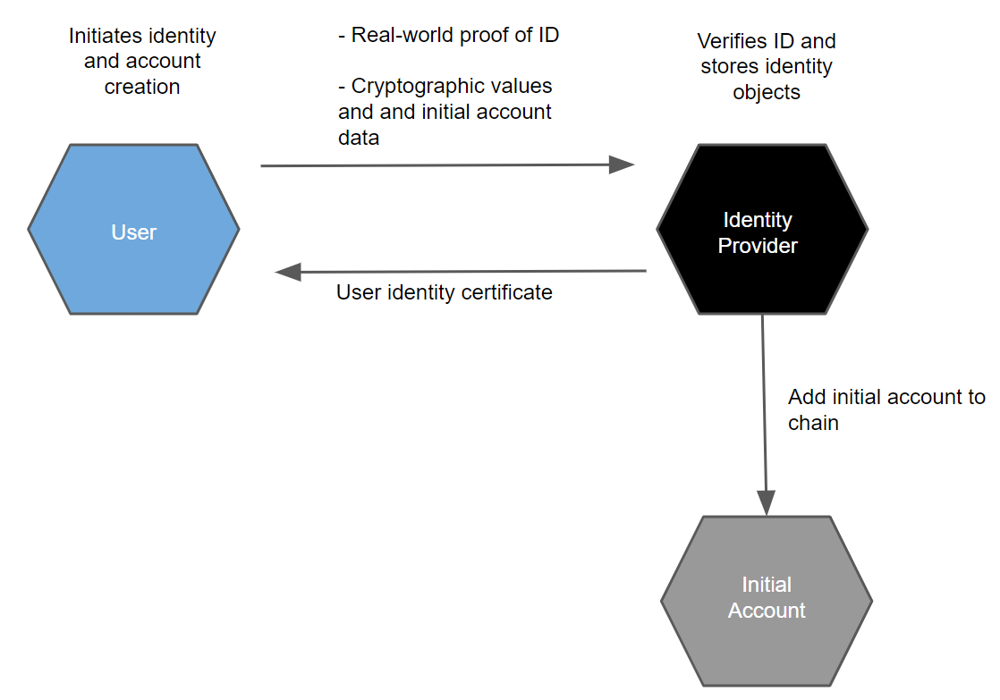

.. include:: ../../variables.rst
.. _reference-id-accounts:

==========
Identities
==========

Accounts and identities are strongly linked on the Concordium Platform. To be able to hold, send, or receive :ref:`CCD<glossary-ccd>` or become a baker on the Concordium blockchain, you need an account and an identity. This is regardless of whether you are using the |mw-gen1|, |mw-gen2|, Desktop Wallet, or Concordium Client for your transactions.

Before you can use the Concordium Platform, an identity provider must verify and record your real-world identity. This identification is performed when you create your first account, the initial account.

About identities
================

Identities are issued by an identity provider. There is a :ref:`registry of selected identity providers and their contact information publicly accessible from the Concordium blockchain<identity-commands>`. Concordium Foundation will maintain the list in the beginning.

.. Note::

   It is possible to create a company identity that is not associated with a specific individual but is issued with documents that identify a company.
   Company identities are only relevant for a few companies. The way they are created differs from how individual identities are created. For more information, see `Company identity creation <https://developer.concordium.software/en/mainnet/net/guides/company-identities.html#company-identities>`_.

While identities facilitate compliance with relevant regulations, they also allow users to be represented on-chain in a way that protects users’ privacy. That is, transactions on the chain are processed without exposing the identity of the sender or receiver. The identity of an account owner can only be revealed via the process of :ref:`anonymity revocation<revoke-anomity>`. Anonymity revocation can only happen in exceptional circumstances, for example if authorities have detected suspicious activity on the account, and requires action by one or more anonymity revokers and the identity provider who issued the account's identity.

Every account on the chain must be derived from an identity that is verified and signed by an approved identity provider. It is publicly visible which identity provider issued an identity for an account, and who the anonymity revokers are for the account and the identity. In addition to this basic information which enables regulatory compliance, an account owner can choose to publicly reveal other values on their account. These values are called :ref:`attributes<glossary-attribute>` and can be, for example, nationality or country of residence. Publicly accessible attributes enable anybody to check the attributes before interacting with an account. Being able to see who issued the identity enables whoever wishes to interact with an account to judge the level of risk in the transaction. If you choose to reveal attributes, you should have a good reason to do so. The general recommendation is not to reveal attributes.

Attributes
----------

Each identity contains a number of cryptographic values and a number of
user-chosen attributes, such as nationality or country of residence. These
attributes are certified by the identity provider. The cryptographic values are
a number of public and private keys, a signature from the identity provider, as
well as a number of secret values the user must use to be able to use the
identity to create accounts.

You are in control of which attributes are revealed to the public. You can choose not to reveal any attributes at all to maintain your anonymity, which is the general recommendation.

Obtain an identity
------------------

You can :ref:`create identities<create-initial-account>` in the Desktop Wallet, |mw-gen1|, |mw-gen2|, or |bw|. Identity creation is an :ref:`off chain<glossary-off-chain>` action. If you are creating your first identity on a mobile device, Concordium strongly recommends using |mw-gen2|.

.. Warning::
   It is not possible to exchange identities and accounts between the |mw-gen1| and the Desktop Wallet. If you try to import a file that has been exported from the |mw-gen1| into the Desktop Wallet, the import will fail, and likewise, if you try to import a file exported from the Desktop Wallet into the |mw-gen1|.

.. Warning::
   Because of the difference in the way private keys are handled between |mw-gen2| / |bw| and the first generation wallets (|mw-gen1| and Desktop Wallet), you cannot exchange identities and accounts between them.

   It is possible to exchange accounts and identities between the |mw-gen2| and the |bw|.

Identity issuance requires *Identity Verification*, which is the process of verifying the real-life identity of the user. This typically requires taking photographs or scans of identification documents, such as a passport. Identity verification also checks that the user-chosen attributes are valid for the user.

Upon verification of the user's identification documents and attributes, the Identity provider issues a :ref:`user identity certificate<glossary-user-identity-certificate>`. The User identity certificate contains attributes about the user. It is basically the Identity Provider’s signature over some cryptographic keys of the user and the validated personal attributes.

About accounts
==============

For information about accounts, see :ref:`Accounts<managing_accounts>`.

Any time you create a new account in |mw-gen1|, you should make a :ref:`backup<backup>`. Backups protect your account keys, ensuring that you do not lose access to your CCDs.

.. _revoke-anomity:

.. include:: ../snippets/revoking-anonymity.rst
