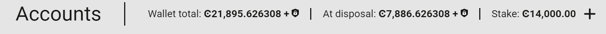
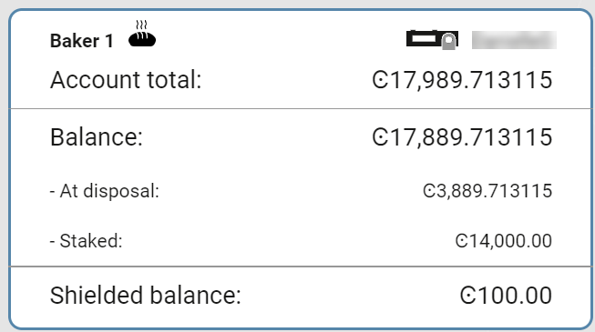
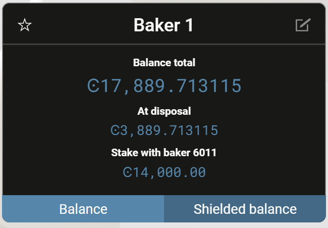
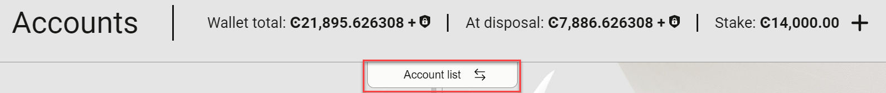

.. _overview-account-desktop:

======================
Use the Desktop Wallet
======================

This topic describes the information and the tasks that are available in the Desktop Wallet. To learn more about creating accounts, see :ref:`Create an account in the Desktop Wallet <create-account>`.

To view information about an account, go to **Accounts** and select the relevant account. At the top of the window you see the following:

-  **Wallet total** shows the total amount of CCDs in all accounts in this wallet, including shielded balances and CCDs that are scheduled to be released to your account on a future date.

-  **At disposal** shows the amount of CCDs you have available for transactions in all accounts in this wallet. This includes shielded balances but *not* staked amounts or CCDs that are scheduled to be released to your account on a future date.

-  **Stake** shows the amount of CCDs staked in all accounts for this wallet.

The most common tasks on an account are:

-  **Send**: Send CCD to a recipient in your address book. See :ref:`Create CCD transfer in the Desktop Wallet <send-ccd-wallets>`.

-  **Shield**: Transfer CCD from your public balance to your shielded balance. See :ref:`Shield CCD on an account <shield-ccd-wallets>`.

-  **Receive**: Select this to display the account address. Select the icon to the right to copy the address if you want to share it with other participants in the network or let them scan the QR code.

In the account card in the accounts list, you can see the following information:

-  The **Account Total** shows the total number of CCDs on the account, which includes the CCDs that are available and any staked CCDs or shielded CCDs. It also includes CCDs that are scheduled to be released to your account on a future date.

-  The **Balance Total** shows the total number of CCD on the account, which includes the CCD that is available and any staked CCD or CCDs that are scheduled to be released to your account on a future date. It does *not* include shielded CCDs.

-  The **At disposal** amount is the amount you can use for transactions, which excludes staked CCD and CCD in a release schedule.

-  The **Staked** amount shows the amount staked if baking.

-  **Shielded balance** shows any shielded amounts on the account.

In addition, you can see the following information about the selected account on the **Balance** tab in the account details:

-  The **Balance Total** shows the total number of CCD on the account, which includes the CCD that is available and any staked CCD or CCDs that are scheduled to be released to your account on a future date. It does *not* include shielded CCDs.

-  The **At disposal** amount is the amount you can use for transactions, which excludes staked CCD and CCD in a release schedule.

-  The **Staked with...** amount shows the amount staked if baking.

On the Shielded balance tab, you'll see:

-  The **Shielded balance total** shows the amount of CCD that you've shielded. The **Balance total** is visible to all participants on the Concordium Blockchain, while the **Shielded balance total** is visible to you only.

   .. Note::
      Shielded transfers and Shielded balance is only available on accounts with a single credential. You can't make or receive shielded transfers on multi-signature accounts.

The Transactions box contains the 10 latest transactions on the account including transfers to other accounts, shielded transfers, and scheduled transfers. When you select a transfer, you'll see the sender and recipient address, the transaction hash, and the block hash. Both successful and failed transactions are listed. If you have any log filters on the account they are also applied here.

More options
============

When you select **Account list** at the top of the window, the button name toggles to **More options**.

**Account list** toggles to **More options**.

.. image:: ../images/desktop-wallet/dw-screen-toggle2.png

You'll see a variety of information in **More options** about your account and a number of tasks you can perform:

-  **Transaction log**. View a list of transactions on the account. Use **Log filters** to specify which transaction types you want to be displayed in the **Transfers** list. See :ref:`Apply a transaction log filter <transaction-log>`.

-  **Send CCD with a schedule**: Send CCD according to a schedule. See :ref:`Transfer CCD with a schedule <CCD-single-schedule-desktop>`.

-  **Inspect release schedule**: Shows any future CCD releases that are scheduled to be released on your account.

- **Export account reports**: Export a file with a list of all transactions on the account. Set the relevant time period and filters, and then select **Make account report**. Save the export as a .csv file.

-  **Credentials and attribute information**: Here you can see all credential ID that are associated with the account and the attributes that are revealed for each credential ID (if any). You can also see the creation dates and valid to dates of the credentials. One or more credentials can be associated with an account.

-  **Update credentials**: Add new credentials to the account. See :ref:`Add credentials to an account <multi-credentials>`.

-  **Register data**: Add a small message to the chain, such as a hash. This information is visible on the chain and cannot be removed. Note that adding this message incurs a transaction fee.

-  **Register as a baker**: Make the account a baker account. See :ref:`Add a baker account in the Desktop Wallet <create-baker-desktop>`. If the account is already a baker account, you'll see **Baking** which contains a list of options for managing a baker account: :ref:`Remove baker <remove-baker>`, :ref:`Update baker keys<update-baker-keys>`, :ref:`Update baker stake<change-baker-stake>`, and :ref:`Update baker restake earnings<change-restake-settings>`.

- **Register as a delegator**: Register the account as a delegator. See :ref:`Delegation in the Desktop Wallet<delegation-dw>` and :ref:`Delegation<delegation-concept>` for information about delegation. If you are already delegating, you'll see **Delegation** which contains a list of options for managing delegation.

Edit account name
-----------------

You can edit the name of the account. Click |edit| to edit the account name. Click |save| to save the change.

.. |edit|    image:: ../images/edit.png
                    :width: 20px
                    :alt: small square with pencil
.. |save|    image:: ../images/save.png
                    :width: 20px
                    :alt: check mark

Set default account
-------------------

To make the currently selected account the default account, click the star icon in the lower right corner. Setting this means that this will be the account initially visible when opening the account page.

Address book overview
=====================

The address book is where you can see all addresses of accounts that you've created in or imported into the Desktop Wallet. In addition, you have the option of adding accounts, for example, if you want to send CCD from the desktop wallet to addresses on the mobile wallet.

- When you select a recipient, the recipient's account address is displayed as well as any notes that you’ve added.

- To copy an address, select the **Copy** icon to the right of the address.

- To add a note, select the **Edit** icon, add your note, and then select **Save recipient**.

- To add an address, select the plus sign in the upper right corner. Enter the name of the recipient, paste the account address, optionally add a note, and then select **Save recipient**. The account address could, for example, be an account address that you've copied from the Mobile Wallet or that somebody sent you.

- To find a specific recipient among a long list of recipients, use the search function.

Desktop Wallet settings
=======================

The Desktop Wallet has a number of settings such as password and node settings that you access by going to the **Settings** page.

Preferences
-----------

The Desktop Wallet provides a set of multi-signature transactions called Foundation transactions that only members of the Concordium Foundation can sign.

These transactions are disabled by default, and if you're not a member of the Concordium Foundation we strongly recommend that you don't enable them. If you do enable the transactions, they will be listed on the multi-signature transactions page. However, you'll not be able to actually sign or submit any of these transactions.

Node settings
-------------

Here you specify which node on the blockchain that you want to connect to.

- If you're running the mainnet version of the Desktop Wallet, you must connect to a mainnet node. In the **Address field**, enter ``127.0.0.1`` and in the **Port field** enter ``10000``.

- If you're running the testnet version of the Desktop Wallet, you must connect to a testnet node. In the **Address** field, enter ``127.0.0.1`` and in the **Port field** enter ``10001``.

- Select **Set connection**. If the connection works, there's a message saying **Successfully connected**.

You can run a node using :ref:`Windows<run-node-windows>`, :ref:`macOS <run-node-macos>`, and :ref:`with Docker <run-a-node>` or :ref:`a Debian package <run-node-ubuntu>` on Linux.

Change wallet password
----------------------

On the this page, you can update the existing password for the Desktop Wallet, providing that you remember the current password.

Concordium strongly recommends that you create a backup of your Desktop Wallet database to ensure that you can recover your accounts, identities, and addresses if, for example, you lose the password to the Desktop Wallet. For more information, see :ref:`Make a backup of identities, accounts, and addresses <export-import>`.

Recover existing accounts
-------------------------

If you lose your accounts, you can recover the accounts by using the Ledger device that you used to create the accounts. You only have to perform a recovery if you have lost the backup of your accounts and identities. For more information, see `Account recovery <https://developer.concordium.software/en/mainnet/net/guides/export-import.html?highlight=account%20recovery>`_.

Terms and conditions
--------------------

If you want to view the latest version of the *License notices* and *Terms and conditions for the Desktop Wallet* do the following.

- On Windows, press **Alt** to display the menu bar, and then in the **Help** menu, choose the document you want to view.

- On Linux, press **Alt** to display the menu bar, and then in the **Help** menu, choose the document you want to view.

- On macOS, select **Help** in the menu bar, and then choose the document you want to view.

Make an account report
======================

When you select an account, you can see a list of all transfers in and out of the account. However, if you need a more structured view of the transfers or, for example, want to compare transfers on different accounts, you have the option of creating an account report. The report is saved as a CSV file on your computer, and the CSV format enables you to sort and organize the data in a spreadsheet.

Create a report of transactions on one or more accounts
-------------------------------------------------------

#. Go to **Accounts** and select the account you want to create a report for.

#. Select **Change view**, and then select **Make account report**.

#. Select the time period that you want the report to cover.

#. Select the transaction types that you want to include in the report.

#. If you want to include more accounts in the report, select **Add another account** in the right pane, and then select the relevant account. Repeat this step for each account you want to add to the report.

#. Select **Make account report**. A CSV file with the selected account and types of transactions is generated and stored on your computer. If you have selected multiple accounts, you will get a .zip file containing a .CSV for each account.

.. todo::

    Write overview topic of transaction types.
