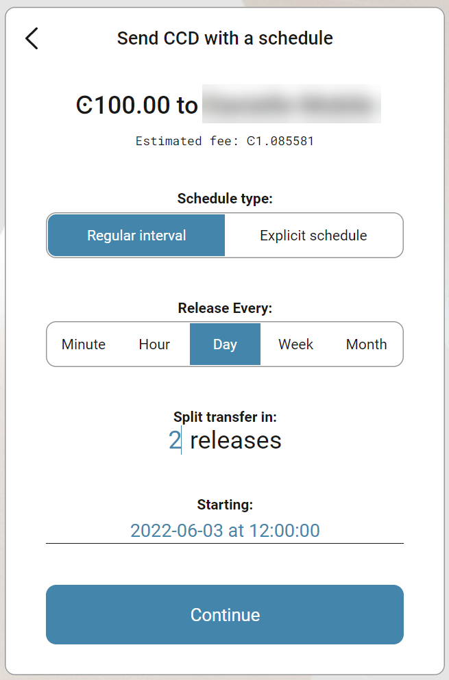
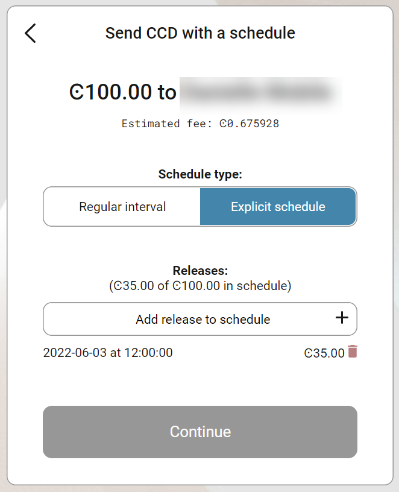
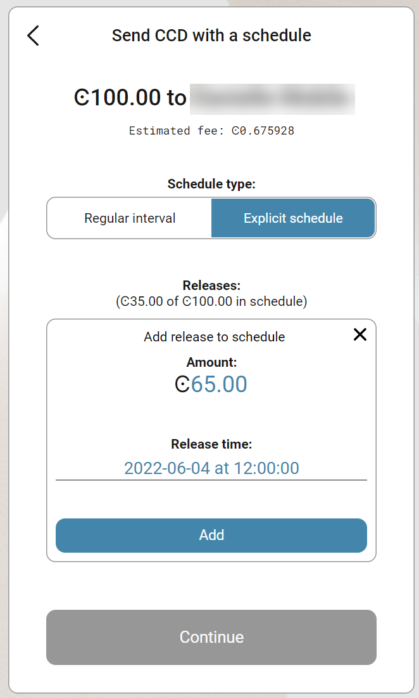

.. _CCD-single-schedule-desktop:

==============================================
Transfer CCD with a schedule in Desktop Wallet
==============================================

This topic describes how you can send CCD from an account with only one signer with a schedule. If you want to learn about sending CCD with a schedule when more co-signers are required, see :ref:`Create a scheduled multi-signature CCD transfer in the Desktop Wallet <create-multisig-scheduled>`.

You can create two types of release schedules: a regular interval
schedule and an explicit schedule.

-  Use a regular interval schedule to release an equal amount of CCD to
   a recipient at regular intervals.

-  Use an explicit schedule if you want the intervals between releases
   to be of different lengths, and if you want to be able to release
   different amounts of CCD to the recipient at each interval.

.. Note::
   You can divide a transfer into a maximum of 255 releases.

#. Go to **Accounts** and select the relevant account.

#. Select **More options**, and then select **Send CCD with a schedule**

#. Enter the amount of CCD that you want to send. If the amount you want to transfer including the transfer fee exceeds the amount in your account, you’ll see a message saying **Insufficient funds**. This means that there's not enough CCD in the account and you’ll have to change the amount. You can see the estimated transaction fee of the transfer under **Transaction Details**.

#. Optionally, enter a **Memo** if you want to send a message to the recipient along with the transfer. Note that there's a fee associated with sending a memo and the fee depends on the size of the memo in bytes.

.. Warning::
    Transaction memos are public and visible on the blockchain, and they are permanent and can't be deleted. Therefore, carefully review all information before you submit the memo to the blockchain.

5. Select the recipient and select **Continue**.

   .. image:: ../images/desktop-wallet/dw-send-ccd-schedule.png
      :alt: transaction screen with amount for scheduled transfer

Option 1: Create a regular interval schedule
--------------------------------------------

#.  Select **Regular interval** in **Schedule type**.

#.  Select the frequency with which you want the transfers to be released in **Release every**.

#.  Specify how many intervals you want to split the transfer into in **Split transfer in**.

#.  Specify the date and time you want the first transfer to take place in **Starting**.

#.  When the schedule is complete, select **Continue**. You can see the release schedule under **Transaction Details**.

#. There's a message saying **Waiting for device. Please connect your Ledger**. Connect the LEDGER device to the computer, and enter your PIN on LEDGER device.

#. Press the right button to navigate to the **Concordium** app, and then press both buttons to open the app. The LEDGER device says **Concordium is ready**. Wait for the message in the Desktop Wallet saying **Ledger Nano S is ready** or **Ledger Nano S Plus is ready** and select **Submit**.

#. Review the transaction on the LEDGER device and verify that the information matches the **Transaction details** in the Desktop Wallet. Navigate to the right and verify the sender address is correct. Continue navigating to the right and verify that the recipient address is correct. When you see **Continue with transaction** press both buttons.

#. The LEDGER device says **Release time (UTC)**. Navigate to the right. The LEDGER device says **Amount**, which is the amount of the release. Navigate to the right. The LEDGER device says **Continue with transaction**. Press both buttons to confirm. Continue with these steps for each release in the schedule.

#. When you've navigated through and verified the information for each release, the LEDGER device says **Sign transaction**. Press both buttons.

#. The LEDGER device says **Concordium is ready**. In the Desktop Wallet, you can now see the details of the transaction proposal and that it's been submitted to the chain. Select **Finish**.

Option 2: Create an explicit schedule
-------------------------------------

#. Select **Explicit schedule**. For each release you want in the schedule, you have to specify the amount and the release time.

#. Select **Add release to schedule** in **Releases**.

#. Enter the amount you want to transfer in this particular release in **Amount**.

#. Specify the date and time you want the transfer to take place in **Release time**.

#. Select **Add**.

#. Repeat the steps for each release you want to add to the schedule. The scheduled releases are listed in chronological order. You can't edit the individual releases, but you can delete a release by selecting the Trash bin next to it.

#. When the schedule is complete, select **Continue**. You can see the release schedule under **Transaction Details**, and you can generate the transaction.

#. There's a message saying **Waiting for device. Please connect your Ledger**. Connect the LEDGER device to the computer, enter your PIN on LEDGER device, and select **Submit** in the Desktop Wallet.

#. Review the transaction on the LEDGER device and verify that the information matches the **Transaction details** in the Desktop Wallet. Navigate to the right and verify the sender address is correct. Continue navigating to the right and verify that the recipient address is correct. When you see **Continue with transaction** press both buttons.

#. The LEDGER device says **Release time (UTC)**. Navigate to the right. The LEDGER device says **Amount** and displays the amount of the release. Navigate to the right. The LEDGER device says **Continue with transaction**. Press both buttons to confirm. Continue with these steps for each release in the schedule.

#. When you've navigated through and verified the information for each release, the LEDGER device says **Sign transaction**. Press both buttons.

#. The LEDGER device says **Concordium is ready**. In the Desktop Wallet, you can now see the details of the transaction proposal and that it's been submitted to the chain. Select **Finish**.
