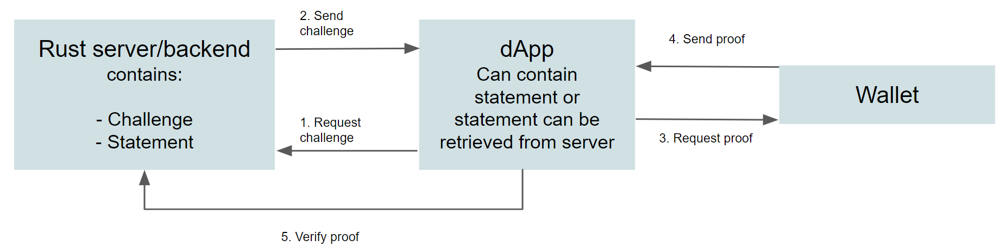

.. include:: ../../variables.rst
.. _create-proofs:

=============
Create proofs
=============

The |bw| allows dApps or services to request proofs that the user meets some requirement, such as proof the user is over a certain age, or resides in a specific set of countries or area. The wallet owner chooses whether to prove these :ref:`attributes<glossary-attribute>` to the dApp or service. The dApp or service constructs a list of :ref:`statements<glossary-statement>` to request a corresponding list of :ref:`zero knowledge proofs<glossary-zero-knowledge-proof>` of the attribute(s) necessary without revealing anything beyond the truth of the statement.

The dApp or service can also request that attributes are revealed. The wallet owner can choose whether they want to reveal these :ref:`attributes<glossary-attribute>` to the dApp or service.

The diagram below shows the interaction between the Rust server/backend, the dApp, and the wallet.

You have a server or backend that contains the :ref:`challenge<glossary-challenge>` and the statement.

1. The dApp requests the challenge from the server/backend.
2. The server/backend returns the challenge to the dApp. The dApp uses it when sending the statement. Your dApp can request the statement from the server or it can contain the statement. If your dApp does not contain the statement, you must also request it from the server/backend.
3. The dApp sends a request for proof for the given challenge and statement to the wallet.
4. The wallet sends proof back to the dApp (if accepted by the user).
5. The dApp verifies the proof to the challenge on the server.

General rules
=============

For the dApp or service developer there are some general rules about proofs that you have to follow.

- There is no limit to the amount of attributes that can be revealed.
- An attribute can only be used in one proof at a time.

The attributes that can be revealed are:

- First name
- Last name
- Sex
- Date of birth
- Country of residence
- Country of nationality
- ID document type
- ID document number
- ID document issuer
- ID valid from
- ID valid to
- National ID number
- Tax ID number

Asking a user to reveal attributes
==================================

You can construct a reveal statement in which the wallet owner must consent to reveal one or more specific attributes.

In the example below, the wallet owner's country of residence is requested to be revealed.

.. code-block:: console

    [
      {
        "type": "RevealAttribute",
        "attributeTag": "countryOfResidence"
      }
    ]

Unless it is absolutely critical to know a specific attribute, it is good policy to use the proof types below instead to determine a user's eligibility for your app instead of requesting that they reveal information to you.

Range proofs
============

:ref:`Range proofs<glossary-range-proofs>` allow you to present a range of values to the user's wallet to determine whether the user meets the required attribute. For example, you might want to know if a user over 18 years of age but under 30 years of age. You can present this as a range proof to be verified by the wallet.

Relevant attributes for range proofs are:

- Date of birth
- ID valid to
- ID valid from

.. Note::

  Age proofs are a common abstraction on date of birth proofs. There are helper functions in the SDK(link?) to aid in constructing these.

Structure a range proof
-----------------------

In the example below, you see a range proof constructed to check that wallet owner is between 25 and 65 years old (as of 2022-12-12).

.. code-block:: console

    {
      "challenge": "a54bc4116655d247fa625d98f768d4d81e55ffe26ac6bab259bad5895d49ae00",
      "statement": [
        {
          "type": "AttributeInRange",
          "attributeTag": "dob",
          "lower": "19571212",
          "upper": "19971212"
        }
      ]
    }

Membership proofs
=================

:ref:`Membership proofs<glossary-membership-proof>` allow you to present a list of values to the user's wallet to determine whether the user has one of the required attributes in the list. For example, you might want to know if a user is a resident of the EU. You can present this as a membership proof to be verified by the wallet.

Relevant attributes for membership proofs are:

- Country of residence
- Country of nationality
- Identity document type
- Identity document issuer

.. Note::

  Country of nationality has helper functions in the SDK(link?) to aid in constructing statements.

Structure a membership proof
----------------------------

In the example below, the proof checks that the wallet owner is a citizen of one of the Nordic countries (Finland, Denmark, Sweden, Norway, or Iceland).

.. code-block:: console

    {
      "challenge": "6c7d69b121d4ce829392d9f2b16395708a458f6183caa20e9074e7283e377418",
      "statement": [
        {
          "type": "AttributeInSet",
          "attributeTag": "nationality",
          "set": [
            "DK",
            "FI",
            "IS",
            "NO",
            "SE"
          ]
        }
      ]
    }

Membership proofs can also prove that a user does NOT have an attribute or attributes in a set, in other words a :ref:`non-membership proof<glossary-non-membership-proof>`. For example, if you need to know whether a user is a resident of a country that is subject to trade sanctions and cannot use your service, you might have a proof that determines whether the wallet owner resides in one or more of the countries.

For example, the statement below asks if the wallet owner is a citizen of China or North Korea.

.. code-block:: console

    {
        "challenge": "4de5faf3d68c09e3e76fd8d82ce251c1ff0e49fdcc2661a2f875db35eba02f4d",
        "statement": [
          {
            "type": "AttributeNotInSet",
            "attributeTag": "nationality",
            "set": [
              "CN",
              "KP"
            ]
          }
        ]
    }

.. Note::

    Country codes to use for residence and nationality proofs are the `ISO-3166-1 alpha-2 codes <https://en.wikipedia.org/wiki/ISO_3166-1_alpha-2>`_.

Example dApp
============

Concordium provides the following example demo app and repo: (Still waiting)

The app is a gallery that requires the user to be over a certain minimum age to view some content.
