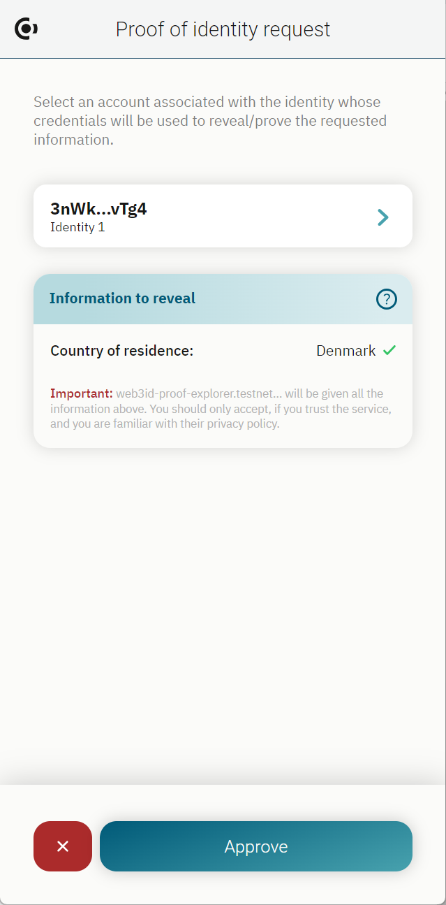
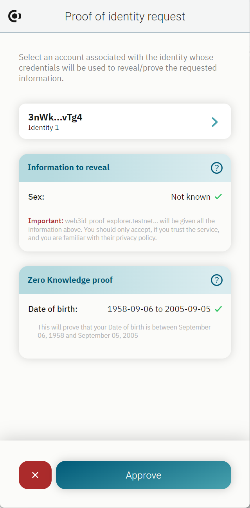

.. include:: ../../variables.rst
.. _secret-proofs:

================================
Proofs and revealing information
================================

Some dApps or services may require you to prove that you are over a certain age, that you reside in a specific range of countries or area without revealing your exact age or country of residence, or that you have a certain type of education. You can choose whether you want to prove these :ref:`attributes<glossary-attribute>` to the dApp or service. The dApp or service uses a :ref:`zero-knowledge proof<glossary-zero-knowledge-proof>` to request the attributes necessary for their service. This means that the dApp or service does not get any exact attributes, only proof that you live up to their requirements.

When an attribute or attributes will be proven by zero-knowledge proof but not revealed, the **Zero-knowledge proof** heading appears on the card with the attributes to prove.

If you do not meet one of the attributes in the statement, you would see a screen similar to below.

In this situation you must reject the proof because you cannot prove that you meet the requirements in the statement.

Other times the dApp or service may request that you **reveal** the information to them, such as your exact nationality or exact age. This is called **Information to reveal** and it appears as shown below in the wallet.

.. Warning::

    By **proving** information to a third-party, it may become possible for them to deduce precise information about you. When you **reveal** information to a third-party, you effectively hand over your information to them. This means that you should only do this if you agree with their data usage and protection policies.

    For example, if your identity says that you are a resident of Denmark and a citizen of Denmark, and they ask you to prove that you are a resident of Norway or Denmark, and then ask you to prove that you are a citizen of Sweden or Denmark, it is quite likely that the third-party would be able to deduce that you are from Denmark.

It is not possible for you to choose which attributes in the statement to prove/reveal or not prove/reveal. If there is something in the statement that you do not want to prove or reveal, you must reject the statement.

It is also possible that a dApp could present a mixed statement that asks you to reveal one attribute and prove another. In the example below, the first name must be revealed and the user's age must be proven.

Another example of a mixed statement could be that the dApp asks for you to prove your country of residence and your education level. This might require you to use account credentials to prove your country of residence meets the requirements, and a :ref:`verifiable credential<glossary-verifiable-credential>` to prove your education level.

(Include two screenshots of the wallet flow with two types of proofs)

Example dApp
============

Concordium provides the following example demo app on testnet for you to see how the functionality works:

- `Demo dApp <https://gallery.testnet.concordium.com/>`_

The app is a gallery that requires the user to be over a certain minimum age and an EU resident to view some content.

|bw|
==================================

When the wallet receives a request, a screen similiar to below appears.

Click **Accept** to allow the dApp or service to complete the proof or click **Reject** if you do not want to share this information.
