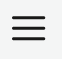

.. include:: ../../variables.rst
.. _recover-wallet:

===================
Recover your Wallet
===================

In case you get a new device or need to restore your existing device, you can recover your identities, accounts, and keys with the secret recovery phrase you wrote down during wallet setup.

.. Note::

    You cannot recover testnet wallets on mainnet, or vice versa.

.. dropdown:: |bw|

    #. After :ref:`reinstalling<setup-bw>` the |bw|, open the extension, create a passcode, and when prompted, choose **Restore**.

        .. image:: ../images/browser-wallet/wallet-choice.png
            :width: 25%

        #. Enter your 24 word secret recovery phrase. Click **Continue**.

        #. Select whether to recover your wallet in Mainnet or Testnet.

        .. Note::

            You cannot recover a wallet created in Mainnet in Testnet, and vice versa. Once you have recovered on the correct network, you can :ref:`switch between mainnet and testnet<switch-network>`.
            If you use both networks, you can recover on the other net after setup, through the settings page.

.. dropdown:: |mw-gen2|

    #. After reinstalling the |mw-gen2| app, open the app.

    #. On the Getting Started screen, tap **Recover wallet**.

        .. image:: ../images/mobile-wallet-gen2/choice-start.png
            :width: 25%

    #. After the screens explaining recovery tap **Continue**.

    #. Enter each word of your recovery phrase in the correct order. When you start typing, possible words appear for you to select. Once the words are correct, tap **Continue** to submit the recovery request to the identity provider(s).

        .. image:: ../images/mobile-wallet-gen2/recovery-enter-phrase.png
            :width: 25%

    #. When recovery is successful, the screen below appears.

        .. image:: ../images/mobile-wallet-gen2/recovery-success.png
            :width: 25%

    Sometimes recovery can take longer. You might encounter a partial recovery.

    This means that accounts and identities have been partially recovered. This could be because one of the identity providers is unresponsive. Tap **Try again** to attempt recovery again now or tap **Continue** to wait until later to try to recover. If you wait until later you can continue to the wallet.

    To continue recovery, go to the More page |morepage| and tap **Recovery** to continue.

    .. Note::

        When you recover your wallet, any account names that you might have edited will be reset to the account number. You can :ref:`edit the account name<change-mw-acct-name>`, if desired.

.. |morepage| image:: ../images/more-ellipsis.png
             :alt: Three dots button
             :width: 40px
.. |moredetails| image:: ../images/more-arrow.png
             :alt: Button with More and double-headed arrow
             :width: 50px

