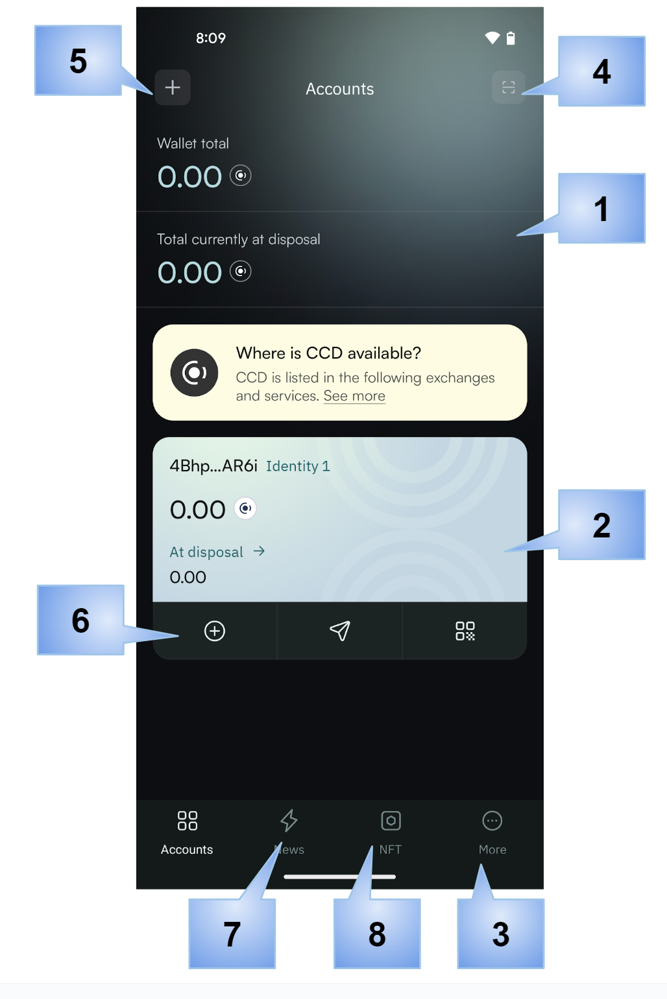

.. include:: ../../variables.rst
.. _setup-cryptox-wallet:

===============================
Set up the |cryptox|
===============================

The |cryptox| is a digital :term:`wallet` that enables you to create and manage your Concordium
:term:`identities<identity>` and :term:`accounts<account>` and to create transactions such as sending CCD, :term:`shielding` and :term:`unshielding` CCD,
and sending :term:`shielded transactions<shielded transfer>`.

To learn more about identities and accounts, see :ref:`identities<reference-id-accounts>` and :ref:`accounts<managing_accounts>`.

Read the following guide to learn how to set up the wallet.

Get started
===========

#. Install the |cryptox| on an Android or iOS phone. See :ref:`Downloads<downloads-cryptox>`.

#. Open the |cryptox|. Read and accept the Terms and Conditions. Tap **Get started**.

   .. image:: ../images/cryptox/cryptox-install1.png
      :width: 50%
      :alt: screen with terms and conditions

#. Decide whether or not to allow activity tracking. This tracking only applies to the general app usage, not funds, transactions or any personal data.

   .. image:: ../images/cryptox/cryptox-install1b.png
      :width: 50%
      :alt: screen with activate account

#. Tap **Activate Account**.

   .. image:: ../images/cryptox/cryptox-install2.png
      :width: 50%
      :alt: screen with activate account

#. Tap **Create wallet**.

   .. image:: ../images/cryptox/cryptox-install4.png
      :width: 50%
      :alt: screen with create wallet

#. Create a six-digit passcode or use a full password. Repeat passcode or password.

   .. image:: ../images/cryptox/cryptox-install5.png
      :width: 50%
      :alt: screen with keypad to enter passcode

#. Now you see your seed phrase which is the access key to all the funds in your wallet.

   You can either write it down, make a digital copy, or take a screenshot of it.
   In either case, make sure to keep it somewhere safe in case you need to recover your wallet.

   When done, check the confirmation box and tap **Continue**.

   .. image:: ../images/cryptox/cryptox-install6.png
      :width: 50%
      :alt: screen with information about saving seed phrase

#. Now you must submit a request for an identity verification. Select an identity provider.

   .. image:: ../images/cryptox/cryptox-install7.png
      :width: 50%
      :alt: screen with identity providers

#. Enter your passcode or password when prompted. An external web page opens within the app.

#. Enter the information requested by the third-party identity provider. The information might vary depending on the identity provider.
   However, they will ask you to provide photos of identification documents and a selfie.

#. When you have submitted the information to the identity provider, the verification or rejection is usually retrieved from the identity provider within minutes, but check your app frequently to retrieve
   the result. The result can be retrieved for up to seven days.

   If your identity request is rejected, you see a message. Tap **Make new identity request** to create a new identity request. You can choose another identity provider.

#. Once the identity provider has approved your verification request, you can create your first account.

   .. image:: ../images/cryptox/cryptox-install8.png
      :width: 50%
      :alt: screen shown after identity verification information is accepted.

#. Tap **Create account** and enter your passcode or password when prompted.

   .. image:: ../images/cryptox/cryptox-install9.png
      :width: 50%
      :alt: screen shown after identity verification information is accepted.

#. Your new account will be visible in the Accounts list.

   .. image:: ../images/cryptox/cryptox-install10.png
      :width: 50%
      :alt: screen showing first account in list

If you want to, you can :ref:`change the name of the account<change-mw-acct-name>`.

Basic navigation
================

In the wallet you have some navigation options.

1. Balances: shows total balances of all accounts.
2. Account: shows the identity on which the account was created, and totals.
3. :ref:`More screen<mw-cryptoX-more-screen>`: contains actions for the wallet.
4. Scan QR code: tap to :ref:`scan a QR code to connect to a dApp<connect-app-bw>`.
5. Add: to :ref:`add a new account<create-account>`.
6. Account actions: range of actions you can perform on the account, such as send and receive.
7. Shortcut to Concordium News.
8. NFT administration.

.. _mw-cryptoX-more-screen:

More screen
-----------

In the More screen |more| you have the following options.

- Identities: view all identities in the wallet and details of the identities, :ref:`edit identity names<change-mw-id-name>`, and :ref:`create new identities<create-initial-account>`.
- Address book: :ref:`manage your address book<address-book-mw>`.
- Recovery: :ref:`recover your wallet<recover-wallet>`.
- Show my seed phrase: :ref:`show my seed phrase<show-seed-phrase>`
- Update passcode and biometrics: :ref:`change your wallet passcode or activate biometrics<change-passcode-mw>`.

In case you have created your wallet from a backup file, you will not have the Recovery and  Show my seed phrase options, but instead the options :ref:`Import<import-export-file>` and :ref:`Export<import-export-file>`.

Account navigation
------------------

When you tap an account, you see the details for the specific account, including balances and transactions.

The toolbar contains actions that can be performed on the account:

- Send: :ref:`send funds<send-CCD-wallets>`
- Receive: find and share your address
- Earn: configure and manage :ref:`validation<baker-concept>` or :ref:`delegation<delegation-concept>`

- Account settings: To perform less often used actions on an account tap |cryptoX-account-settings|

   - Transfer filters: configure filters to show or hide rewards
   - Release schedule: :ref:`inspect a release schedule<inspect-release-schedule-mw>`
   - Export private key: :ref:`export your private key<export-key>` for testing smart contracts, for example
   - Export transaction logs: :ref:`export transaction logs<export-transaction-logs>`
   - Change account name: :ref:`customize account names<change-mw-acct-name>`

.. |cryptoX-account-settings| image:: ../images/cryptoX/cryptoX-acct-settings.png
                        :alt: gear wheel
                        :width: 40px

