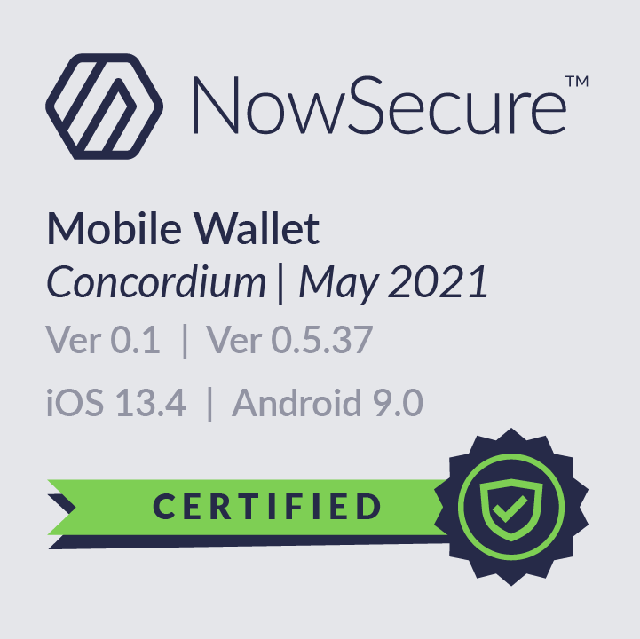

.. include:: ../../variables.rst
.. _downloads:

=========
Downloads
=========

.. contents::
   :local:
   :backlinks: none

This topics contains information about where you can download the Concordium Wallets and tools for |Net|. You can also find out about the hardware requirements for running a node.

Concordium Mobile Wallet
========================

The Concordium Mobile Wallet is available for iOS and Android. The Mobile Wallet supports iOS 13 or later and Android 8 or later.

You can find Concordium Mobile Wallet on App Store and Google Play.

.. image:: ../images/mobile-wallet/app-store-badge.svg
   :width: 23%
   :target: https://apps.apple.com/us/app/concordium-mobile-wallet/id1566996491
.. image:: ../images/mobile-wallet/google-play-badge.png
   :width: 29.5%
   :target: https://play.google.com/store/apps/details?id=software.concordium.mobilewallet.mainnet

The Concordium Mobile Wallet has been verified by NowSecure.

.. _downloads-desktop-wallet:

Concordium Desktop Wallet
=========================

-  `Download the Desktop Wallet for Windows <https://distribution.mainnet.concordium.software/tools/windows/concordium-desktop-wallet-1.2.0.exe>`_

-  `Download the Desktop Wallet for macOS <https://distribution.mainnet.concordium.software/tools/macos/concordium-desktop-wallet-1.2.0.dmg>`_

-  Download the Desktop Wallet for Linux:
   -  `AppImage <https://distribution.mainnet.concordium.software/tools/linux/concordium-desktop-wallet-1.2.0.AppImage>`_

      - SHA256 checksum of the download: :substitution-code:`|cdw-appimage-checksum|`
      - :ref:`Verification instructions <verification-cdw-appimage>`

   -  `Debian package <https://distribution.mainnet.concordium.software/tools/linux/concordium-desktop-wallet-1.2.0.deb>`_

      - SHA256 checksum of the download: :substitution-code:`|cdw-deb-checksum|`
      - :ref:`Verification instructions <verification-cdw-deb>`

   -  `RPM <https://distribution.mainnet.concordium.software/tools/linux/concordium-desktop-wallet-1.2.0.rpm>`_

      - SHA256 checksum of the download: :substitution-code:`|cdw-rpm-checksum|`
      - :ref:`Verification instructions <verification-cdw-rpm>`

Concordium Ledger App
=====================

`Download the Concordium Ledger App <https://distribution.mainnet.concordium.software/tools/concordium-ledger-app-2.0.1-target-2.0.0.zip>`_

.. _concordium-node-and-client-download:

Concordium Client
=================
Download the Concordium Client:

-  `Download the Concordium Client for Linux <https://distribution.concordium.software/tools/linux/concordium-client_1.1.1-0>`_

   - SHA256 checksum of the download: :substitution-code:`|client-linux-checksum|`
   - :ref:`Verification instructions <verification-client-linux>`

-  `Download the Concordium Client for macOS <https://distribution.concordium.software/tools/macos/signed/concordium-client_1.1.1-0.zip>`_.

-  `Download the Concordium Client for Windows <https://distribution.concordium.software/tools/windows/signed/concordium-client_1.1.1-0.exe>`_

Cargo-concordium
================
Download cargo-concordium:

-  `Download cargo-concordium for Linux <https://distribution.concordium.software/tools/linux/cargo-concordium_1.0.0-2>`_

-  `Download cargo-concordium for MacOS <https://distribution.concordium.software/tools/macos/cargo-concordium_1.0.0-2>`_

-  `Download cargo-concordium for Windows <https://distribution.concordium.software/tools/windows/cargo-concordium_1.0.0-2.exe>`_

For information about installing cargo-concordium, see :ref:`Install tools for development <setup-tools>`

Concordium node distributions
=============================

Node Debian package
-------------------
To run a node on a server with Ubuntu, you need a Debian package.

- `Download the Debian package <https://distribution.mainnet.concordium.software/deb/concordium-mainnet-node_1.1.3_amd64.deb>`_

   - SHA256 checksum of the download: :substitution-code:`|node-deb-package-checksum|`
   - :ref:`Verification instructions <verification-node-debian-package>`

To learn how to run a node with Ubuntu, see :ref:`Run a node on a server with Ubuntu <run-node-ubuntu>`.

.. _concordium-docker-package-download:

Full suite for running a node on Linux using Docker
---------------------------------------------------
Download the full suite for running a node on Linux using Docker. The suite contains Concordium Node, Concordium Client and cargo-concordium.

- `Download the suite for Linux <https://distribution.mainnet.concordium.software/tools/linux/concordium-software-linux-1.1.3-0-mainnet.tar.gz>`_

   - SHA256 checksum of the download: ``1e86ceda79be5bcb84f2615fdcd494fc7bc6e50f5e65c35cf47262e126c3be55``

To learn how to run a node with Docker, see :ref:`Run a node with Docker <run-a-node>`.

Native Windows node
-------------------

To run a node on Windows, you need a Windows Installer package.

- `Download the Windows Installer package <https://distribution.concordium.software/windows/Signed/Node-1.1.3.msi>`_

To learn how to run a node on Windows, see :ref:`Run and manage a node on Windows <run-node-windows>`

Native Mac node
---------------

To run a node on macOS, you need a macOS installer package.

- `Download the macOS installer package <https://distribution.concordium.software/macos/signed/concordium-node-1.1.3.pkg>`_

To learn how to run a node on Mac, see :ref:`Run and manage a node on macOS  <run-node-macos>`.

Mainnet genesis block
=====================
The genesis block is included in node distributions.
Download the block separately to inspect it or to run a node in a custom configuration.

- `Download the mainnet genesis block <https://distribution.mainnet.concordium.software/data/genesis.dat>`_

  - SHA256 checksum of the download: :substitution-code:`|mainnet-genesis-block-checksum|`
  - :ref:`Verification instructions <verification-mainnet-genesis-block>`

.. _requirements-run-node:

Requirements for running a node
===============================

The following are the minimum system requirements for running a node. If your system does not meet or exceed these requirements, you might not be able to run the node properly.

You need a broadband connection to run a node, and we strongly recommend that the node is running around the clock. This is especially important if you're running a baker node.

If you use a laptop in combination with Docker, sleep mode can cause problems with the Docker container used to run the node.

System requirements
-------------------

-  CPU: A quad core CPU or better of a new generation x64 (AMD Ryzen 5000 series or Intel Core 11000 series desktop or mobile CPUs or CPU with similar single threaded performance).

-  Minimum 16 GB of RAM.

-  Minimum of 1TB fast SSD disk space available (minimum NVMe PCI Express 3.0 4x SSD).

Auxiliary tools
===============

Auxiliary tools are a collection of tools that can be used by developers to perform actions as needed.

Encrypt/decrypt tool
--------------------

- `Download the Encrypt/decrypt tool for Linux <https://distribution.concordium.software/tools/linux/utils-1.0.0>`_

- `Download the Encrypt/decrypt tool for Windows <https://distribution.concordium.software/tools/windows/signed/utils-1.0.0.zip>`_

- `Download the Encrypt/decrypt tool for MacOS <https://distribution.concordium.software/tools/macos/signed/utils-1.0.0.zip>`_

For information about how to use the encrypt/decrypt tool, see :ref:`Auxiliary tools  <developer-tools>`.

*Apple® is a trademark of Apple Inc., registered in the U.S. and other countries*.
