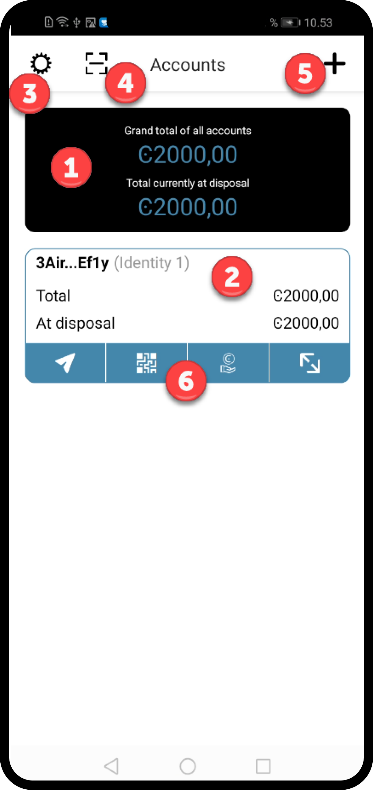
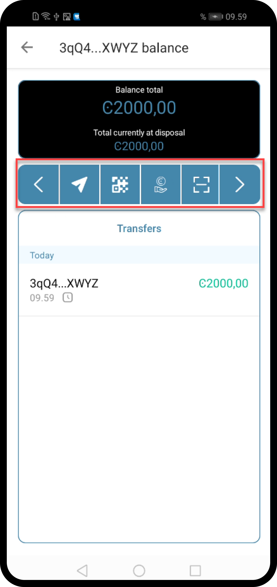

.. include:: ../../variables.rst
.. _setup-g2-mobile-wallet:

========================
Set up the |mw-gen2|
========================

The |mw-gen2| is a digital :ref:`wallet<glossary-wallet>` that enables you to create and manage your Concordium
:ref:`identities<glossary-identity>` and :ref:`accounts<glossary-account>` and to create transactions such as sending CCD, :ref:`shielding<glossary-shielding>` and :ref:`unshielding<glossary-unshielding>` CCD,
and sending :ref:`shielded transactions<glossary-shielded-transfer>`.

To learn more about identities and accounts, see :ref:`identities<reference-id-accounts>` and :ref:`accounts<managing_accounts>`.

Read the following guide to learn how to set up the wallet.

Get started
===========

#. Install the |mw-gen2| on an Android phone. See :ref:`Downloads<downloads-mwgen2>`.

#. Open the |mw-gen2|; read and accept the Terms and Conditions.

#. Create a six-digit passcode or use a full password.

   .. image:: ../images/mobile-wallet-gen2/create-passcode.png
      :width: 50%
      :alt: screen with keypad to enter passcode

Secret recovery phrase
======================

Now you must write down and confirm your :ref:`secret recovery phrase<glossary-secret-recovery-phrase>`. It is important to keep this recovery phrase in a safe location in case you need to :ref:`recover your wallet<recover-wallet>`.

#. Tap **Set up a fresh wallet**.

   .. image:: ../images/mobile-wallet-gen2/choice-start.png
      :width: 50%
      :alt: screen with information about setup and options to create a new wallet or recover wallet

#. Tap on the screen to view your secret recovery phrase. Write down all 24 words in the exact order in which they are shown.

   .. image:: ../images/mobile-wallet-gen2/recovery-phrase-pre.png
      :width: 50%
      :alt: screen with hidden secret recovery phrase

#. Place a check in the box **I confirm I have written down my 24 word secret recovery phrase**.

   .. image:: ../images/mobile-wallet-gen2/recovery-phrase-shown.png
      :width: 50%
      :alt: screen with 24 word recovery phrase shown and confirmation checkbox

#. On the next screens select the word to enter in each index to confirm your secret recovery phrase. Once correct, tap **Continue**.

   .. image:: ../images/mobile-wallet-gen2/recovery-phrase-confirm.png
      :width: 50%
      :alt: screen to enter recovery phrase so you can confirm that you have it

Request your identity and account
=================================

Having set up your passcode and your secret recovery phrase, you must then submit a request for an identity and an account.

Request identity
----------------

#. Read the next page in the app, shortly explaining the Concordium concepts of initial account and identity. Tap **Continue**.

#. Select a third party :ref:`identity provider<glossary-identity-provider>` from the list. Enter your wallet passcode when prompted. An external web page opens within the app.

   .. image:: ../images/mobile-wallet/MW11.png
      :width: 50%
      :alt: screen with option to select identity provider

#. Enter the information requested by the third-party identity provider. The information might vary depending on the identity provider.
   However, they will ask you to provide photos of identification documents and a selfie.

#. When you have submitted the information to the identity provider, you will have a pending initial account and identity in your app.
   The verification or rejection is usually retrieved from the identity provider within minutes, but check your app frequently to retrieve
   the result. The result can be retrieved for up to seven days.

   .. image:: ../images/mobile-wallet/MW12.png
      :width: 50%
      :alt: screen shown after identity verification information is submitted and request is pending

If your identity request is rejected, you see a message. Tap **Make new identity request** to create a new identity request. You can choose another identity provider.

Request account
---------------

Once the identity provider has verified your identity you can submit an account. You can see when your identity has been verified by the green check next to the identity name.

#. Tap **Submit account**. Enter your wallet passcode when prompted.

   .. image:: ../images/mobile-wallet-gen2/submit-acct.png
      :width: 50%
      :alt: screen shown after selecting to create account

Basic navigation
================

In the wallet you have some navigation options.

1. Balances: shows total balances of all accounts.
2. Account: shows the identity on which the account was created, and totals.
3. :ref:`Wallet settings<mw-gen2-wallet-settings>`: contains actions for the wallet.
4. Scan QR code: tap to :ref:`scan a QR code to connect to a dApp<connect-app-bw>`.
5. Add: to :ref:`add a new account<create-account>`.
6. Account actions: range of actions you can perform on the account, such as send, receive, bake/delegate.

.. _mw-gen2-wallet-settings:

Wallet settings
---------------

In the Wallet settings |wallet-settings| you have the following options.

- Your identity cards: view all identities in the wallet and details of the identities, :ref:`edit identity names<change-mw-id-name>`, and :ref:`create new identities<create-initial-account>`.
- Address book: :ref:`manage your address book<address-book-mw>`.
- Update passcode and biometrics: :ref:`change your wallet passcode or activate biometrics<change-passcode-mw>`.
- Recovery: :ref:`recover your wallet<recover-wallet>`.

Account navigation
------------------

When you tap on an account, you see the details for the specific account, including balances and transactions. The toolbar contains actions that can be performed on the account. Use the left and right arrows at the end of the toolbar to navigate the actions.

- Send: :ref:`send funds<send-CCD-wallets>`
- Receive: find and share your address
- Earn: configure and manage :ref:`baking<baker-mw>` or :ref:`delegation<delegation>`
- Scan QR code: scan QR code of a dApp
- Account settings: perform some less often used actions on an account
   - Transfer filters: configure filters to show or hide rewards or finalization rewards
   - Show shielded balance: Show the shielded balance tab on the account and the shielding action buttons
   - Release schedule: :ref:`inspect a release schedule<inspect-release-schedule-mw>`
   - Change account name: :ref:`customize account names<change-mw-acct-name>`
   - Export private key: :ref:`export your private key<export-key>` for testing smart contracts, for example

.. |wallet-settings| image:: ../images/settings.png
                        :alt: gear wheel
                        :width: 40px
