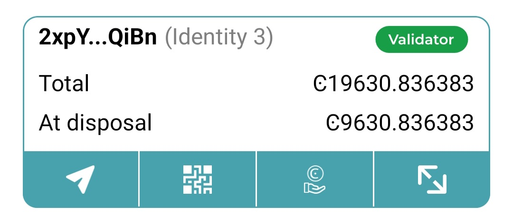
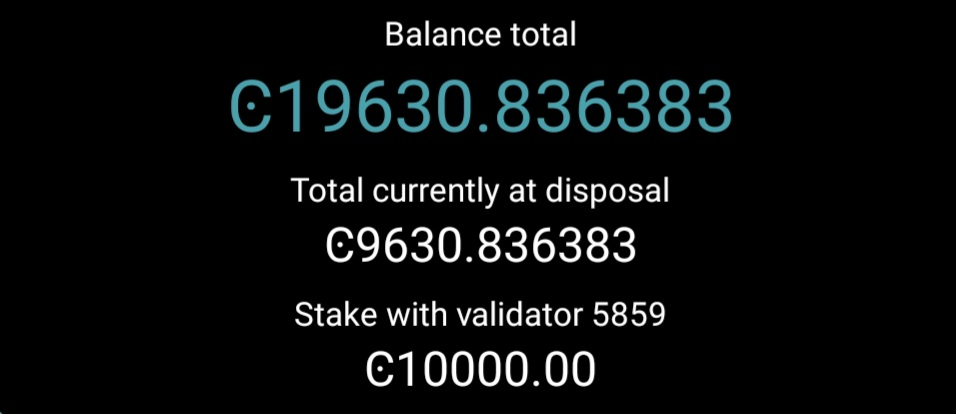

.. _add-baker-mw:

==========================
Add baker in Mobile Wallet
==========================

#. Go to **Accounts**. Tap on the balance area of the account you want to add as a baker account or tap **More** |moredetails|.

#. In the hamburger menu |hamburger| tap **Baking**.

#. After the screens explaining baking, specify the amount that you want to stake on the Register Baker screen. The more you stake, the greater the probability that your account will be chosen to bake the next block. Baker accounts receive a reward when they have baked a block, and the reward is added to the staked amount on the account by default. However, you can change this setting so that the reward is added to the disposable amount instead. Select **Don’t restake** if you'd rather add the rewards to the disposable amount on the account.

    .. image:: ../images/mobile-wallet/add-baker-amt-mw.png

.. Note::

    There is a minimum amount to stake to become a baker. To find out what the minimum stake is, you can run the :ref:`consensus show-chain-parameters transaction in concordium-client<consensus show-chain-parameters>`.

.. Warning::

   Do not stake all of your funds or you will not have enough to cover transaction fees for unstaking or other transactions.

4. Choose whether you want to open a :ref:`baker pool<glossary-baker-pool>` or keep it closed. By opening a baker pool, others can delegate stake to your baker, thus increasing the chance that you are selected to bake a block and earn rewards. If you have a baker pool with delegators, the delegators also earn rewards when you bake blocks. Bakers are also paid a commission by the delegators for baking on their behalf. You can choose **Close for delegation** if you do not wish to run a baker pool.

    .. image:: ../images/mobile-wallet/add-baker-pool-mw.png

5. If you open a baker pool, you can optionally enter a URL with information about your baker to give delegators more information about your baker pool to help them research baker pools. This information is not shared in the case of a closed baker.

    .. image:: ../images/mobile-wallet/add-baker-pool-url-mw.png

6. You have to export the baker credentials so that you can start the node with the baker keys. Tap **Export baker keys** and navigate to the place on your device where you want to save the file. Give the file a name and the extension .json.

    .. image:: ../images/mobile-wallet/add-baker-export-keys-mw.png

.. Warning::

    This is the only time that you can export the credentials. If you're going to transfer the baker keys to someone else, make sure to do so through a secure channel. Generate new keys if you believe the keys have been compromised or lost.

7. Once you have saved the keys, you see an overview screen of the add baker transaction. Review the information then tap **Submit baker transaction**.

    .. image:: ../images/mobile-wallet/add-baker-submit-mw.png

8. The Mobile Wallet shows that the transaction has been submitted to the chain. Tap **Finish**. Once the transaction is approved, the active baker screen appears where you have the possibility to update baker settings.

    .. image:: ../images/mobile-wallet/add-baker-finish-mw.png

9. You need to import your baker keys file to your node in order to start baking. It is preferable to update them on the node as close to the next :ref:`pay day<glossary-pay-day>` as possible to prevent the node from being down as a baker for a longer time.

    - :ref:`Windows<baker-windows>`
    - :ref:`macOS<baker-macos>`
    - :ref:`Docker<baking-docker>`
    - :ref:`Ubuntu<baker-ubuntu>`

Once the transaction is finalized after importing your baker keys to the node, you see the baking status reflected in the account list and on the account card.

.. Warning::

    Transactions on the blockchain are permanent. That is, they are irreversible and can't be deleted. Therefore, carefully review that you have selected the right account to add as baker, and that you have entered the correct amount to stake.

.. |hamburger| image:: ../images/hamburger.png
             :alt: Three horizontal lines

.. |moredetails| image:: ../images/more-arrow.png
             :alt: Button with More and double-headed arrow
