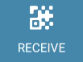

.. include:: ../../variables.rst
.. _share-address-mw:

===================================
Find and share your account address
===================================

If you need to share your account address with someone, you can find the address on the account page.

.. dropdown:: |mw-gen2|

   #. In the account overview tap |receive| or in the transaction overview for an account tap |receive|.

   #. You see a QR code and your address. To share your address:

      .. image:: ../images/mobile-wallet/MW54.png
         :width: 25%

      - You can let someone scan your QR code if they have the |mw-gen2| or |mw-gen1| installed.

      - You can tap **SHARE** and then share the address using one of the share options.

      - You can tap **COPY** to copy the address and then paste it somewhere of your own choosing.

.. dropdown:: |bw|

   #. Go to the **Accounts** page.

   #. On the account you want to find the address to tap |receive|.

   #. Share your address:

       - You can let someone scan your QR code if they have the |mw-gen1| or |mw-gen2| installed.

       - You can tap **COPY** to copy the address and then paste it somewhere of your own choosing.

.. dropdown:: |mw-gen1|

   #. Go to the **Accounts** page.

   #. On the account you want to find the address to, tap **RECEIVE**.

      .. image:: ../images/mobile-wallet/MW13.png
         :width: 25%

   #. Share your address:

      .. image:: ../images/mobile-wallet/MW54.png
         :width: 25%

      - You can let someone scan your QR code if they have the |mw-gen2| or |mw-gen1| installed.

      - You can tap **SHARE** and then share the address using one of the share options.

      - You can tap **COPY** to copy the address and then paste it somewhere of your own choosing.

.. |receive| image:: ../images/receive.png
             :alt: QR code
             :width: 50px

