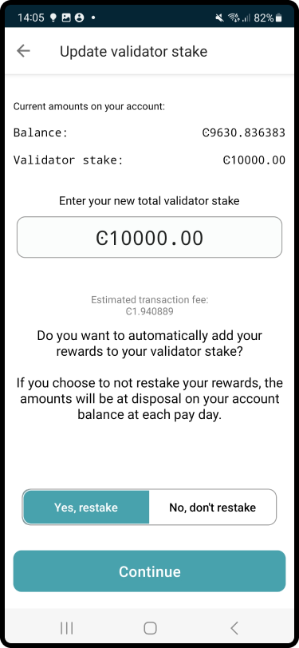

.. include:: ../../variables.rst
.. _update-baker-mw:

====================
Change baker options
====================

The following tabs describe how to access baker settings.

.. tabs::

    .. tab:: |mw-gen2|

        #. You can either: tap |earn| on the account you want to delegate from in the **Accounts** page, or tap on an account card and tap |earn-w-text| on the account transaction overview screen.

        #. In the Baker status screen tap **Update baker settings**.

        .. |earn| image:: ../images/earn.png
             :alt: Hand receiving money
             :width: 25%

        .. |earn-w-text| image:: ../images/earn-w-text.png
             :alt: Hand receiving money with text earn
             :width: 25%

    .. tab:: |mw-gen1|

        #. Go to **Accounts**. Tap on the balance area of the baker account you want update or tap **More** |moredetails|.

        #. In the hamburger menu |hamburger| tap **Baking**.

        #. In the Baker status screen tap **Update baker settings**.

            .. image:: ../images/mobile-wallet/baker-status-mw.png
                :width: 25%

Once you have access baker settings for your wallet, you have four options:

    - Update baker stake
    - Update pool settings
    - Update baker keys
    - Stop baking

Update baker stake
==================

If you choose **Update baker stake** you see your balance and the current Baker stake amount. Enter the amount you want to stake. This is the full amount to stake and is not added to the existing stake. You can also choose to adjust your restake setting between **Yes, restake** rewards or **No, don’t restake** rewards. Tap **Continue**.

On the overview screen, check the information. Once you are satisfied, tap **Submit baker transaction**.

Once the transaction is submitted you see a confirmation screen. Tap **Finish** to complete the action.

.. Note::

   Reducing your stake results in a longer :ref:`cool-down period<glossary-cool-down-period>`. The staked amount will be locked during this period and cannot be increased or decreased; you can still change restaking preferences during cool-down. The stake reduction is not effective until the next :ref:`pay day<glossary-pay-day>` after cool-down period ends. During the cool-down period the staked amount continues earning rewards.

.. _update-pool-settings:

Update pool settings
====================

If you choose **Update pool settings**, you have three options:

.. image:: ../images/mobile-wallet/update-baker-pool-mw.png
    :width: 25%

- Open pool: open a pool for a previously closed baker
- Closed for new: close the pool to new delegators. Existing delegators are not affected. You might do this when, for example, the pool is close to meeting one or both of the :ref:`bounding caps<delegation-concept>`. **It is the baker’s responsibility to monitor the stake to make pool management decisions.**
- Close pool: close a pool permanently.

If you choose **Open pool**:

#. You can optionally enter a URL with information about your baker to give delegators more information about your baker pool to help them research baker pools. This information is not shared in the case of a closed baker.

#. In the Update pool settings overview screen review the information then tap **Submit delegation transaction**.

#. The |mw-gen2| or |mw-gen1| shows that the transaction has been submitted to the chain. Tap **Finish**. Once the transaction is approved, the active baker screen appears where you have the possibility to update baker settings.

If you choose **Closed for new**:

Existing delegators remain in the pool. You have the option to adjust commission fees and your baker information URL.

#. Enter an optional URL with information about your baker to give delegators more information about your baker pool to help them research baker pools. This information is not shared in the case of a closed baker.

#. In the Update pool settings overview screen review the information then tap **Submit delegation transaction**.

#. The |mw-gen2| or |mw-gen1| shows that the transaction has been submitted to the chain. Tap **Finish**. Once the transaction is approved, the active baker screen appears where you have the possibility to update baker settings.

If you choose **Close pool**:

This closes the pool completely for both existing delegators and new delegators.

#. In the Update pool settings overview screen review the information then tap **Submit delegation transaction**.

#. The |mw-gen2| or |mw-gen1| shows that the transaction has been submitted to the chain. Tap **Finish**. Once the transaction is approved, the active baker screen appears where you have the possibility to update baker settings.

.. Note::

   Closing a pool does not mean that baking stops. You continue baking but only using your own stake. If you wish to stop baking, you must :ref:`stop baking<remove-baker-mw>`.

Update baker keys
=================

If you believe your baker keys have been compromised or lost, you can generate new baker keys. It is important to remember to update your baker keys on your node once you have exported them.

#. If you choose **Update baker keys**, after the screens explaining reasons for updating baker keys, you see the new baker keys. Tap **Export baker keys** and navigate to the place on your device where you want to save the file.

    .. image:: ../images/mobile-wallet/update-baker-keys.png
        :width: 25%

.. Warning::

    This is the only time that you can export the credentials. If you're going to transfer the baker keys to someone else, make sure to do so through a secure channel. Generate new keys if you believe the keys have been compromised or lost.

2. Once you have saved the keys, review the information on the overview screen of the add baker transaction then tap **Submit baker transaction**.

3. The |mw-gen2| or |mw-gen1| shows that the transaction has been submitted to the chain. Tap **Finish**. Once the transaction is approved, the active baker screen appears where you have the possibility to update baker settings.

4. You need to import your baker keys file to your node in order to start baking with the new keys. It is preferable to update them on the node as close to :ref:`pay day<glossary-pay-day>` as possible to prevent the node from being down as a baker for a longer time.

    - :ref:`Windows<baker-windows>`
    - :ref:`macOS<baker-macos>`
    - :ref:`Docker<baking-docker>`
    - :ref:`Ubuntu<baker-ubuntu>`

.. _remove-baker-mw:

Stop baking
===========

If you no longer wish to bake on this account, you can stop baking.

#. Tap **Stop baking**.

    .. image:: ../images/mobile-wallet/baker-hamburger-menu.png
        :width: 25%

#. After the screens explaining baker removal, review the information on the overview screen. When you are satisfied, tap **Submit baker transaction**.

#. The |mw-gen2| or |mw-gen1| shows that the transaction has been submitted to the chain. Tap **Finish**.

.. Note::

    When you stop baking, there is a longer :ref:`cool-down period<glossary-cool-down-period>` before the transaction takes effect. During the cool-down period, your stake continues to earn rewards.

.. Note::

   If you stop baking, remember that this does not shut down your node. You need to shut down the node in a separate action if you no longer wish to run a node on the Concordium blockchain.

.. |hamburger| image:: ../images/hamburger.png
             :alt: Three horizontal lines
             :width: 10%

.. |moredetails| image:: ../images/more-arrow.png
             :alt: Button with More and double-headed arrow
             :width: 10%
