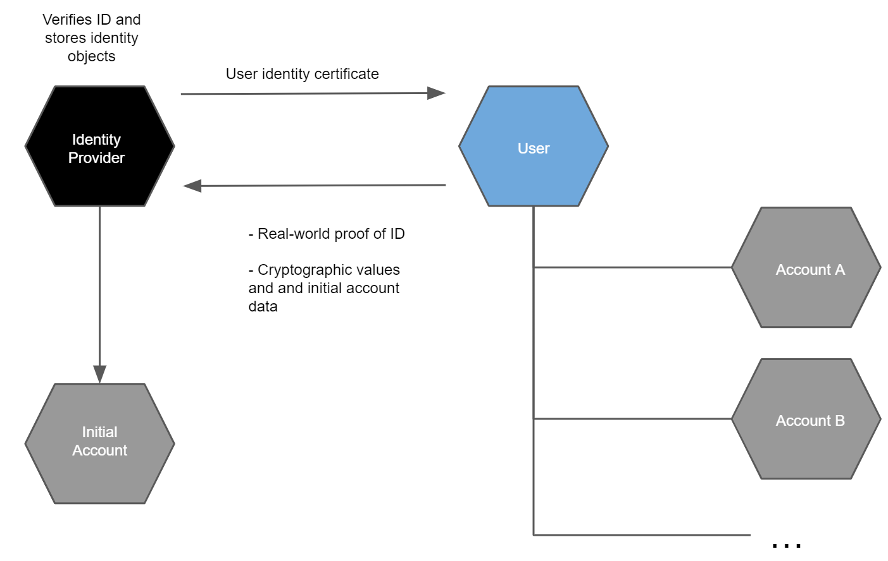

.. _Discord: https://discord.com/invite/xWmQ5tp
.. include:: ../../variables.rst
.. _managing_accounts:

========
Accounts
========

Accounts and identities are strongly linked on the Concordium Platform. To be able to hold, send, or receive :ref:`CCD<glossary-ccd>` or become a baker on the Concordium blockchain, you need an account and an identity. This is regardless of whether you are using the |mw-gen2|, the |mw-gen1|, Desktop Wallet, or Concordium Client for your transactions.

You must have a verified identity and a user identity certificate issued by an authorized identity provider to create accounts on the Concordium Platform. For more information about identities, see :ref:`Identities<reference-id-accounts>`.

About accounts
==============

An account on the Concordium blockchain is owned by one or more :ref:`credential holders<glossary-credential-holder>` and consists of two parts: The :ref:`on-chain<glossary-on-chain>` part, which is publicly visible and maintained by the bakers, and the :ref:`off-chain<glossary-off-chain>` part.

The on-chain part of the account consists of:

- the credentials of the credential holders associated with the account
- public balance
- shielded balance
- account sequence number
- public keys of each credential to verify transaction signatures.

The off-chain part of the account contains:

-  private keys of credential holders which are used to sign actions by the
   account (e.g., sending transfers, deploying smart contracts)
-  the identity an account is created from (this is needed for managing
   the account on the chain)
-  decryption keys used for :ref:`shielded transfers<glossary-shielded-transfer>`.

Concordium provides several ways of interacting with the on-chain account.
Off-chain parts of accounts can be transferred between different devices but not between |mw-gen1| and Desktop Wallet, or |mw-gen2| and Desktop Wallet. The same account can be used from multiple devices at the same time.

Accounts on the chain are identified via an account address, which is a 32-byte
sequence. The address is usually displayed in Base58Check encoding with version
byte 1. An example of such an address is
``3ZFGxLtnUUSJGW2WqjMh1DDjxyq5rnytCwkSqxFTpsWSFdQnNn``.

In the :ref:`tools<tools>` described below the user will typically select an **account name**
which makes the account easier to identify. This is only a local alias, and is not used by the Concordium blockchain.
The name is resolved to an address before interactions with the node.

Initial account
---------------

.. Note::

   Initial accounts are not created by the identity provider when using |mw-gen2| or |bw|. You create all accounts yourself.

The user gets an :ref:`glossary-initial-account` at the same time as an :ref:`identity<reference-id-accounts>` has been issued by an :ref:`identity provider<glossary-identity-provider>`. As the initial account is submitted to the chain by the identity provider, the identity provider knows the owner of the initial account. For this reason, you may not want to use the initial account and create a regular account instead. There can only be one initial account for one identity.

The user additionally :ref:`creates account keys<backup>` for an initial account, which the user stores privately. The identity provider then verifies that the attributes in the user identity information
are valid for the user and stores them locally in an identity object that is specific to the user. Identity objects are only held by identity providers. The identity provider then opens an
account, the initial account, on behalf of the user. At the end of the identity verification process, the user receives a user identity certificate that can be used for creating
additional accounts and the user gets access to the initial account on the Concordium Platform. These certificates are valid for a given period. You can obtain a new certificate
by creating a new identity and going through the identity verification process again with an identity provider.

Based on the user identity certificate the user can subsequently create other accounts (see below) that can only be linked to the user if the anonymity revokers and the identity provider are
involved. This gives a user a way to create accounts with an additional layer of privacy protection compared to that in the initial account. The owner of a regular account is not known to the identity providers or any other single entity. To facilitate compliance with relevant regulations, a regular account can only be created from an *identity* which is issued :ref:`glossary-off-chain` by an Identity provider. While an account has to be created from an identity, the user's privacy is still protected, and the account owner's identity can only be revealed via the process of :ref:`anonymity revocation<revoking-anomity>`, which can only happen under stringent regulations. In particular, a key feature of the design of identities and accounts is that the identity provider cannot reveal the identity of an account on their own.

Account creation
----------------

Once you have an identity and a user identity certificate from an identity provider, you can use it to create more accounts on the Concordium Platform. This is typically done using an :ref:`app or wallet<tools>` that guides users through the account creation process. The creation of an account is an :ref:`glossary-on-chain` action that requires sending a transaction to a node that participates in the Concordium network.

.. Note::
   |mw-gen2| and |mw-gen1| do not submit the transaction directly to a node, but via a proxy. |mw-gen2| and |mw-gen1| do not need to be connected to a node.

The input to the transaction is a *credential*, which contains a number of :ref:`cryptographic proofs<glossary-cryptographic-proof>`, as well as a selection of attributes the user wishes to reveal publicly. The proofs establish that the attributes the user revealed publicly are the ones approved by the identity provider. The proofs reveal no other information. In particular, the identity provider itself cannot determine the owner of the account. Note that revealing attributes publicly is completely optional. The benefit gained from revealing attributes is that other users may decide whether to trust the account based on the publicly available information.

An example is that you might need to reveal your nationality sometimes. So you might have one account with no attributes revealed, and another account that reveals your nationality. When required, you can use the account with the nationality revealed while keeping
all other activities completely anonymous.

.. Note::
   It is possible to create a shared account where multiple users share one account. For more information, see :ref:`Overview of shared accounts with multiple credentials<overview-shared-accounts>`.

Any time you create a new account when using |mw-gen1| or Desktop Wallet, you should make a :ref:`backup<backup>`. Backups protect your account keys, ensuring that you do not lose access to your CCDs.

Attributes
----------

Each identity contains a number of cryptographic values and a number of
user-chosen attributes, such as nationality or country of residence. These
attributes are certified by the identity provider. The cryptographic values are
a number of public and private keys, a signature from the identity provider, as
well as a number of secret values the user must use to be able to use the
identity to create accounts.

You are in control of which attributes are revealed to the public. You can choose not to reveal any attributes at all to maintain your anonymity, which is the general recommendation.

Benefits of revealing attributes
^^^^^^^^^^^^^^^^^^^^^^^^^^^^^^^^

Every account on the chain must be derived from an identity that is verified and
signed by an approved identity provider. It is publicly visible which identity
provider issued an identity for an account and who the anonymity revokers are
for the account and the identity. In addition to this basic information which
enables regulatory compliance, an account owner can choose to publicly reveal
other values on their account, such as their nationality or country of
residence. Since this information is publicly accessible, anybody can check it
before interacting with an account. Moreover, being able to see who issued the
identity enables whoever wishes to interact with an account to judge the level
of risk in the transaction.

.. _revoking-anomity:

.. include:: ../snippets/revoking-anonymity.rst

Account concepts
================

.. _managing-account-balances:

Account balances
----------------

Each account has two balances, the *public balance* which can be *seen* by anyone, and a :ref:`shielded
balance<glossary-shielded-balance>`. The shielded balance is only known to the owner of the account. It
can only be used in :ref:`shielded transfers<glossary-shielded-transfer>` to
other accounts.

The public balance of the account is always used for payment of transaction fees,
baking, finalization, and transfers, even for shielded transfers.

At any given time some of the public balance might be unavailable for use. This
can happen in two ways:

- the account has :ref:`staked<glossary-staked-amount>` some of the public
  balance in order to become a baker or to delegate
- some of the public balance is locked up because it was received via a
  :ref:`transfer with schedule<glossary-transfer-with-schedule>`

The locked-up balance can be staked, but it can not be used for payment of
transaction fees, nor can it be transferred to other accounts.

Here's an example that illustrates the relationship between the different balances (in this explanation, transaction fees are ignored). Suppose that on January 1 the account starts
with 100 CCD on the public balance. None of it is locked-up or staked.

Then on January 2 the account receives 50 CCD via a :ref:`transfer with
schedule<glossary-transfer-with-schedule>` with the release scheduled for
December 31 of the same year. At this point, January 2, the account has 100 CCD
at disposal, the rest being locked. If the account tried to transfer more than
100 CCD the transaction would be rejected.

On January 3 the account becomes a baker with the initial stake of 125 CCD.
This is successful because the total public balance is 150CCD.
After this the account still has 25 CCD at disposal, because CCD locked in a release schedule will be prioritized for stakes.

Account sequence number
-----------------------

Each account on the Concordium blockchain has a :ref:`sequence number<glossary-transaction-sequence-number>` and each
transaction signed by the account must have a sequence number. For a transaction
to be considered valid its sequence number must be the next available one for
the account. The sequence number is maintained by all the bakers in order to
validate transactions.

You can :ref:`look up the sequence number<account-seqno>` from an up to date node using Concordium Client.

The |mw-gen2| and |mw-gen1| keeps track of the sequence number and assigns the correct one when sending transactions.
``concordium-client`` tracks the sequence number automatically, but it can
also be set manually.

Account aliases
---------------

In protocol versions 1 and 2 accounts and account addresses have a one-to-one relationship. In protocol version 3 each account has 16777216 addresses, namely a so-called canonical account address together with
matching account aliases. The canonical account address is derived when an account is created on chain. The other 16 million addresses with matching initial 29 bytes are referred to as account aliases for
the same account. Thus, accounts can be referred to by any address whose initial 29 bytes match.

This allows each account to have aliases for different uses and creates a kind of sub-account structure. An account owner can give out different aliases for different uses to keep track of transfers and assign them meaning.

Each account still has one total account balance. Hence, transfers to and from aliases of an account add to and subtract from that total account balance, respectively. Transfers between different aliases of the same account do not change the balance of the account, apart from cost. Finalization, block, and baking rewards are always received on the account's canonical address.

To show aliases, :ref:`run a transaction in Concordium Client<account-aliases>`.

.. _tools:

Tools
=====

The Desktop Wallet
------------------

The Desktop Wallet is a digital wallet that enables you to create and manage your Concordium identities, credentials, and accounts from your desktop and to create transactions such as sending CCD, adding a baker, and exporting and importing account information.

The |mw-gen1|
-----------------

The |mw-gen1| is a digital smartphone wallet that enables you to create and manage your Concordium identities and accounts, to create simple and shielded transactions, bake and delegate, and to export and import your accounts and identities.

.. Note::

   It is no longer possible for users of |mw-gen1| on an Android device to create new accounts.

The |mw-gen2|
------------------

The |mw-gen2| is a second generation digital smartphone wallet that enables you to create and manage your Concordium identities and accounts, to create simple and shielded transactions, bake and delegate, and to export and import your accounts and identities.

To learn more about the differences between the wallets, see :ref:`Deciding between the wallets<choosing-wallet>`.

.. warning:: You can't exchange identities and accounts between the |mw-gen1| or |mw-gen2| and the Desktop Wallet. You can, however, send CCD from one wallet to another.

Command-line tool
-----------------

The Concordium distribution ships with a command-line tool named
:ref:`concordium-client<concordium-client>`. It is designed as a low-level interface to the
Concordium blockchain. It cannot be used to create identities, but it can
:ref:`import accounts<concordium-client-import-accounts-keys>` exported from the mobile wallets. Once an account has been
imported, the tool can be used to do CCD transfers from the account, as well as
send all other :ref:`transaction<transactions>` types supported by the Concordium blockchain.
