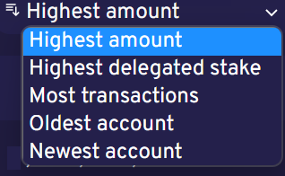

.. _accounts-view:

=========================
CCDScan Accounts overview
=========================

The Accounts overview shows information about accounts during the selected time range in the filter.

.. image:: ../images/ccd-scan/ccd-scan-accounts.png

|

The graphs show the **Cumulative accounts created** since inception and the **Accounts created** during the selected time range in the filter.

Below the graphs, the table contains the following:

- **Address**: the first six characters of the account hash. You can click Copy |copy| to copy the entire hash. Click the account hash to see the :ref:`account details<accounts-view>`.
- **Account age**: how long the account has existed.
- **Transactions**: number of transactions the account has conducted.
- **Delegated stake**: total amount of CCD the account has delegated.
- **Balance**: The publicly visible balance of the account. Does not include shielded amounts.

You can sort the information in the table using the following sort options:

.. _home-screen-sender:

Sender/Account details
======================

When you select a sender or account, the following appears.

.. image:: ../images/ccd-scan/ccd-scan-home-sender.png

|

The following information is shown in the account details:

- **Account**: the first six characters of the account number are shown. Click Copy |copy| to copy the entire account number. If the account is participating in baking or delegation, the staked amount is displayed. Additional information is available on the account: a baker section for bakers, a delegation section for delegators, and a rewards section for both bakers and delegators.
- **Balance**: the current account balance is shown. If the account has a release schedule, the remaining locked amount is displayed here. The same applies if the account is participating in baking or delegation then the amount staked is displayed under the account balance.
- **Age**: the age of the account including the exact timestamp for all individual accounts.
- **Transactions**: a list of all related transactions associated with the account. Use the navigation buttons at the bottom to navigate through transactions.
- **Release schedule**: shown only for accounts that have transfers with a release schedule to show the remainder of the schedule (non-released assets). The list of release dates and amounts is available, including a drill-through link to the :ref:`underlying transaction(s)<home-screen-transaction>`.
- **Account statement**: shows how the account balance has changed over time, including the types of changes that have impacted the balance of the account. Use the navigation buttons at the bottom to navigate through account statements.
- **Baker**: if an account is also a baker, the baker ID and the staked amount is shown here. Click the baker ID to see :ref:`baker details<home-screen-baker>`.
- **Delegation**: shown for accounts that are delegating to a baker pool or passive delegation. Information includes the delegator ID of the account, the staked amount, if the earnings are restaked or not, and the delegation target (a baker or passive delegation) including drill-though to the :ref:`baker<home-screen-baker>` or passive delegation information.
- **Rewards**: includes an overview graph that shows the aggregated rewards for an account based on the applied time range filter. The table shows reward details broken down by type. Click the block hash to see :ref:`block details<home-screen-block>` for the corresponding block where the reward payout occurred. Use the navigation buttons at the bottom to navigate through reward payouts.

.. |copy| image:: ../images/ccd-scan/ccd-scan-copy.png
             :class: button
             :alt: Green document on top of another green document

.. |hamburger| image:: ../images/ccd-scan/hamburger-menu.png
             :class: button
             :alt: Three horizontal lines on a dark background
