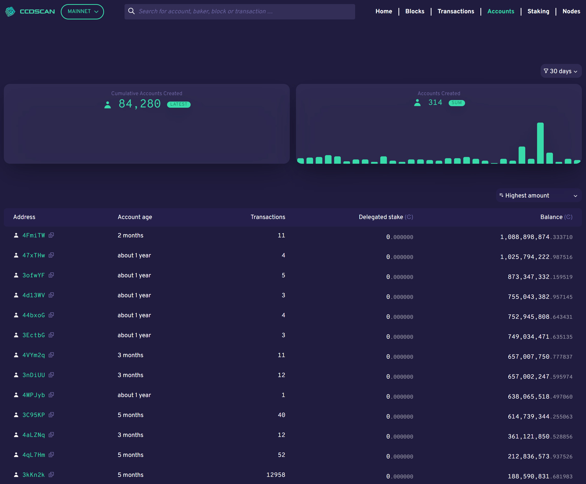

.. _accounts-view:

=========================
CCDScan Accounts overview
=========================

The Accounts overview shows information about accounts during the selected time range in the filter.

|

The graphs show the **Cumulative accounts created** since inception and the **Accounts created** during the selected time range in the filter.

Below the graphs, the table contains the following:

- **Address**: the first six characters of the account hash. You can click Copy |copy| to copy the entire hash. Click the account hash to see the :ref:`account details<accounts-view>`.
- **Account age**: how long the account has existed.
- **Transactions**: number of transactions the account has conducted.
- **Delegated stake**: total amount of CCD the account has delegated.
- **Balance**: The publicly visible balance of the account. Does not include shielded amounts.

You can sort the information in the table using the following sort options:

.. |copy| image:: ../images/ccd-scan/ccd-scan-copy.png
             :class: button
             :alt: Green document on top of another green document

.. |hamburger| image:: ../images/ccd-scan/hamburger-menu.png
             :class: button
             :alt: Three horizontal lines on a dark background
