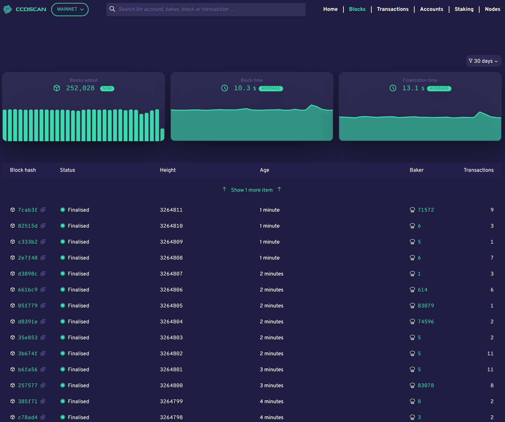

.. _blocks-view:

=======================
CCDScan Blocks overview
=======================

The Blocks overview shows information about the blocks created during the selected time range in the filter.

|

The graphs show the number of blocks added, the average block time, and the average finalization time.

Below the graphs, the table contains the latest blocks added to the blockchain with the following information:

- **Block hash**: the first six digits of the block hash. Click Copy |copy| to copy the entire hash. Click the block hash to see :ref:`block details<home-screen-block>`.
- **Status**: the block status
- **Height**: block height
- **Age**: block age
- **Baker**: the baker ID of the baker who baked the block. Click the baker ID to see :ref:`baker details<home-screen-baker>`.
- **Transactions**: the number of transactions in the block

.. |copy| image:: ../images/ccd-scan/ccd-scan-copy.png
             :class: button
             :alt: Green document on top of another green document

