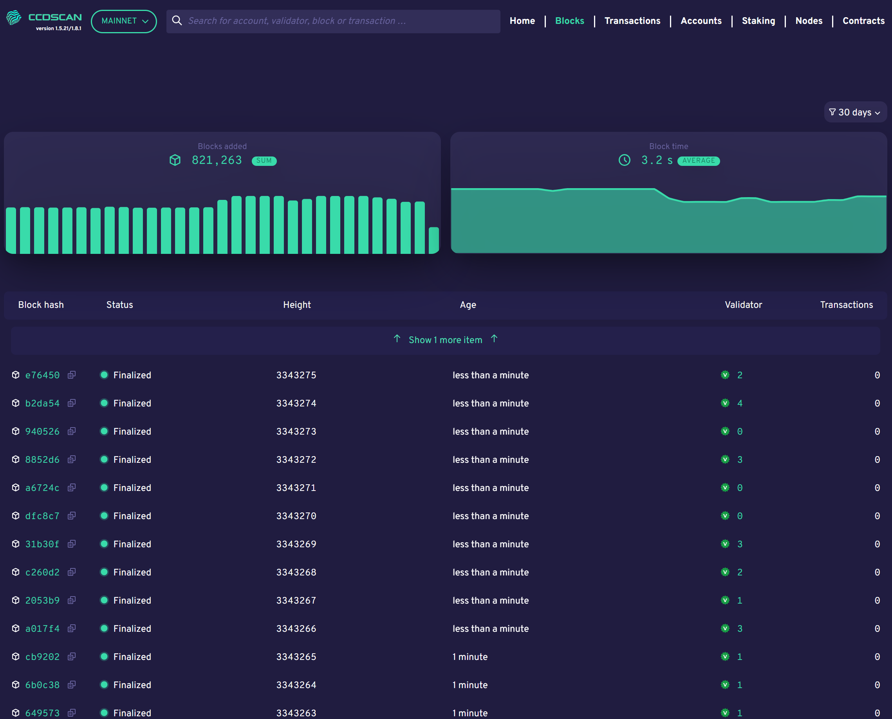

.. _blocks-view:

=======================
CCDScan Blocks overview
=======================

The Blocks overview shows information about the blocks created during the selected time range in the filter.

|

The graphs show the number of blocks added, the average block time, and the average finalization time.

Below the graphs, the table contains the latest blocks added to the blockchain with the following information:

- **Block hash**: the first six digits of the block hash. Click Copy |copy| to copy the entire hash. Click the block hash to see :ref:`block details<home-screen-block>`.
- **Status**: the block status
- **Height**: block height
- **Age**: block age
- **Baker**: the baker ID of the baker who baked the block. Click the baker ID to see :ref:`baker details<home-screen-baker>`.
- **Transactions**: the number of transactions in the block

.. _home-screen-block:

Block details
=============

When you click a block hash, the following appears:

|

The block details shows the following information about the block.

- **Block**: the first six characters of the block hash. You can click Copy |copy| to copy the entire hash.
- **Finalised** or **Rejected**: state of the block.
- **Age**: age of the block with date/time stamp.
- **Baker id**: baker ID of the baker who baked the block. Click on the baker ID for details about the :ref:`baker<home-screen-baker>`.
- **Tokenomics**: shows the tokenomics of the accrued block rewards, including the minted CCDs for the block with a breakdown of the distribution plus finalisers and baker rewards. A subsection of tokenomics is the full list of finalisers for each individual block including their weight and reward. It is possible to copy the full address of the finalizer |copy| or drillthrough to the account information of the finaliser. Baker rewards includes a breakdown of the baker rewards details about the rewards, transaction fees, and so on.
- **Transactions**: shows the transaction(s) contained in the block, if any, including the first six characters of the transaction hash, transaction type, first six characters of the Sender account, and the cost of the transaction. You can click **Hash** for more :ref:`information about the transacation<home-screen-transaction>`, or click **Sender** for more :ref:`information about the sender<home-screen-sender>`. You can click Copy |copy| to copy the entire hash or account number.
- **Block statistics**: shows the block time (time since last block) and the finalization time of the block (the time before proof of finalization of the selected block was included in a subsequent block).

.. |copy| image:: ../images/ccd-scan/ccd-scan-copy.png
             :class: button
             :alt: Green document on top of another green document

