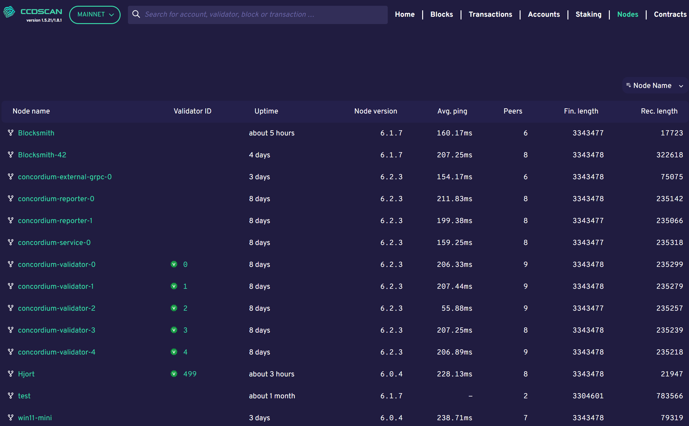
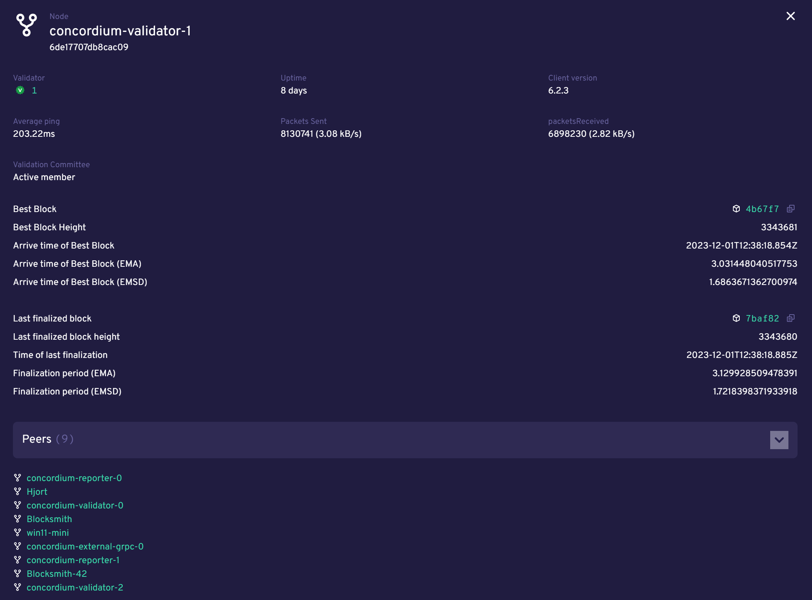

.. _ccdscan-nodes:

======================
CCDScan Nodes overview
======================

Nodes shows information about the nodes on Mainnet/Testnet in alphabetical order. The list contains the following information:

- **Node name**: node name as given by the node runner. Click the node name to see the :ref:`node details<node-details>`.
- **Baker ID**: if the node is a baker, the baker ID appears. Click the baker ID to see the :ref:`baker details<home-screen-baker>`.
- **Uptime**: amount of time the node has been running.
- **Node version**: version of Concordium node software that the node is running.
- **Avg. ping**: average ping time between the peers of the participant.
- **Peers**: number of peers connected to the participant.
- **Fin. length**: length of participant’s chain up to last finalized block.

|

.. _node-details:

Node details
============

When you click a node name on the Nodes page, the following appears:

The following information is shown in the node details:

|

- **Node**: shows the name of the node
- **Baker**: baker ID of the node if it is a baker. Click the baker ID to see the :ref:`baker details<home-screen-baker>`.
- **Uptime**: amount of time the node has been running.
- **Client version**: version of concordium node software the node is running.
- **Average ping**: average ping time between the peers of the participant.
- **Packets sent**: number of packets sent by the participant during uptime.
- **Packets received**: number of packets received by the participant during uptime.
- **Baking committee**: Active member or Not a member
- **Best block statistics**: shows statistics about the best block.  Click Copy |copy| to copy the entire block hash. Click the block hash to see :ref:`block details<home-screen-block>`.
- **Last finalized block statistics**: shows statistics about the last finalized block in participant’s chain.  Click Copy |copy| to copy the entire block hash. Click the block hash to see :ref:`block details<home-screen-block>`.
- **Peers**: Shows the current list of peers of the node with the ability to drill-through and inspect peer node information.

.. |copy| image:: ../images/ccd-scan/ccd-scan-copy.png
             :class: button
             :alt: Green document on top of another green document

.. |hamburger| image:: ../images/ccd-scan/hamburger-menu.png
             :class: button
             :alt: Three horizontal lines on a dark background

