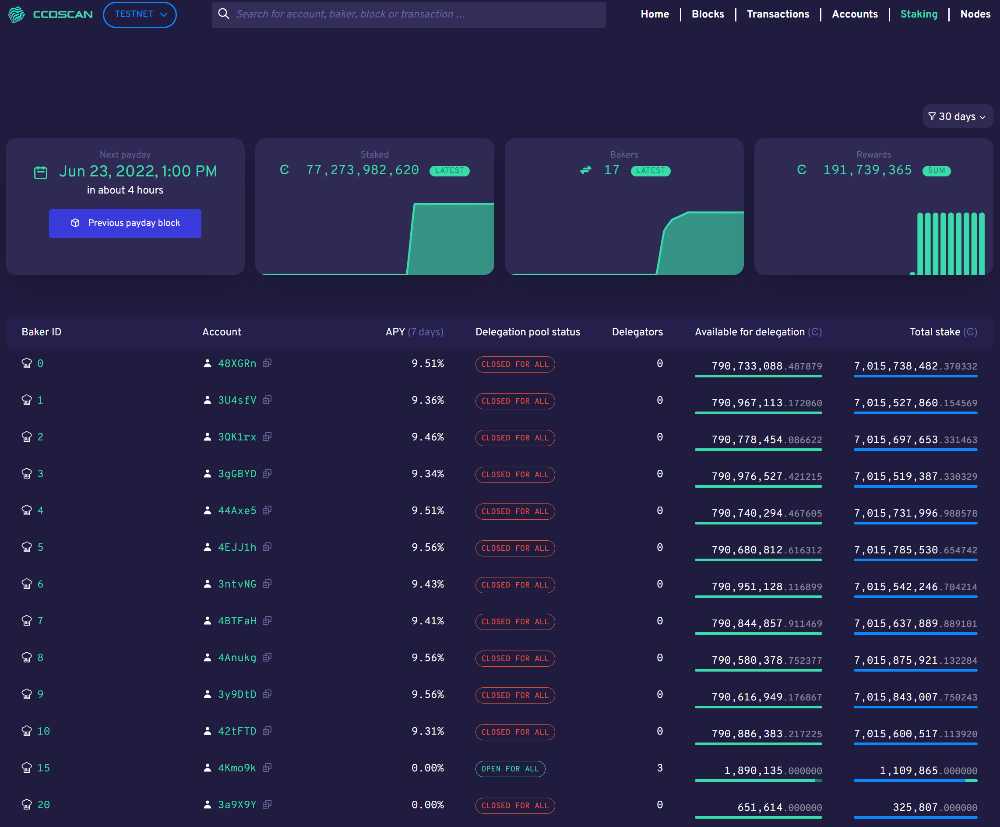
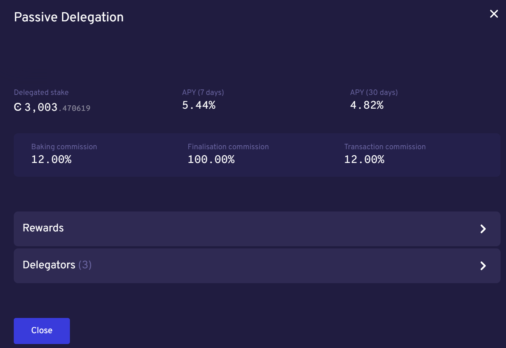

.. _bakers-view:

========================
CCDScan Staking overview
========================

The Staking overview shows information about bakers during the selected time range in the filter:

|

The graphs show when the next payday happens, the amount of staked CCD, the number of bakers, and the total of rewards during the selected time range in the filter. The **Previous payday block** contains information about all rewards paid out for a payday period. If you click **Previous payday block**, a special block details screen for the previous pay day block appears.

(Screenshot of pay day block details)

The Pay Day block details contains the following:

- **Block**: the first six digits of the block hash. Click Copy |copy| to copy the entire hash. The block status is also shown.
- **Age**: the age of the block and date/time stamp when it was created.
- **Baker id**: ID of the baker who baked the block. Click the baker IDto see the :ref:`baker details<home-screen-baker>`.
- **Tokenomics**: contains the following details about the block:
    - Distributed minted CCD: Contains the total minted CCDs and a breakdown on their distribution across the baker reward account, finalization reward account, and foundation account.
    - Accrued block rewards: similar to a ‘regular’ :ref:`block<home-screen-block>`; contains the accrued block rewards.
    - Payday foundation rewards: displays the payout to the foundation account for the pay day period and contains the option to drill-through to the :ref:`foundation account<accounts-view>`.
    - Payday account rewards: lists all the accounts and the rewards broken down by baker reward, finalization reward, and transaction fees.
    - Payday pool rewards: lists all the pools (including passive delegation) and the rewards broken down by baker reward, finalization reward, and transaction fees.
- **Transactions**: shows the transaction(s) contained in the block, if any, including the first six characters of the transaction hash, transaction type, first six characters of the Sender account, and the cost of the transaction. You can click **Hash** for more :ref:`information about the transacation<home-screen-transaction>`, or click **Sender** for more :ref:`information about the sender<home-screen-sender>`. You can click Copy |copy| to copy the entire hash or account number.
- **Block statistics**: shows the block time (time since last block) and the finalization time of the block (the time before proof of finalization of the selected block was included in a subsequent block).

Below the graphs, you can switch between **Baker pools** and **Top delegators**. You can also choose to see details for **Passive delegation**. There is a switch to **Show only open pools** and a filter where you can choose how the data shown in the table should be ordered.

Baker pools view
================

If you select **Baker pools** the table contains a list of all bakers/pools (including historic bakers) sorted by their staked amount, containing the following:

- **Baker ID**: ID of the baker. This is the ID you need if you want to delegate to the baker pool in a wallet. Click the baker IDto see the :ref:`baker details<home-screen-baker>`. If the Baker has been removed (i.e. the baker is no longer active), **Removed** appears next to the ID.
- **Baker APY (30 days)**: the calculated yield of the baker for the past 30 days.
- **Delegators APY (30 days)**: the calculated yield of the delegators for the past 30 days.
- **Delegation pool Status**: the baker's pool status.
- **Delegators**: the number of delegators that baker has if the baker has an open pool
- **Available for delegation**: shows the maximum number of remaining CCDs available for delegation based on the capital bound and the leverage factor between a baker and associated delegators. Based on the :ref:`cap<delegation-caps>` imposed.
- **Total stake**:  shows the combined stake of the baker and delegators (if any) and the percentage breakdown of the split between the two.

Top delegators view
===================

If you select **Top delegaators** you see a list of all delegators (sorted by their staked amount. With the ability to see account details plus inspect details about the delegation target (baker pool or passive delegation), and so on. The table contains the following:

- **Account address**: the first six characters of the account hash. You can click Copy |copy| to copy the entire hash. If you click on an account hash, the :ref:`account details<accounts-view>` appears.
- **Delegation target**: the baker whose pool the account has staked. If you click on a baker ID, the :ref:`baker details<home-screen-baker>` appears.
- **Restake earnings**: shows the delegator's restaking preference.
- **Staked amount**: amount of CCD the delegator has staked.

Passive delegation view
=======================

If you select **Passive delegation**  it is possible to see the size of the passive delegation in total and information about the yield from delegating to passive delegation. Furthermore it is possible to see the commission rates for passive delegation.

- **Delegated stake**: amount of CCD delegated to passive delegation.
- **APY (7 days)**: the calculated yield of passive delegation based on past 7 days.
- **APY (30 days)**: the calculated yield of passive delegation based on past 30 days.
- **Baking commission**: percent of rewards paid as commission to baker.
- **Finalisation commission**: percent of finalization commission.
- **Transaction commission**: the transaction commission percent.
- **Rewards**: list of rewards paid out during the selected time range. Includes an overview graph that shows the aggregated rewards for passive delegation based on the applied filter. Rewards details are displayed in a table. 
    - **Time** shows the date/time the reward was paid
    - **Reference** shows the first six characters of the block hash in which the reward was paid. You can click Copy |copy| to copy the entire hash. Click the hash to see the :ref:`block details<home-screen-block>` for the block where the award payout occurred.
    - **Rewards** shows the amount of reward distributed.
- **Delegators**: the delegators staking to passive delegation, their restake preference, and amount staked. Click on a **Hash** to see :ref:`account details<accounts-view>`. You can click Copy |copy| to copy the entire hash.

.. |copy| image:: ../images/ccd-scan/ccd-scan-copy.png
             :class: button
             :alt: Green document on top of another green document

.. |hamburger| image:: ../images/ccd-scan/hamburger-menu.png
             :class: button
             :alt: Three horizontal lines on a dark background
