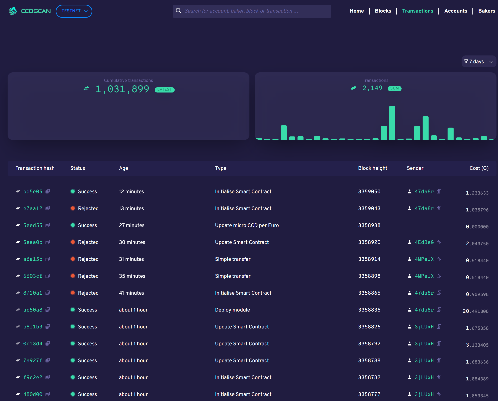

.. _transactions-view:

=============================
CCDScan Transactions overview
=============================

The Transactions overview shows information about the transactions during the selected time range in the filter.

|

The graphs show the number of **cumulative transactions** since inception and the number of **Transactions** in a range as determined by the time selected in the filter.

Below the graphs, the table contains the following:

- **Transaction hash**: the first six digits of the transaction hash. You can click Copy |copy| to copy the entire hash. Click the transaction hash to see the :ref:`transaction details<home-screen-transaction>`.
- **Status**: transaction status
- **Age**: transaction age
- **Type**: transaction type
- **Block height**: the block height of the transaction.
- **Sender**: the first six characters of the account that sent the transaction. You can click Copy |copy| to copy the entire hash. Click the account hash to see the :ref:`account details<accounts-view>`.
- **Cost**: the transaction fee.

.. |copy| image:: ../images/ccd-scan/ccd-scan-copy.png
             :class: button
             :alt: Green document on top of another green document

.. |hamburger| image:: ../images/ccd-scan/hamburger-menu.png
             :class: button
             :alt: Three horizontal lines on a dark background
